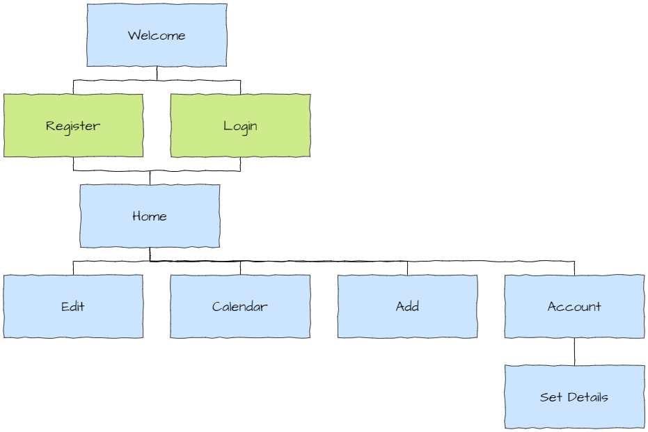
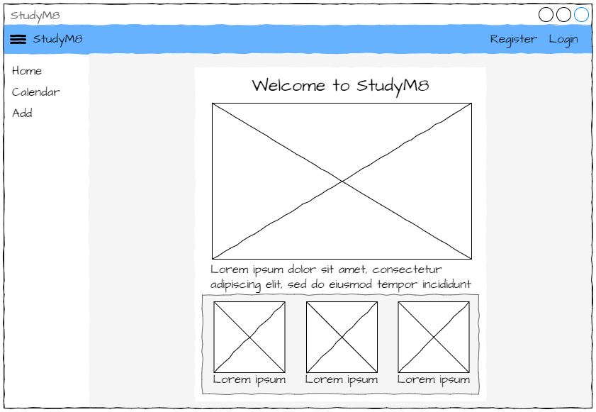
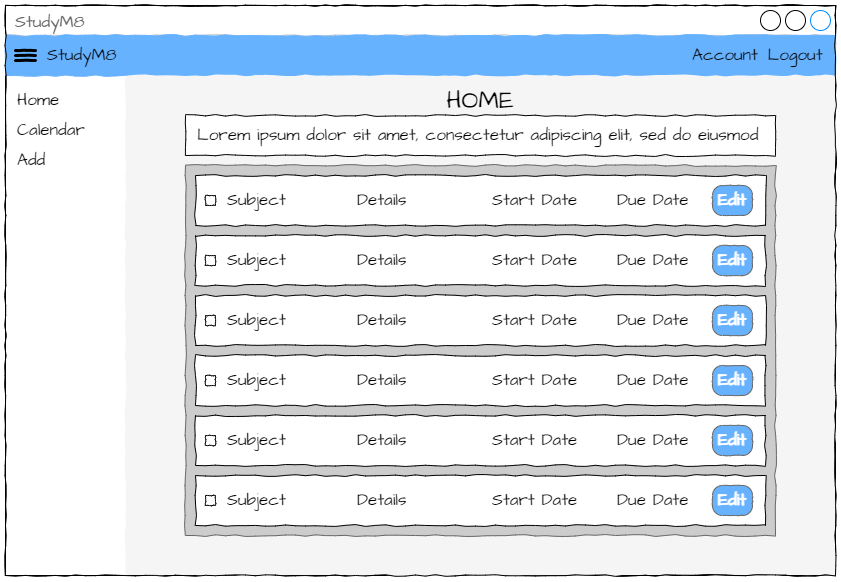
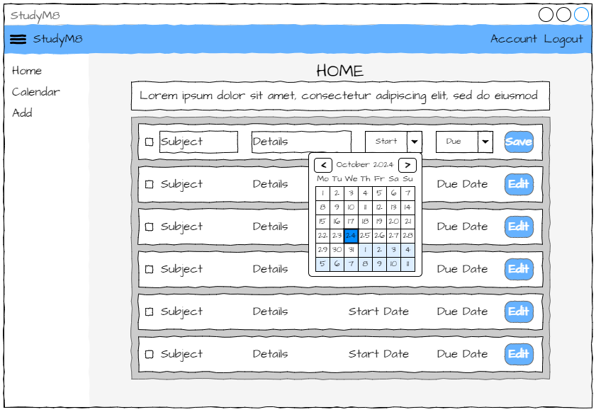
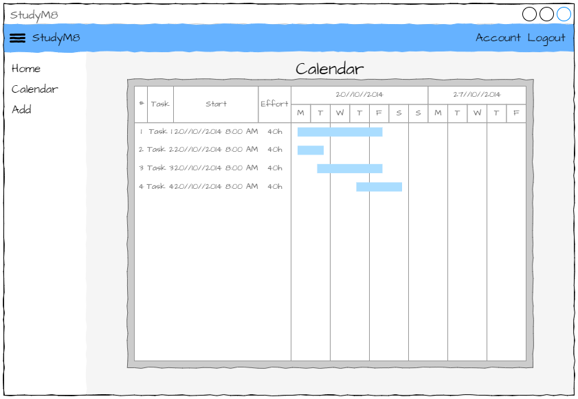
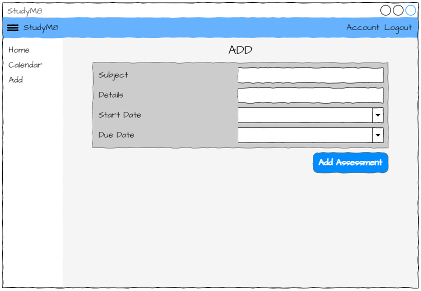
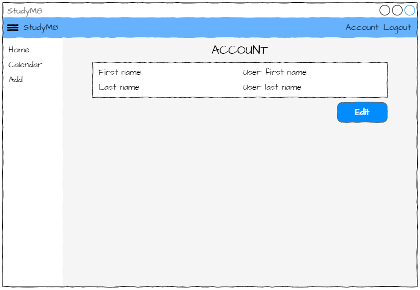

# StudyM8 design

```{topic} In this tutorial you will:
- Understand website planning principles.
- Create a site map to visualize the structure and links between pages.
- Develop wireframes to design the layout and structure without detailed design elements.
```

Before we start creating our website, we need to plan what it will look like. You have already had a chance to use the finished app, but you will not normally have this opportunity. Therefore, it is best to start with an understanding of the different pages that your website is comprised of, how they fit together and what they will look like.

## Site Map

The first step is to identify all the webpages your site contains, and how they fit together. We show this using a site map. A site map is a simple diagram that shows all the pages and the links between them.

Here is the sitemap for our StudyM8 app.



A few things worth noting:

- users cannot access any pages unless they have either logged in or registered
- we don't need to design the login and register pages as Anvil provides these features
- the Set Details page can only be accessed via the Account page

## Wireframes

Wireframes are diagrams that provide a clear, visual representation of a website's structure and layout without the distraction of detailed design elements. This allows designers, developers, and clients to focus on the functionality, navigation, and user experience, ensuring that all key components are logically arranged and work together effectively.

Below are the wireframes for StudyM8. They follow web design principles called Material Design, which was developed by Google. It's popularity on the web will make our app easier to use, as users will be familiar with different website components.

### Welcome Page

The welcome page is the landing page for the website. This is where users first arrive and the only page that can be accessed without a user account. It will be used to explaining the app and encourage the user to register for an account.



Notice the Material Design features:

- the menu bar across the top of the page, with links on the right-hand side
- the hamburger icon (three horizontal lines) in the top left corner that will open and close the left panel menu
- the left panel menu with links to the different web pages
- the content is contained in cards (the white and grey boxes). Not only does this groups information for the user, but it also is a useful organising tool for the frontend

```{admonition} Lorem Ipsum
:class: note
What is the gobbledygook text on the page? It is called Lorem Ipsum, and it is a text placeholder. It allows designers to focus on the layout of text without needing the actual content that will be used. You could just mash your keyboard, but Lorem Ipsum has the advantage of actually being words, albeit nonsensical. This means that it will act like text in regards to layout (word wrapping, punctuation, paragraph length, etc.).

If you're not keen on the classic Lorem Ipsum, there are plenty of others to choose from.

**<a href="https://loremipsum.io/ultimate-list-of-lorem-ipsum-generators/" target="_blank">The Ultimate List of Lorem Ipsum Generators</a>**
```

### Home Page

The home page is what authenticated (signed in) uses will see. It provides a list of all the assessments and their details.



Things to note:

- each assessment has it's own card. This uses a design feature called repeating panels. The number of panels show will depend on the number of assessments displayed
- each assessment also has an edit button that will allow the user to edit that assessments details.

### Edit Page

The edit page is a variation of the home page in which the user can an assessment's details. When the user clicks an assessment's edit button, the card for that assessment changes



Things to note:

- both the start date and the due date are edited using a date picker component. Since dates are written differently in different countries, date pickers prevent users from entering the date incorrectly.

### Calendar Page

The calendar page has a chart that shows all incomplete assessments, and when the user needs to be working on them. It is an easy way to identify when their academic load is the highest.



Things to note:

- the actual chart displayed will look different to our finished app

### Add Page

The add page allows the user to enter new assessment details. Again note the use of date pickers.



### Account Page

The account page shows the user their current details. The Edit button on this page take them to the set details page.



### Set Details Page

The set details page allows the user to change their details saved on the app.


