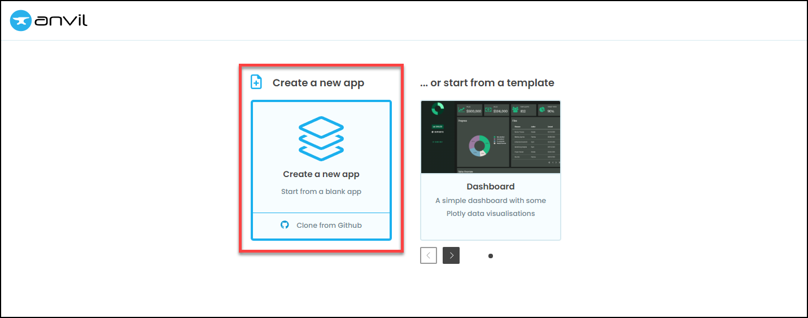
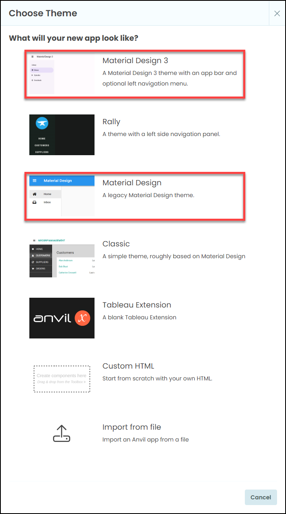
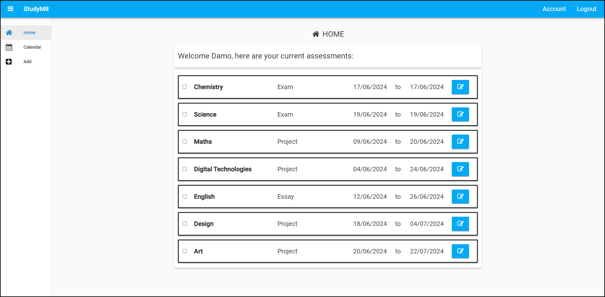
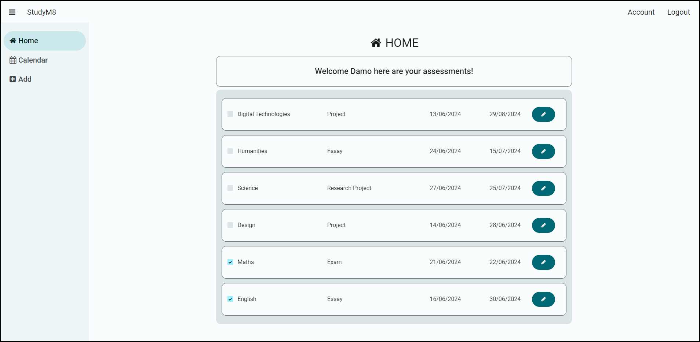
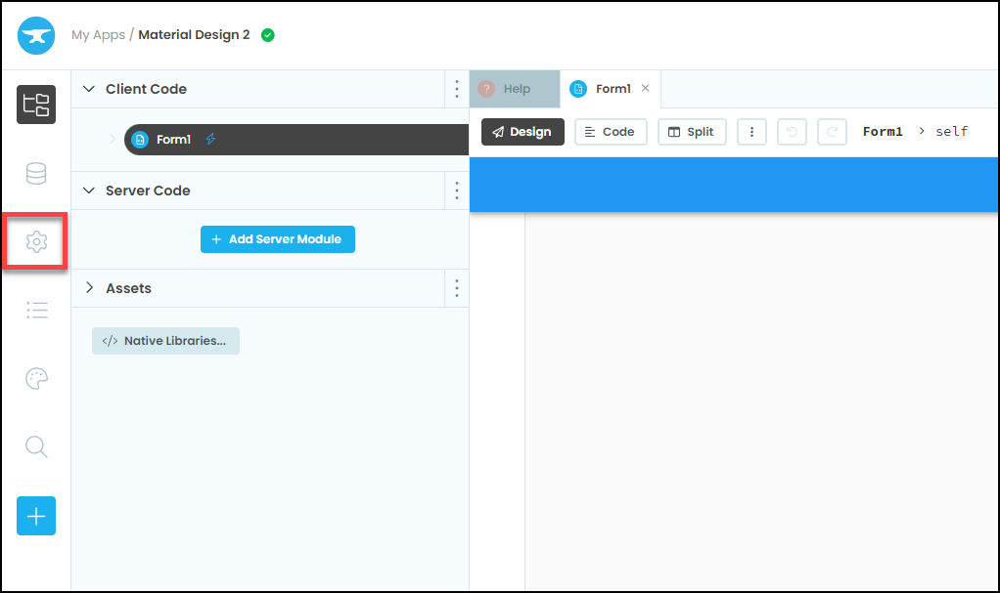
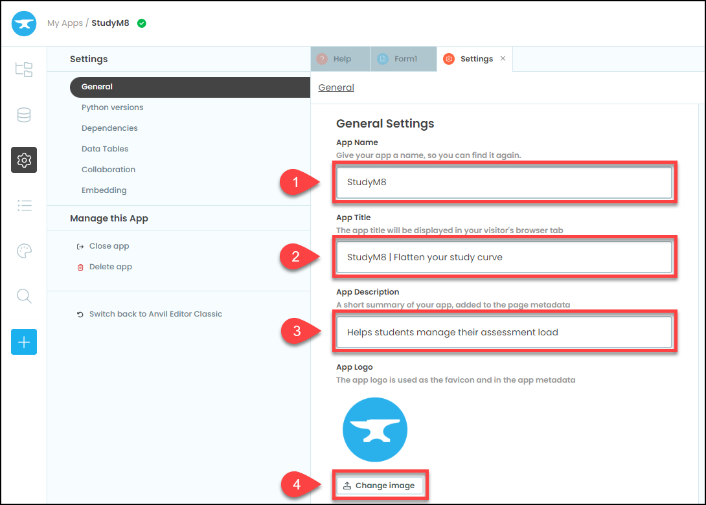
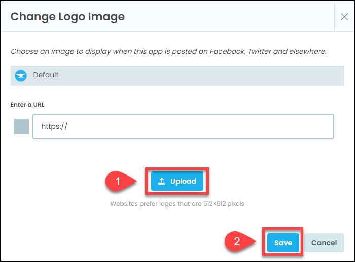
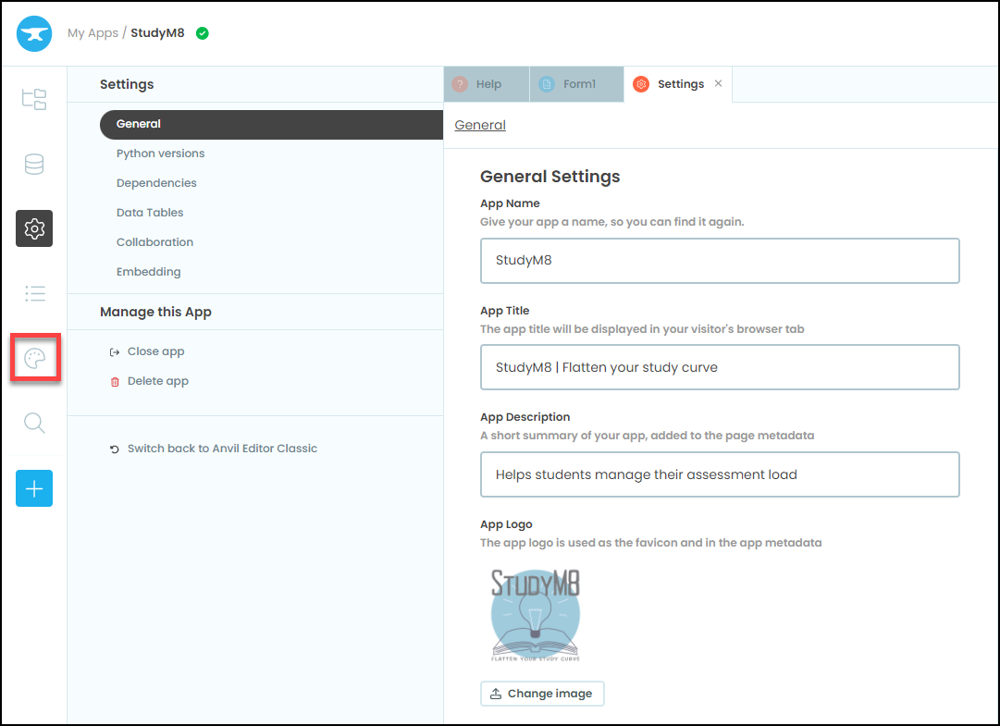
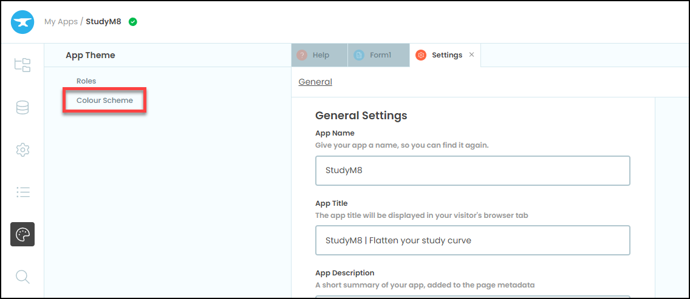
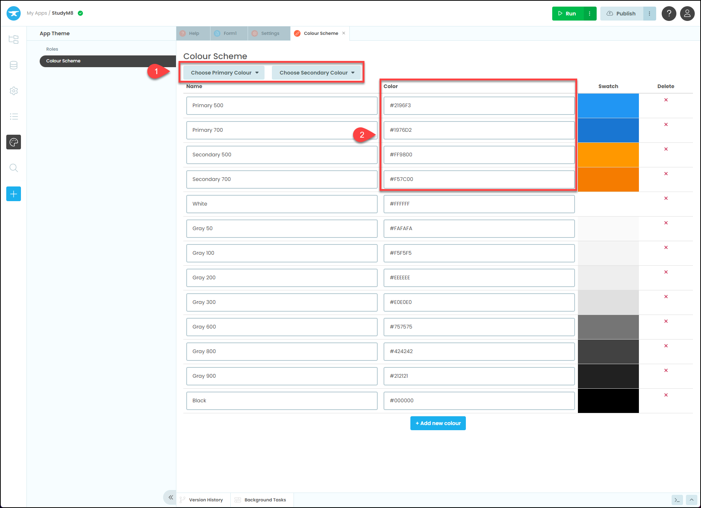

# Create new app

```{topic} In this tutorial you will:
- 
```

Now that we have planned our app, it is time to create. First you need to log into **<a href="https://anvil.works/build" target="_blank">Anvil</a>**.

You will be presented with a choice between **Create a new app** and **...or start from a template**. We want to create a new app.



## Choose Theme

You will then be asked to choose a theme. These tutorials will be using Material Design, but you can use Material Design 3 since they are structurally rthe same. Check the exmaples below to decide (don't worry about the colours, you can change them latter).



### Material Design example



### Material Design 3 example



Once you have chosen your template, you will be taken to the Anvil interface. We'll explore the interface in the next tutorial. Before we do, we are just going to adjust a few things on our new app.

## Rename App

First we will rename the app. To do this go to settings by clicking the cog icon in the left hand side menu.



Fill out the details is steps 1-3 below and then click on the **Change image** button.



Right mouse click on the image of the logo below and save it to your computer.


Click on the **Upload** button, select the logo.png file you just downloaded, then click **Save**



## Colour Scheme

The last step is choosing your colour scheme. You can choose between pre-set schemes or customise your own. You can change the colour scheme at any time.

Click on the colour pallet icon in the left hand side menu to enter the **App Theme** menu.



Then choose **Colour Scheme**



The options avaiable to your will depend if you have chosen **Material Design** or **Material Design 3**. Eitheway, you will be able to:

1. Choose from some preset options
2. Edit the individual **<a href="https://htmlcolorcodes.com/" target="_blank">HTML color codes</a>** for different parts of your theme.



Go ahead and choose a colour scheme.
