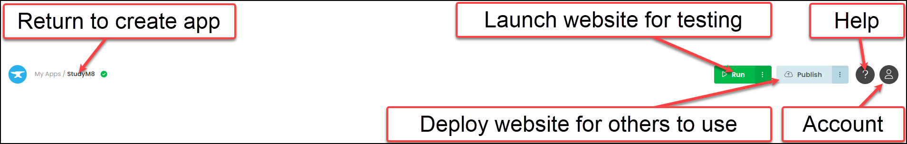
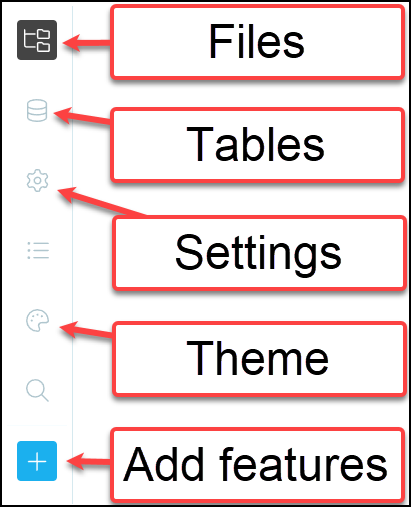
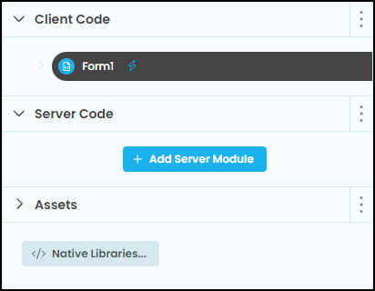
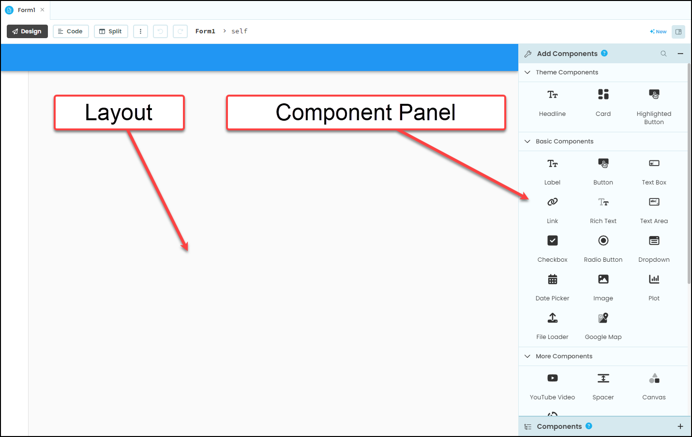
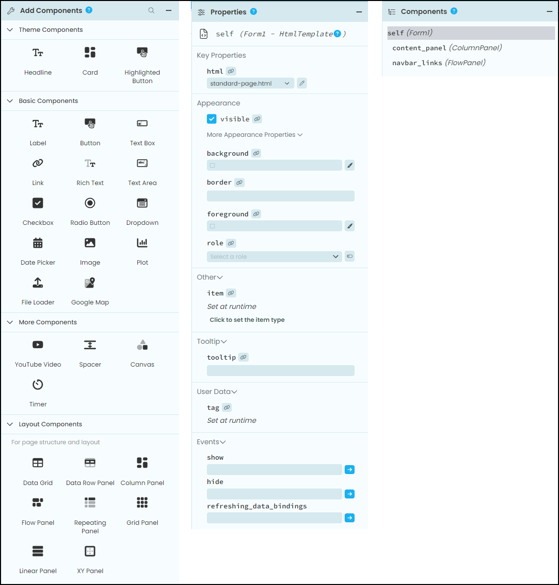
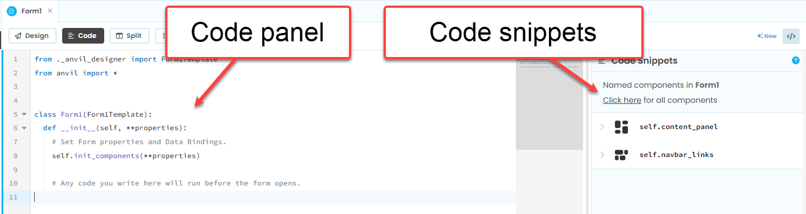
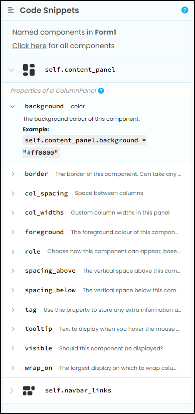
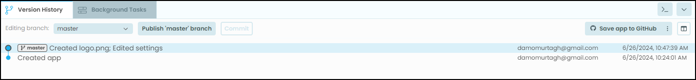

# Anvil Interface

```{topic} In this tutorial you will:
- Understand the main menu for app navigation and management.
- Explore the side menu for accessing files, tables, settings, and themes.
- Utilize the submenu, which changes based on the selected side menu option.
- Work in the workspace, including design mode (layout and components panel) and code mode (code panel and code snippets).
- Use the integrated terminal for viewing print statement outputs and error messages.
```

Lets have a look at the different parts of the Anvil interface.

The interface is made up of five different parts:

- Main menu
- Side menu
- Submenu
- Workspace
- Terminal


Lets look at each of these. along with the feature we will use

```{admonition} Viewing Instruction Images
:class: note
Anvil is a web app, which means making instruction screen capture with adequate detail was difficult. Many of the instructions will only capture one part of the Anvil interface which should provide enough detail to read. 

All screen captures on this site are actually larger than displayed. If you are find the instructions too difficult to follow, right mouse click on the image, the choose **Open image in new tab**. This will show you a larger version of the image.
```

## Main menu

The main menu allows you to:

- Return the the create app page (which also lists your other apps)
- Launch your website for testing
- Deploy your website for others to use
- Access help
- Access your account details



## Side menu

The side menu gives:

- **Files** - access the files that make up your website
- **Tables** - work with the tables that make up your backend database
- **Setting** - manage your apps meta data details
- **Theme** - work with the CSS of your website
- **Add** - include more features



## Submenu

The content of the submenu is depends on which menu is selected. For example, if the file menu is selected it will display the client and server files that make up your website (see below). We've already seen what the settings and theme submenus display.



## Workspace

The workspace is the main area where you will create your web app. What it displays, depends on which of the three modes is selected. The workspace can hold multiple files with each file residing in it's own tab.

### Design mode

To the left of the design mode you have the **layout**. This is where you add and position components to make your website. To the right you have the **components panel**.



#### Components panel

The components panel has three sections:

- Add components - click and drag components from here to add them to your layout
- Properties - edit the properties of the currently select component
- Components - lists all the components on the current layout



### Code mode

In the code mode of the workspace you will find the code panel where you write code and the code snippet panel where you can see the code hooks for the components.



#### Code snippets

The code snippets panel list all the name components, their properties and those properties current values.



## Terminal

The integrated terminal displays a range of output that normally occur in website development. It will display two types of outputs you are interested in:

- output from print statements
- error messages

