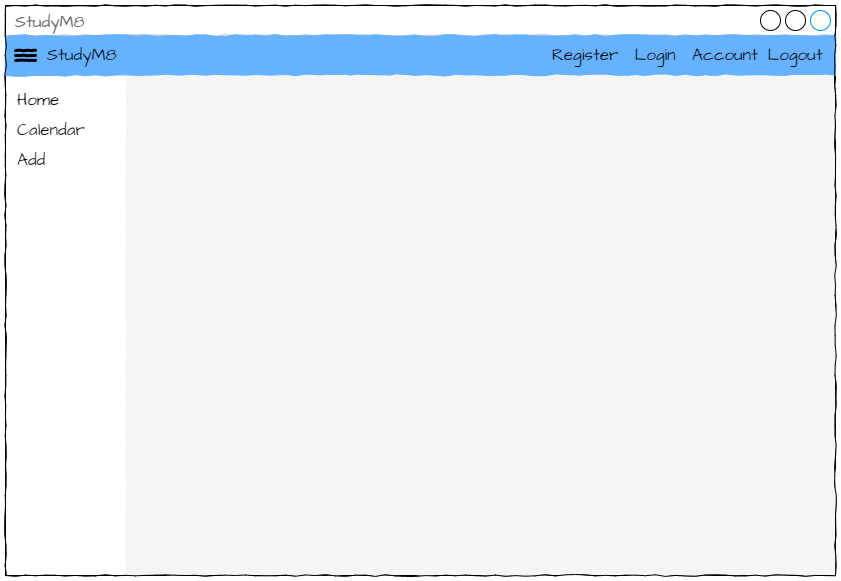
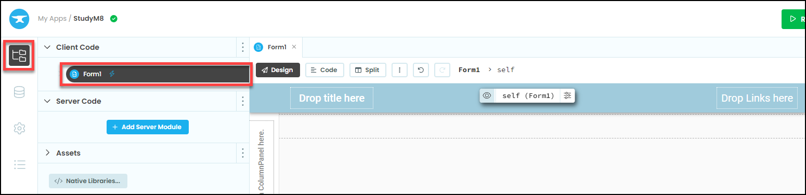
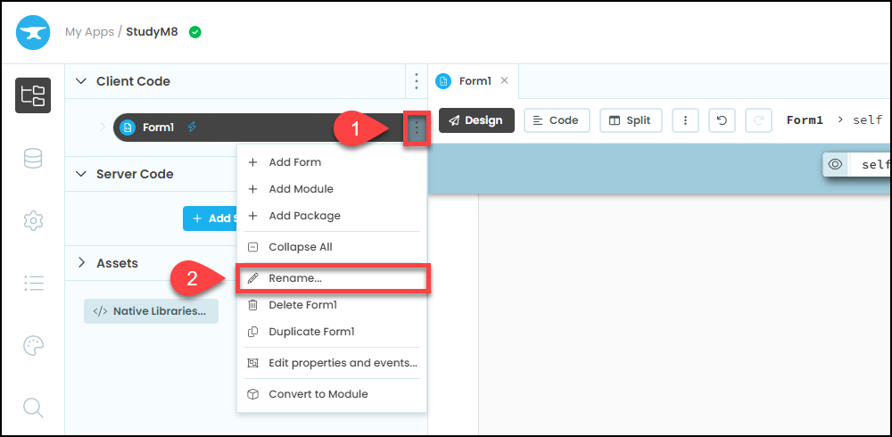
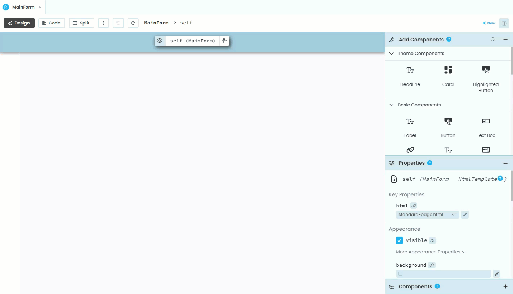
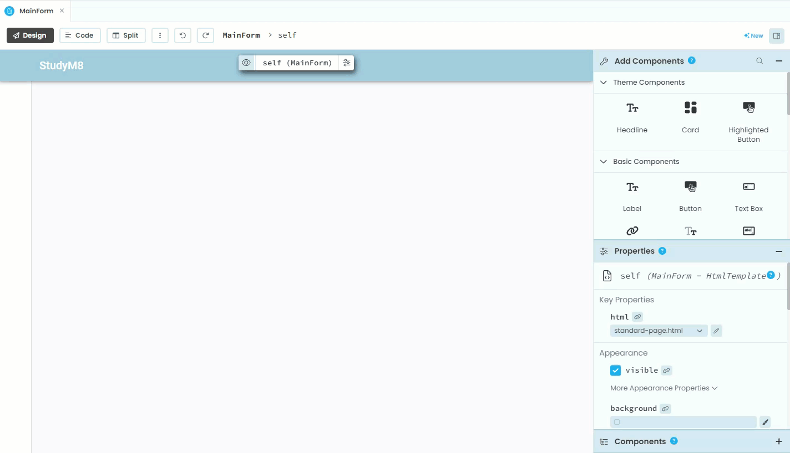
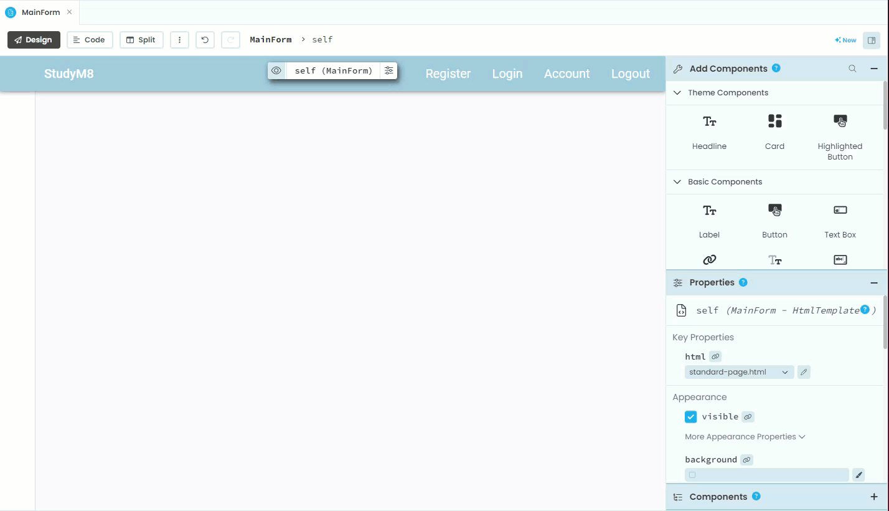
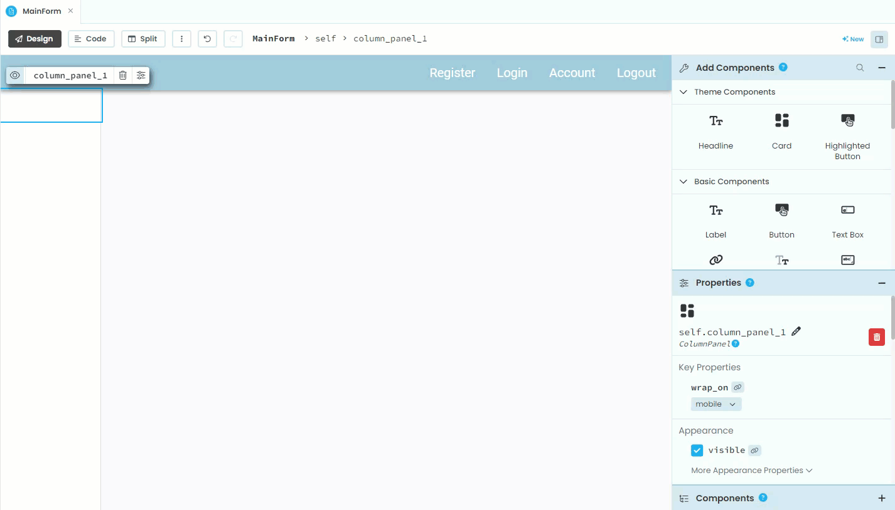
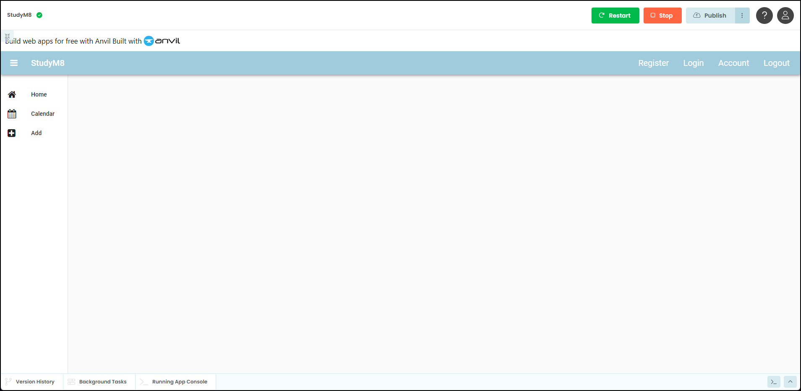

# Create the Main Form

```{topic} In this tutorial you will:
- Learn about Single-Page Applications and why they are used
- Create the main form of a Single-Page Application
```

Almost time to start making our website, but before we do, there is one last concept we need to understand.

Looking at our **[wireframes](./03_studyM8_design.md)** you will notice that they all look very similar. The top bar, and the side menu all look the same, it is only the main content in the grey centre panel that changes. As the user navigatges from one page to another, we could just send the entire page's data each time, but this is extremely inefficient.

In our frontend backend diagram, it is the communitication over the internet between frontend and backend (the lightening bolt) that is the slowest.


This means it is faster to minimise the amount of data being transferred. When changing from the Home page to the Calendar page, why send the side menu data when it is already on the user's computer. This is where Single-Page Applications come in.

## Single-Page Applications

A Single-Page Application doesn't reload every time the user navigates to a new page, but rather, it only loads the parts of the website that change. This approach results in a smoother, faster user experience similar to that of a desktop application.

How does it work? Intially a **main form** is loaded containing the content that remains constant. Then  different components or views are swapped in and out based on user interactions, this is called **dynamic loading**.

In our design our main form would look something like this:



The parts that get dynamically loaded are called **components**, but we'll deal with those in the next tutorial. For now, lets create our main form.

## The MainForm

Anvil already has the start of your MainForm openned for you. If you cannot see it go:

- **Files** in the side menu
- **Form1** in the submenu



### Rename Form1

Form1 is a poor name for this file. So we will remane it to `MainForm` (check your spelling and capitalisation).

```{admonition} Naming Conventions
:class: note
We are now making quite complex applications. The finished app will consist of 11 different files, and over 50 componets. All of these are named and some of the names are very similar. Therefore it is important to use naming conventions.

Naming conventions include information that makes it easier to remember what the component is. For example, all links will start with the word `link`, all web components will be in camel case and have the word component appended to the end (eg. `CalendarComponent`)

It seems like extra work, but it makes things easier by reducing your coignative load.
```

Click in the **elipses** (three dots) then **rename**. Type `MainForm` then press enter.



### Add Title

To add the top left **StudyM8** title you need to:

1. In the **Add Component** section, click on **Label**.
2. Then, in the MainForm's menu bar, click on the **Drop title here** box.
3. Go to the **Properties** section and in the **text** box add `StudyM8`.
4. Still in the **Properties** section, rename the label to `label_title`.



### Menu Bar Links

To add the **Register** link to the menu bar:

1. In the **Add Component** section, find and click on **Link**.
2. Then, in the MainForm's menu bar, click on the **Drop links here** box.
3. Go to the **Properties** section and in the **text** box add `Register`.
4. Still in the **Properties** section, rename the link to `link_register`.



Repeat these steps for the other links:

- **Login** - named `link_login`
- **Account** - named `link_account`
- **Logout** - named `link_logout`

### Side Bar

If you look at the sidebar you will see the message **To add a side bar drop a ColumnPanel here**. Since we want a sidebar, we better drop a ColumnPanel there.

To create the side bar:

1. In the **Add Component** section, find and click on **ColumnPanel** (it's under Layout Components).
2. Click on the message in the sidebar section.
3. Since our code is not going to interact with this component, we don't have to rename it.



### Side Bar Links

Now to add the side bar links starting with **Home**:

1. In the **Add Component** section, find and click on **Link**.
2. Click on the ColumnPanel in the side bar.
3. Go to the **Properties** section and in the **text** box add `Home`.
4. Still in the **Properties** section, rename the link to `link_home`.
5. In the **Properties** section find the **Icon** option and type `home` then click and choose the **fa:home** icon



Repeat these steps for the other two links:

- **Calendar**
  - name: link_calendar
  - icon: fa:calendar
- **Add**
  - name: link_add
  - icon: fa:plus-square

## Testing

The layout of your MainForm is now complete. Click the green **Run** button and have a look at the design. It should look the same as below (except for colours).



Click on the red **Stop** button when you have finished.