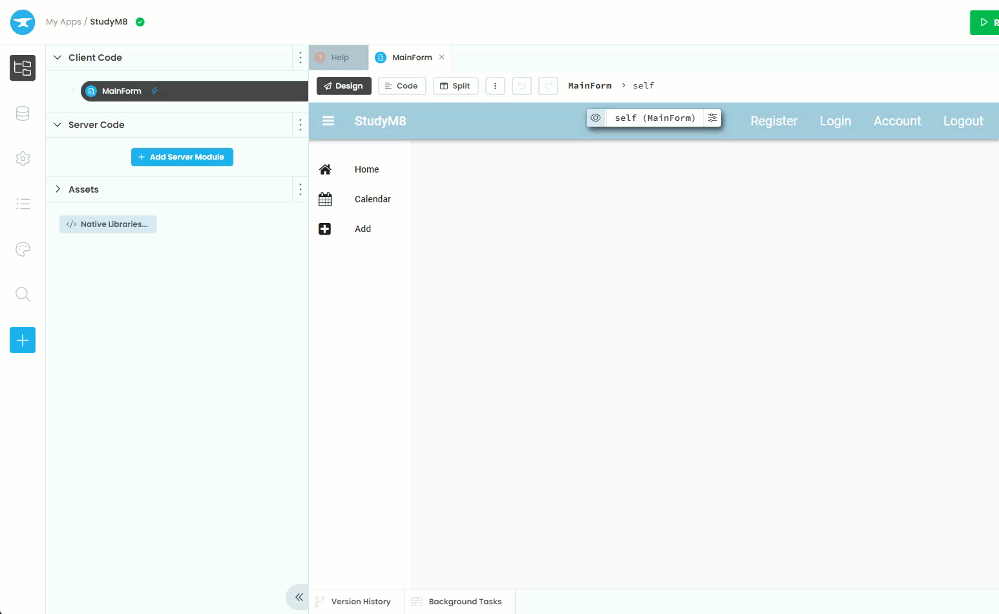
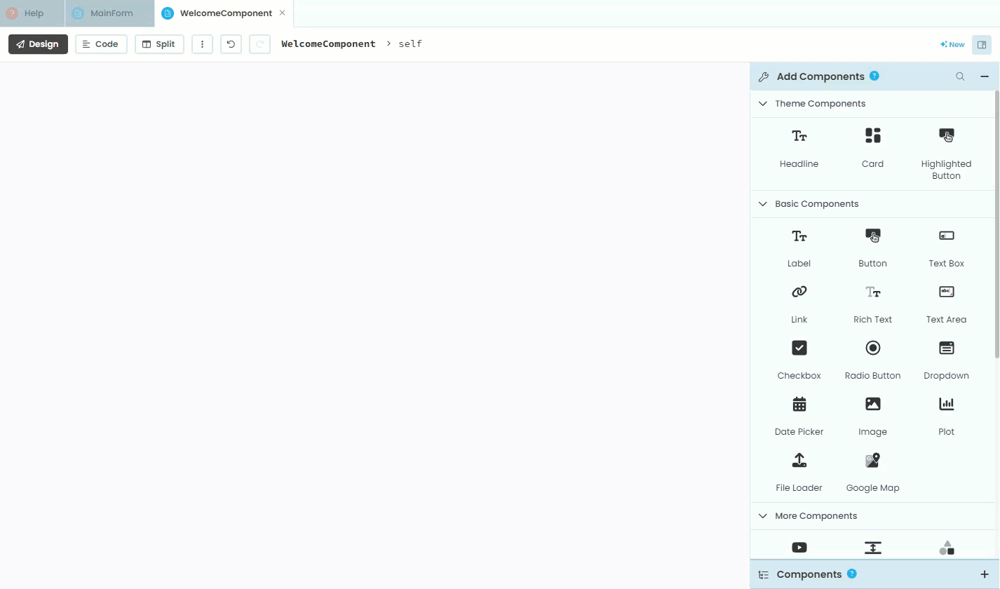
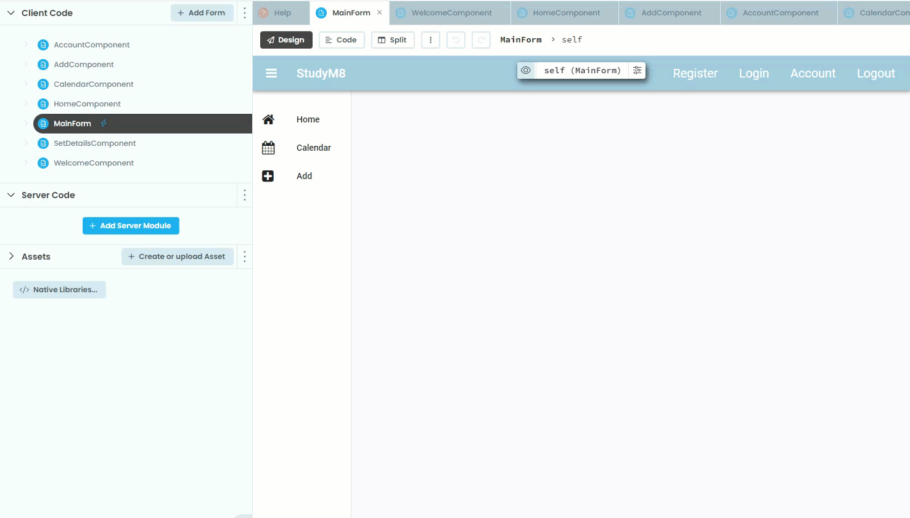

# Adding Components

```{topic} In this tutorial you will:
- Learn how to create the dynamically loaded components of a Single-Page Application
```

We now need to create all the components that will be dynamically loaded into the MainForm. Looking at our **[design](./03_studyM8_design.md)**, although we have seven pages, we only need six components, since the Edit Page is just a modified Home Page.

The six components we need to make are:

- **WelcomeComponent** for the Welcome Page
- **HomeComponent** for the Home Page
- **CalendarComponent** for the Calendar Page
- **AddComponent** for the Add Page
- **AccountComponent** for the Account Page
- **SetDetailsComponent** for the Set Details Page

First we'll work through creating the **WelcomeComponent**, then you can use the same process for creating the other five components.

## Creating the WelcomeComponent

### Add new form

First your will need to add a new form to the website. To do this:

1. In the File submenu, click on the **Client Code** elipses
2. Choose **Add form**
3. Choose **Blank Panel**
4. Rename the form to **WelcomeComponent**



### Add a title

We will gradually add the differnt elements to these components. In the meanwhile we will add a title to each component so we can distinguish between them.

To add a title:

1. In the **Add Components** click on **Headline**
2. Click at the top of the WelcomeComponent
3. In **Properties** change the **Text** to `Welcome`
4. Scroll down to **align** and choose **center**



You have now added your first component.

## Create other components

Follow the same steps to create the remaining components, choosing appropriate titles:

- **HomeComponent** for the Home Page
- **CalendarComponent** for the Calendar Page
- **AddComponent** for the Add Page
- **AccountComponent** for the Account Page
- **SetDetailsComponent** for the Set Details Page

## Check your work

You should now have seven files in your file submenu:

- **AccountComponent**
- **AddComponent**
- **CalendarComponent**
- **HomeComponent**
- **MainForm**
- **SetDetailsComponent**
- **WelcomeComponent**

They should look similar to the following:


