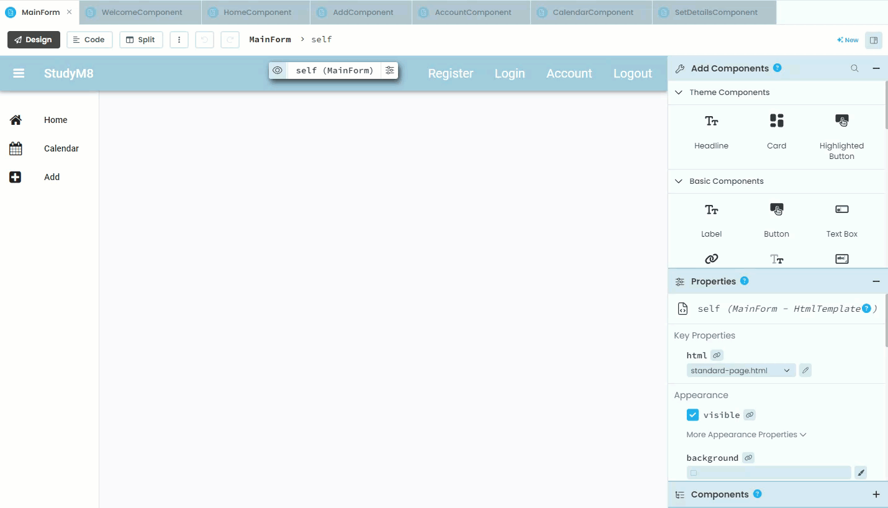
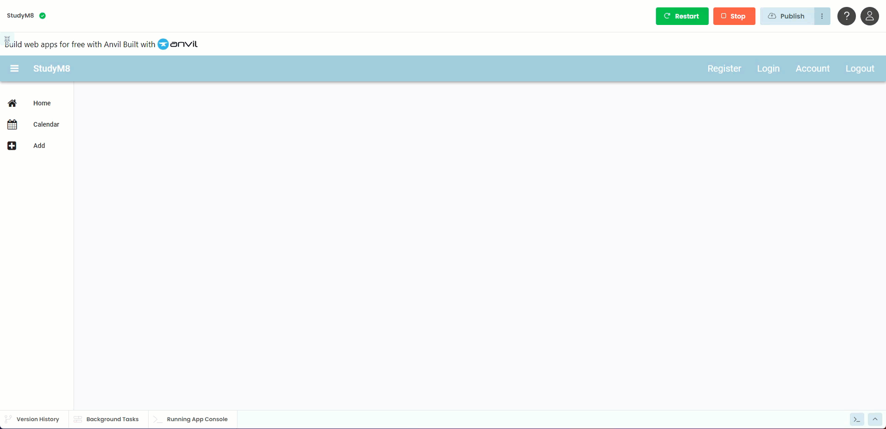
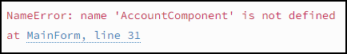
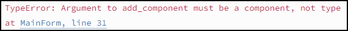

# Connecting links

```{topic} In this tutorial you will:
- 
```

We now need to connect the links on our MainForm to the components we just created. The will use code to make these connections. We need create a handler for each link that loads it's respective component.

```{admonition} Event Driven Program
:class: note
Event-driven programming is where a computer program runs based on specific actions (clicks, key presses, or messages from other programs). The program reacts to these events as they happen. The code that detects the event is said to **listen** for the event, then it calls a **handler** to react to the event.
```

To simplfy the process, we are only going to connect four of the components:

- HomeComponent
- CalendarComponent
- AddComponent
- AccountComponent

We will work throught connecting the HomeComponent link, then you can repeat the steps for the other three links.

## Connecting HomeComponent

To do this we need to open the MainForm file in the **design** mode.

### Create handler

To create the handler

1. Select the **Home** link on the layout
2. In the pop-up menu, click **on click event &rarr;**
3. This will add a handler to the code and open the workspace into the **split** mode. 
4. For easier coding, choose the **Code** mode.



### Handle click event

The `link_home_click` method is our Home link handler. 

```{code-block} python
:linenos:
:lineno-start: 12
:emphasize-lines: 2-3
  def link_home_click(self, **event_args):
    """This method is called when the link is clicked"""
    pass
```

#### Import component

Before we work on the handler, we first must `import` the `HomeComponent` into this code.

Add the highlighted line to the import statements at the top of the code.

```{code-block} python
:linenos:
:emphasize-lines: 3
from ._anvil_designer import MainFormTemplate
from anvil import *
from ..HomeComponent import HomeComponent
```

#### Edit handler

We replace the `pass` with the code that we want to run when the Home link is clicked. To start, we will delete the unhelpful comment and the `pass` statement on lines 14 & 15.

```{code-block} python
:linenos:
:lineno-start: 13
  def link_home_click(self, **event_args):
    
```

Now you need to add the highlighted two lines of code:

```{code-block} python
:linenos:
:lineno-start: 13
:emphasize-lines: 2-3
  def link_home_click(self, **event_args):
    self.content_panel.clear()
    self.content_panel.add_component(HomeComponent())
```

Code Explaination:

- **line 14**:
  - `self` &rarr; refers to this form, ie. **HomeForm**.
  - `content_panel` &rarr; refers to the component in the HomeForm layout into which the components will be dynamically loaded.
  - `clear()` &rarr; will remove the current component from the **content_panel** making it available for the **HomeComponent**.
- **line 15**:
  - `self` &rarr; refers to this form, ie. **HomeForm**.
  - `content_panel` &rarr; refers to the component in the HomeForm layout into which the components will be dynamically loaded.
  - `add_component(HomeComponent())` &rarr; will load the **HomeComponent** into the **content_panel**

### Test

Check that the links works:

1. Click on the green **Run** button
2. When the site load, click on the **Home** link
3. The Home title of your HomeComponent should appear on the screen.


## Other Components

Now repeat the above process for the:

- CalendarComponent
- AddComponent
- AccountComponent

## Final Test

Once you have added handlers for the above three links, run your website and check:

- All four links load the correct components.
- The other links (Register, Login and Logout) do nothing.



## Common Errors

Below are some the errors that you might have and what causes them.

### NameError



This could mean that you failed to import the component (in this example `AccountComponent`) at the top of the page.

### TypeError



This could mean that your missed the `()` after the component (in this example `AccountComponent`) in the `add_component` statement.

## Final code state

By the end of this tutorial your code should be as below:

### MainForm

```{code-block} python
:linenos:
from ._anvil_designer import MainFormTemplate
from anvil import *
from ..HomeComponent import HomeComponent
from ..CalendarComponent import CalendarComponent
from ..AddComponent import AddComponent
from ..AccountComponent import AccountComponent


class MainForm(MainFormTemplate):
  def __init__(self, **properties):
    # Set Form properties and Data Bindings.
    self.init_components(**properties)

    # Any code you write here will run before the form opens.

  def link_home_click(self, **event_args):
    self.content_panel.clear()
    self.content_panel.add_component(HomeComponent())

  def link_calendar_click(self, **event_args):
    self.content_panel.clear()
    self.content_panel.add_component(CalendarComponent())

  def link_add_click(self, **event_args):
    self.content_panel.clear()
    self.content_panel.add_component(AddComponent())

  def link_account_click(self, **event_args):
    """This method is called when the link is clicked"""
    self.content_panel.clear()
    self.content_panel.add_component(AccountComponent())
```