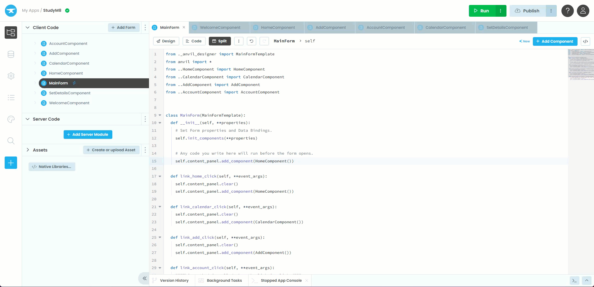
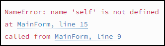

# Set the Initial Component

```{topic} In this tutorial you will:
- Learn how to run code when forms are loaded
```

When you tested your website in the last tutorial, did you notice that, at first, there was no component loaded on the MainForm. This isn't a good look. So, in this tutorial, we will make the **MainForm** automatically load the **HomeComponent** as soon as it starts.

## Running code upon loading

This is much easier than if first seems. If you look at the **MainForm** code you will notice a comment on line 14.

```{code-block} python
:linenos:
:lineno-start: 10
:emphasize-lines: 5
  def __init__(self, **properties):
    # Set Form properties and Data Bindings.
    self.init_components(**properties)

    # Any code you write here will run before the form opens.
```

It does exactly what is says. In order to make code run as soon as the form loads, we just bneed to add it to the `__init__` after that comment.

## Loading HomeComponent

So what code do we need to add? Well, you have already written code that loads the HomeComponent into the MainForm. Check line 18 below.

```{code-block} python
:linenos:
:lineno-start: 16
:emphasize-lines: 3
  def link_home_click(self, **event_args):
    self.content_panel.clear()
    self.content_panel.add_component(HomeComponent())
```

So it would make sense to simply copy that line and paste it under line 14. So the `__init__` will now lokk like:

```{code-block} python
:linenos:
:lineno-start: 10
:emphasize-lines: 6
  def __init__(self, **properties):
    # Set Form properties and Data Bindings.
    self.init_components(**properties)

    # Any code you write here will run before the form opens.
    self.content_panel.add_component(HomeComponent())
```

## Testing

**Run** your website and the HomeComponent should show up straight away.



## Common Errors

### NameError



This might mean that when you pasted the `add_component` line, the indentation was incorrect. Make sure that it lines up the the comment on the line above.

## Final code state

By the end of this tutorial your code should be the same as below:

### Final MainForm

```{code-block} python
:linenos:
from ._anvil_designer import MainFormTemplate
from anvil import *
from ..HomeComponent import HomeComponent
from ..CalendarComponent import CalendarComponent
from ..AddComponent import AddComponent
from ..AccountComponent import AccountComponent


class MainForm(MainFormTemplate):
  def __init__(self, **properties):
    # Set Form properties and Data Bindings.
    self.init_components(**properties)

    # Any code you write here will run before the form opens.
  self.content_panel.add_component(HomeComponent())

  def link_home_click(self, **event_args):
    self.content_panel.clear()
    self.content_panel.add_component(HomeComponent())

  def link_calendar_click(self, **event_args):
    self.content_panel.clear()
    self.content_panel.add_component(CalendarComponent())

  def link_add_click(self, **event_args):
    self.content_panel.clear()
    self.content_panel.add_component(AddComponent())

  def link_account_click(self, **event_args):
    """This method is called when the link is clicked"""
    self.content_panel.clear()
    self.content_panel.add_component(AccountComponent())
```