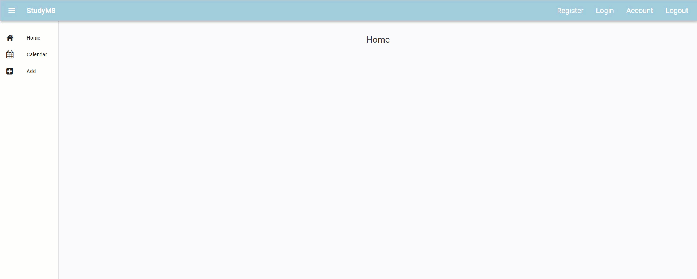

# Adjust Page Title

```{topic} In this tutorial you will:
- Learn how to dynamically interact with the layout components
```

In this tutorial we are going to change the MainForm title into a **breadcrumb**.

```{admonition} Website Breadcrumbs
:class: note
Breadcrumbs are a web design elements used for navigation. They typically display a horizontal list near the top of a page showing the path from the homepage to the current page, with each section separated by a symbol.
```

## Planning

To acheive this, we want the MainForm title to display the following text for each component (at this stage we will only focus on the compontents we have linked):

- HomeComponent &rarr; **StudyM8**
- CalendarComponent &rarr; **StudyM8 - Calendar**
- AddComponent &rarr; **StudyM8 - Add**
- AccountComponent &rarr; **StudyM8 - Account**

### Breadcrumb stub

Whilst we could simple change the title to the above text, we're going to do something a bit tricky. Notice that each breadcrumb starts with **StudyM8**? This is the text we typed into the title label. Rather than hardcoding **StudyM8** into the program, we will take the text value from the title, and then add whatever text is needed.

This approach has an added advantage. If we decide to change the title text on the MainForm layout, this change will flow through the rest of the website. The text of the title becomes our **single point of truth** for the start of our breadcrumb.

```{admonition} Single Point of Truth
:class: note
The concept of a single point of truth (SPOT), also known as a single source of truth (SSOT), in programming refers to the practice of storing a particular piece of information in only one place within a system. This principle ensures that data is centralized and consistent across the application, minimizing the risk of discrepancies and redundancy. 

By having a single authoritative source for data, any changes or updates to the information are made in one place, ensuring that all parts of the system have access to the most current and accurate data. This approach simplifies maintenance, improves data integrity, and reduces the complexity of data management.
```

## The Code

### Determine the stem

Open the MainForm in code mode. The first thing we need to do is store the value for the breadcrumb stem. We will do that in the `__init__`.

```{code-block} python
:linenos:
:lineno-start: 10
:emphasize-lines: 2
  def __init__(self, **properties):
    # Set Form properties and Data Bindings.
    self.init_components(**properties)
```

Check the comment on line 11. The breadcrumb stem will be a Form property, so it should go into this section of the code. Add the highlighted code.

```{code-block} python
:linenos:
:lineno-start: 10
:emphasize-lines: 4
  def __init__(self, **properties):
    # Set Form properties and Data Bindings.
    self.init_components(**properties)
    self.breadcrumb_stem = self.label_title.text
```

```{admonition} Code explaination
:class: notice
- **line 13**:
  - `self.label_title.text` &rarr; take the current text value of the lable_title on this form (MainForm)
  - `self.breadcrumb_stem =` &rarr; store it in the breadcrumb_stem variable
```

### Change the title

We now need to change the title for each component. The event that will trigger this action will be link clicking. Luckily we already have event handlers for this, so we can simply add our code to these event handlers.

#### HomeComponent

Lets start with the **HomeComponent**. We need to return the title text back to the breadcrumb stem. This is important for when users return to the Home page from another page.

Adjust the `link_home_click` handler by adding the highlighted code below:

```{code-block} python
:linenos:
:lineno-start: 18
:emphasize-lines: 4
  def link_home_click(self, **event_args):
    self.content_panel.clear()
    self.content_panel.add_component(HomeComponent())
    self.label_title.text = self.breadcrumb_stem
```

```{admonition} Code explaination
:class: notice
- **line 21**:
  - `self.breadcrumb_stem` &rarr; take the value in the breadcrumb_stem variable
  - `self.label_title.text =` &rarr; write it to the label_title
```

#### Other components

Next we will do the CalendarComponent. Go to the `link_calendar_click` handler and add the highlighted code:

```{code-block} python
:linenos:
:lineno-start: 18
:emphasize-lines: 4
  def link_calendar_click(self, **event_args):
    self.content_panel.clear()
    self.content_panel.add_component(CalendarComponent())
    self.label_title.text = self.breadcrumb_stem + " - Calendar"
```

```{admonition} Code explaination
:class: notice
- **line 21**:
  - `self.breadcrumb_stem` &rarr; take the value in the breadcrumb_stem variable
  - `+ " - Calendar"` &rarr; add **- Calendar** to the end of it
  - `self.label_title.text =` &rarr; write it to the label_title
```

The breadcrumb for both AddComponent and AccountComponent are the same process, so go ahead and make the changes.

## Testing

Now launch your website and check that your breadcrumb changes when each component is loaded.



## Final code state

By the end of this tutorial your code should be the same as below:

### MainForm

```{code-block} python
:linenos:
from ._anvil_designer import MainFormTemplate
from anvil import *
from ..HomeComponent import HomeComponent
from ..CalendarComponent import CalendarComponent
from ..AddComponent import AddComponent
from ..AccountComponent import AccountComponent


class MainForm(MainFormTemplate):
  def __init__(self, **properties):
    # Set Form properties and Data Bindings.
    self.init_components(**properties)
    self.breadcrumb_stem = self.label_title.text

    # Any code you write here will run before the form opens.
    self.content_panel.add_component(HomeComponent())

  def link_home_click(self, **event_args):
    self.content_panel.clear()
    self.content_panel.add_component(HomeComponent())
    self.label_title.text = self.breadcrumb_stem

  def link_calendar_click(self, **event_args):
    self.content_panel.clear()
    self.content_panel.add_component(CalendarComponent())
    self.label_title.text = self.breadcrumb_stem + " - Calendar"

  def link_add_click(self, **event_args):
    self.content_panel.clear()
    self.content_panel.add_component(AddComponent())
    self.label_title.text = self.breadcrumb_stem + " - Add"

  def link_account_click(self, **event_args):
    """This method is called when the link is clicked"""
    self.content_panel.clear()
    self.content_panel.add_component(AccountComponent())
    self.label_title.text = self.breadcrumb_stem + " - Account"
```