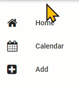
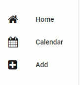
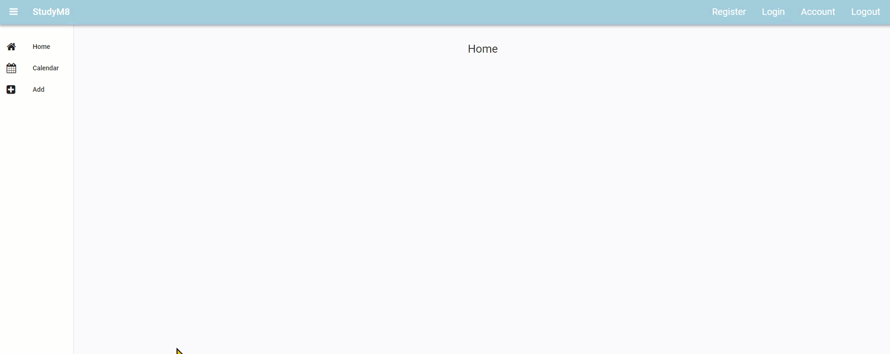
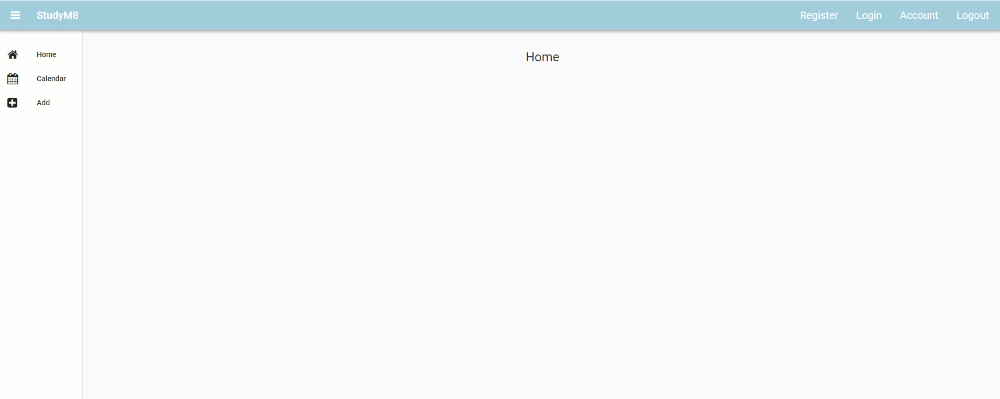
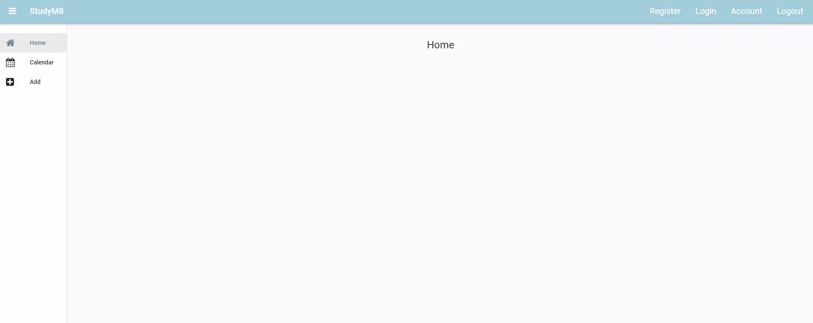

# Show Active Link

```{topic} In this tutorial you will:
- Learning how to dymnaically change the role of layout components
```

In Material Design, we show active links to enhance the user experience and navigation. Highlighting active links provides users with a visual feedback indicating their current location within the website or application, offering a sense of context and orientation. Our website does not use active links, an issue that we will address in this tutorial.

## Changing link's roles

In Anvil, links can have a **selected role**. This changes the formatting of the link to differentiate it from non-selected links. It is the fomatting that is uses when the mouse cursor moves over a link.



```{admonition} Roles
:class: note
In Anvil, roles are used to apply specific CSS classes to components, allowing for customized styling and behavior. This makes it easy to target and style components using CSS, ensuring a consistent and manageable way to apply custom designs across your application
```

We want to use the **selected role** on the Home, Calendar and Add links, but only when their components are loaded. Each link has a property called `role`, so we need to set this value accordingly.

### Role values for given state

To achieve this we are going to change the links role values according to the **state** of the website.

```{admonition} State Machine
:class: note
A state machine is a way to design programs by breaking it down into different conditions called states. Each state represents a specific situation the program can be in. The program can switch from one state to another based on inputs or events. These switches are called transitions. 

A state machine makes it easier to manage complex behaviors by clearly defining what the system should do in each state and how it moves between states.
```

#### Link State Logic table

| State | link_home.role | link_calendar.role | link_add.role |
| :--- | :---: | :---: | :---: |
| HomeComponent loaded | selected | None | None |
| CalendarComponent loaded | None | selected | None |
| AddComponent loaded | None | None | selected |
| AccountComponent loaded | None | None | None |

## Code

The events that will change the website's state are the clicking of links, so we could put the code in the event handlers. But that will require changing the link_home, link_calendar and link_add roles in each of the event handlers. This repetition of code violates the **DRY principle**.

```{admonition} DRY principle
:class: note
The DRY (Don't Repeat Yourself) principle in programming means that you should avoid writing the same code more than once. Instead, you write your code in a way that lets you use it in multiple places without copying and pasting it. This makes your code cleaner, easier to understand, and easier to change. If you need to update something, you only have to do it in one place, and it will automatically update everywhere else it's used.
```

Instead we will create a seperate method that get called by each handler. When the handler calls the method, it will need to pass the state of the website.

Open the MainForm in code mode.

Lets place this method after the `__init__` and before the link handlers, also add a structure comment identifying the link handlers.

```{code-block} python
:linenos:
:lineno-start: 18
:emphasize-lines: 1,2, 4
  def set_active_link(self, state):
    pass
  
  # --- link handlers
  def link_home_click(self, **event_args):
```

```{admonition} Code explaination
:class: notice
- **line 18**:
  - `def set_active_link` &rarr; names the new method **set_active_link**
  - `self` &rarr; makes the method callable from within MainForm
  - `state` &rarr; expects the state of the website to be passed when called (this will be a string)
- **line 19**:
  - `pass` &rarr; a placeholder that get replaced with our code.
- **line 21**:
  - `# --- link handlers` &rarr; structural comment to help organise the code.
```

Now we will add the logic, which will be three `if` statements, one for each of the links. These `if` statements will follow the logic in our table above. We will identify the state of the machine by passing the following strings:

- HomeComponent &rarr; `"home"`
- CalendarComponent &rarr; `"calendar"`
- AddComponent &rarr; `"add"`
- AccountComponent &rarr; `"account"`

### Home link

First we'll do the home link.

```{code-block} python
:linenos:
:lineno-start: 18
:emphasize-lines: 2-5
  def set_active_link(self, state):
    if state == "home":
      self.link_home.role = "selected"
    else:
      self.link_home.role = None
```

```{admonition} Code explaination
:class: notice
- **line 19**:
  - `if state == "home":` &rarr; checks to see if **"home"** was passed as the state.
- **line 20** (only executed if state is **"home"**):
  - `self.link_home.role = "selected"` &rarr; changes the role (formatting) of home link to **selected**
- **line 22** (executed if the state is anything other than **"home"**)
  - `self.link_home.role = None` &rarr; changes the role (formatting) of home link back to the deselected (**None**)
```

Now we need to call `set_active_link` from the `link_home_click` event handler.

```{code-block} python
:linenos:
:lineno-start: 33
:emphasize-lines: 5
  def link_home_click(self, **event_args):
    self.content_panel.clear()
    self.content_panel.add_component(HomeComponent())
    self.label_title.text = self.breadcrumb_stem
    self.set_active_link("home")
```

```{admonition} Code explaination
:class: notice
- **line 37**:
  - `self.set_active_link("home")` &rarr; call the **set_active_link** method and pass the state **"home"**
```

### Test home link

Launch your website and check if the Home link remains lighlighted once you click it.



### Calendar and Add links

Now your turn. Do the same for the **Calendar** link and **Add** link. Below is what your test should look like.



Notice that clicking on the Account link didn't deselect the other link? Lets fix that

### Account link

The Account link is a little different to the others. We don't want to set it to selected, just deselect the other links. Look at the **set_active_link** method, the code is designed that if the link's state is not passed, it will be deselected. So we can pass a state of **"account"** and all links will be deselected.

So, in the **link_account_click** handler call the **set_active_link** method and pass **"account"** as the state.

Now launch your website and check if the account link deselects the other links.



### Initial Component

In the lastest test you can notice that the **Home** link is not selected when the website launches. This is a simple fix.

Go to the `__init__` and add a call to **set_active_link** just after you add the **HomeComponent**.

## Testing

Test your website. Check that the Home link is selected when it load. then click on all four links we have worked on:

- Home
- Calendar
- Add
- Account

Did they all act as expected?



## Final code state

By the end of this tutorial your code should be the same as below:

### Final MainForm

```{code-block} python
:linenos:
from ._anvil_designer import MainFormTemplate
from anvil import *
from ..HomeComponent import HomeComponent
from ..CalendarComponent import CalendarComponent
from ..AddComponent import AddComponent
from ..AccountComponent import AccountComponent


class MainForm(MainFormTemplate):
  def __init__(self, **properties):
    # Set Form properties and Data Bindings.
    self.init_components(**properties)
    self.breadcrumb_stem = self.label_title.text

    # Any code you write here will run before the form opens.
    self.content_panel.add_component(HomeComponent())
    self.set_active_link("home")

  def set_active_link(self, state):
    if state == "home":
      self.link_home.role = "selected"
    else:
      self.link_home.role = None
    if state == "add":
      self.link_add.role = "selected"
    else:
      self.link_add.role = None
    if state == "calendar":
      self.link_calendar.role = "selected"
    else:
      self.link_calendar.role = None
  
  # --- link handlers
  def link_home_click(self, **event_args):
    self.content_panel.clear()
    self.content_panel.add_component(HomeComponent())
    self.label_title.text = self.breadcrumb_stem
    self.set_active_link("home")

  def link_calendar_click(self, **event_args):
    self.content_panel.clear()
    self.content_panel.add_component(CalendarComponent())
    self.label_title.text = self.breadcrumb_stem + " - Calendar"
    self.set_active_link("calendar")

  def link_add_click(self, **event_args):
    self.content_panel.clear()
    self.content_panel.add_component(AddComponent())
    self.label_title.text = self.breadcrumb_stem + " - Add"
    self.set_active_link("add")

  def link_account_click(self, **event_args):
    """This method is called when the link is clicked"""
    self.content_panel.clear()
    self.content_panel.add_component(AccountComponent())
    self.label_title.text = self.breadcrumb_stem + " - Account"
    self.set_active_link(("account"))
```
