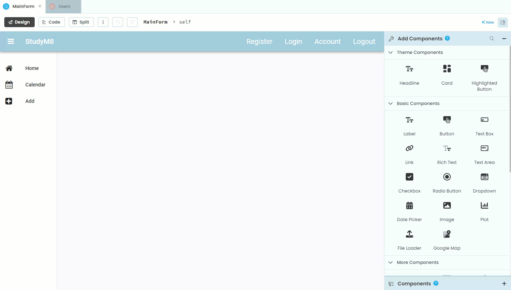
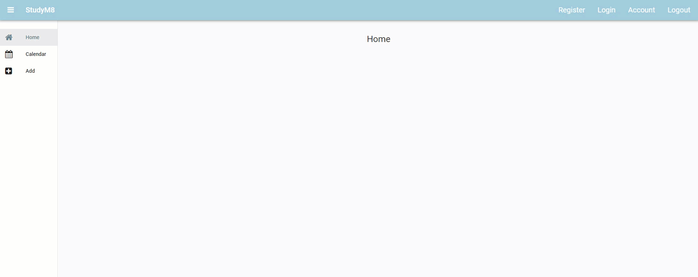
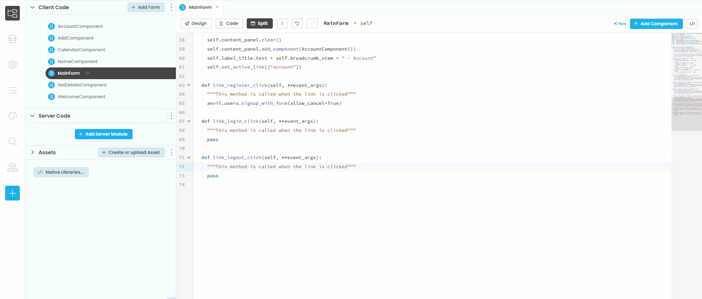
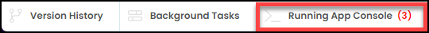
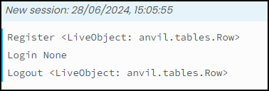

# User Management Features

```{topic} In this tutorial you will:
- Incorporate user management features into your website.
```

In this tutorial you will incorporate usermangement features to allow users to:

- Register for an account
- Login with a registered account
- Logout of the website

The events that trigger all these features will be link clicks, so we have to go back to the MainForm Design mode and create handlers for the **Register**, **Login** and **Logout** links.



## Code

### Register

The first feature we need to add is the registration feature so we can create users.

Go to the **link_register_click** handler. Delete the comment and the `pass` statement. Then add the highlighted code below:

```{code-block} python
:linenos:
:lineno-start: 63
:emphasize-lines: 2
  def link_register_click(self, **event_args):
    anvil.users.signup_with_form(allow_cancel=True)
```

```{admonition} Code explaination
:class: notice
- **line 64**:
  - `signup_with_form` &rarr; use the built-in registration form
  - `anvil.users.` &rarr; from the Anvil user managment tool
  - `allow_cancel=True` &rarr; add a cancel button to the registration form
```

Launch your website and try to register an account.



Stop your website and check that your account has been created in the users table.



### Logout

Since we are remembering the user, we now need to be able to logout.

Go to the **link_logout_click** handler. Delete the comment and the `pass` statement. Then add the highlighted code below:

```{code-block} python
:linenos:
:lineno-start: 70
:emphasize-lines: 2
  def link_logout_click(self, **event_args):
    anvil.users.logout()
```

```{admonition} Code explaination
:class: notice
- **line 70**:
  - `logout()` &rarr; use the built-in logout feature
  - `anvil.users.` &rarr; from the Anvil user management tool
```

### Login

Finally we need to allow users already registered to login

Go to the **link_login_click** handler. Delete the comment and the `pass` statement. Then add the highlighted code below:

```{code-block} python
:linenos:
:lineno-start: 66
:emphasize-lines: 2
  def link_login_click(self, **event_args):
    anvil.users.login_with_form(allow_cancel=True)
```

```{admonition} Code explaination
:class: notice
- **line 67**:
  - `login_with_form` &rarr; use the built-in login form
  - `anvil.users.` &rarr; from the Anvil user managment tool
  - `allow_cancel=True` &rarr; add a cancel button to the registration form
```

## Test

### Run the test

It is really hard to test if our user features work, as we have no indication if the user is logged in or not. To solve this we will add some testing code to the handlers.

```{code-block} python
:linenos:
:lineno-start: 63
:emphasize-lines: 3, 7, 11
  def link_register_click(self, **event_args):
    anvil.users.signup_with_form(allow_cancel=True)
    print("Register", anvil.users.get_user())

  def link_login_click(self, **event_args):
    anvil.users.login_with_form(allow_cancel=True)
    print("Logout", anvil.users.get_user())

  def link_logout_click(self, **event_args):
    anvil.users.logout()
    print("Login", anvil.users.get_user())
```

```{admonition} Code explaination
:class: notice
All three are estentially the same, so I'll just explain the first.

- **line 65**:
  - `print` &rarr; send to the terminal
  - `"Register"` &rarr; the name of the link just clicked
  - `anvil.users.get_user()` &rarr; what the current user is
```

Launch your website, then:

- Register another user
- Logout
- Login using your new user

Notice your terminal has three new messages:



Click on the Terminal tab and you should have the three messages below.



### Tidy up

If you recieved the same messages, your test passed.

Go back into the MainForm code and remove the three print statements.

## Final code state

By the end of this tutorial your code should be the same as below:

### MainForm

```{code-block} python
:linenos:
from ._anvil_designer import MainFormTemplate
from anvil import *
import anvil.tables as tables
import anvil.tables.query as q
from anvil.tables import app_tables
import anvil.users
from ..HomeComponent import HomeComponent
from ..CalendarComponent import CalendarComponent
from ..AddComponent import AddComponent
from ..AccountComponent import AccountComponent


class MainForm(MainFormTemplate):
  def __init__(self, **properties):
    # Set Form properties and Data Bindings.
    self.init_components(**properties)
    self.breadcrumb_stem = self.label_title.text

    # Any code you write here will run before the form opens.
    self.content_panel.add_component(HomeComponent())
    self.set_active_link("home")

  def set_active_link(self, state):
    if state == "home":
      self.link_home.role = "selected"
    else:
      self.link_home.role = None
    if state == "add":
      self.link_add.role = "selected"
    else:
      self.link_add.role = None
    if state == "calendar":
      self.link_calendar.role = "selected"
    else:
      self.link_calendar.role = None
  
  # --- link handlers
  def link_home_click(self, **event_args):
    self.content_panel.clear()
    self.content_panel.add_component(HomeComponent())
    self.label_title.text = self.breadcrumb_stem
    self.set_active_link("home")

  def link_calendar_click(self, **event_args):
    self.content_panel.clear()
    self.content_panel.add_component(CalendarComponent())
    self.label_title.text = self.breadcrumb_stem + " - Calendar"
    self.set_active_link("calendar")

  def link_add_click(self, **event_args):
    self.content_panel.clear()
    self.content_panel.add_component(AddComponent())
    self.label_title.text = self.breadcrumb_stem + " - Add"
    self.set_active_link("add")

  def link_account_click(self, **event_args):
    """This method is called when the link is clicked"""
    self.content_panel.clear()
    self.content_panel.add_component(AccountComponent())
    self.label_title.text = self.breadcrumb_stem + " - Account"
    self.set_active_link(("account"))

  def link_register_click(self, **event_args):
    anvil.users.signup_with_form(allow_cancel=True)

  def link_login_click(self, **event_args):
    anvil.users.login_with_form(allow_cancel=True)

  def link_logout_click(self, **event_args):
    anvil.users.logout()
```