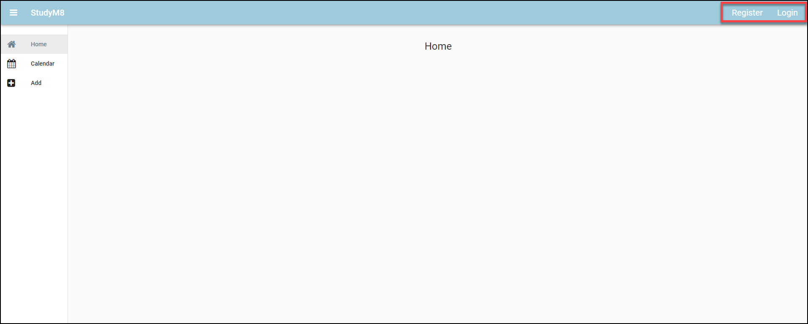
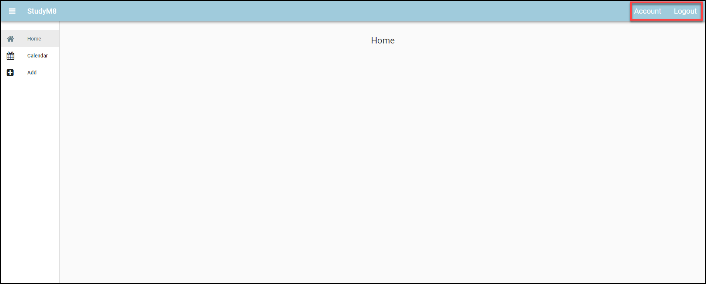

# Account Links Visability

```{topic} In this tutorial you will:
- Dynamically change elements' visibility according to the user logged in status
```

Currently we have four links associated with accounts (Register, Login, Account, Logout), but the relevence of these links depend on whether the user is logged in or not. If the user is logged in, they don't need the login or register link, and, similarily account and logout are not needed if the user is not logged in. So we should adjust the MainForm to not display irrelevent links. How will we do this?

## Planning

Fortunately each layout element has a visability property, so we can simply set this to `True` or `False` depending on the logged in status of the user.

In testing the last tutorial we used code the `anvil.users.get_user()` to show who the current logged in user was. If there was a user it returned `<LiveObject>: anvil.table.Row`, if there wasn't a user it returned `None`. According to Python **truthiness**, any object is has a Boolean value or `True`, while `None` has a Boolean value of `False`.

```{admonition} Python Truthiness
:class: note
In Python, "truthiness" refers to how values are evaluated in a boolean context, determining whether they are considered `True` or `False`. The values that return `True` are said to be **Truthy**, while the values that return `False` are called `Falsy`.

| Truthy Values | Falsy Values |
| :--- | :--- |
| `not None` | `None` |
| Any non-zero number (e.g., 1, -1, 3.14) | Zero of any numeric type (eg. `0`) |
| Non-empty strings (e.g., "Hello") | Empty string (eg. `""`) |
| Non-empty lists (e.g., [1, 2, 3]) | Empty list (eg. `[]`) |
| Non-empty dictionaries  (e.g., {"key": "value"}) | Empty dictionary (eg. `{}`) |
| Non-empty tuples (e.g., (1, 2)) | Empty tuples (eg. `()`) |
| Non-empty sets (e.g., {1, 2, 3})| Empty set (eg. `set()`) |
| Objects by default | Special Objects that explicitly return `False` |
```

We will use Python truthiness, get_user() and the links visablity to dynamically adjust the account links in respect to the users authentication.

We want to map it this way:

| `get_user()` | Register visability | Login visability | Account visability | Logout visability |
| :--- | :--- | :--- | :--- | :--- |
| `True` | `False` | `False` | `True` | `True` |
| `False` | `True` | `True` | `False` | `False` |

If you look at the table above you can see that the truthiness of:

- Register visability is the opposite of `get_user()`
- Login visability is the opposite of `get_user()`
- Account visability is the same as `get_user()`
- Logout visability is the same as `get_user()`

There the visiblity of the links can be rewritten as a function of the truthiness of `get_user()`.

- Register visability = `not get_user()`
- Login visability = `not get_user()`
- Account visability = `get_user()`
- Logout visability = `get_user()`

Where should we place our code? It would be effective if the test is done each time the page changes. We just made a function `set_active_link` which we call each time a link is clicked, so we should put it there.

## Code

Open the **MainForm** in code mode and go to the `set_active_link` method.

Then you want to enact our plan above by writting the highlighted code at the bottom of the `set_active_link` method.

```{code-block} python
:linenos:
:lineno-start: 23
:emphasize-lines: 15-18
  def set_active_link(self, state):
    if state == "home":
      self.link_home.role = "selected"
    else:
      self.link_home.role = None
    if state == "add":
      self.link_add.role = "selected"
    else:
      self.link_add.role = None
    if state == "calendar":
      self.link_calendar.role = "selected"
    else:
      self.link_calendar.role = None

    self.link_register.visible = not anvil.users.get_user()
    self.link_login.visible = not anvil.users.get_user()
    self.link_account.visible = anvil.users.get_user()
    self.link_logout.visible = anvil.users.get_user()
```

```{admonition} Code explaination
:class: notice
- **line 37**:
  - will set the visibility of `link_register` to opposite of the value returned by `anvil.users.get_user()`
  - therefore if a user is logged in, `link_register` will not be visible, but if there is no user logged in, then `link_register` will be displayed.
- **line 38**:
  - will set the visibility of `link_login` to opposite of the value returned by `anvil.users.get_user()`
  - therefore if a user is logged in, `link_login` will not be visible, but if there is no user logged in, then `link_login` will be displayed.
- **line 39**:
  - will set the visibility of `link_account` to the same value returned by `anvil.users.get_user()`
  - therefore if a user is logged in, `link_account` will be displayed, but if there is no user logged in, then `link_account` will not be visible.
- **line 40**:
  - will set the visibility of `link_logout` to the same value returned by `anvil.users.get_user()`
  - therefore if a user is logged in, `link_logout` will be displayed, but if there is no user logged in, then `link_logout` will not be visible.
```

Before we test our code, we have one more issue we need to resolve. We need to redirect the user to Home, after they have finished with Login, Register and Logout. To do this, add the following highlighted code.

```{code-block} python
:linenos:
:lineno-start: 1
:emphasize-lines: 3-6, 10-13, 17-20
  def link_register_click(self, **event_args):
    anvil.users.signup_with_form(allow_cancel=True)
    self.content_panel.clear()
    self.content_panel.add_component(HomeComponent())
    self.label_title.text = self.breadcrumb_stem
    self.set_active_link("home")

  def link_login_click(self, **event_args):
    anvil.users.login_with_form(allow_cancel=True)
    self.content_panel.clear()
    self.content_panel.add_component(HomeComponent())
    self.label_title.text = self.breadcrumb_stem
    self.set_active_link("home")

  def link_logout_click(self, **event_args):
    anvil.users.logout()
    self.content_panel.clear()
    self.content_panel.add_component(HomeComponent())
    self.label_title.text = self.breadcrumb_stem
    self.set_active_link("home")
```

```{admonition} Code explaination
:class: notice
These have been copied from the `link_home_click` method and are all the steps we need to do to load the **HomeComponent**.
```

## Test

Before we test this code, go to the **User table** and delete all the rows (ie. all your users). Then launch your website.

### Not Registered nor logged in

At first, since you now have no users, the user cannot possibly be logged in. You should see both the **Register** and the **Login** links.



### Registered and logged in

Click **Register** and register a new user (you can reuse the ones you deleted if you want).

Now there is a user logged in, so you only see the **Account** and **Logout** links.



### Logout

Now click the **Logout** button.

Since there is no user logged in you should see the **Register** and **Login** links.


### Login

Finally click the **Login** button and use the user credintials you just registered.

Since there is a user logged in again, you should see the **Account** and **Logout** links.


If your website acts this way, then you have finished this tutorial

## Final code state

By the end of this tutorial your code should be the same as below:

### Final MainForm

```{code-block} python
:linenos:
from ._anvil_designer import MainFormTemplate
from anvil import *
import anvil.tables as tables
import anvil.tables.query as q
from anvil.tables import app_tables
import anvil.users
from ..HomeComponent import HomeComponent
from ..CalendarComponent import CalendarComponent
from ..AddComponent import AddComponent
from ..AccountComponent import AccountComponent


class MainForm(MainFormTemplate):
  def __init__(self, **properties):
    # Set Form properties and Data Bindings.
    self.init_components(**properties)
    self.breadcrumb_stem = self.label_title.text

    # Any code you write here will run before the form opens.
    self.content_panel.add_component(HomeComponent())
    self.set_active_link("home")

  def set_active_link(self, state):
    if state == "home":
      self.link_home.role = "selected"
    else:
      self.link_home.role = None
    if state == "add":
      self.link_add.role = "selected"
    else:
      self.link_add.role = None
    if state == "calendar":
      self.link_calendar.role = "selected"
    else:
      self.link_calendar.role = None

    self.link_register.visible = not anvil.users.get_user()
    self.link_login.visible = not anvil.users.get_user()
    self.link_account.visible = anvil.users.get_user()
    self.link_logout.visible = anvil.users.get_user()
  
  # --- link handlers
  def link_home_click(self, **event_args):
    self.content_panel.clear()
    self.content_panel.add_component(HomeComponent())
    self.label_title.text = self.breadcrumb_stem
    self.set_active_link("home")

  def link_calendar_click(self, **event_args):
    self.content_panel.clear()
    self.content_panel.add_component(CalendarComponent())
    self.label_title.text = self.breadcrumb_stem + " - Calendar"
    self.set_active_link("calendar")

  def link_add_click(self, **event_args):
    self.content_panel.clear()
    self.content_panel.add_component(AddComponent())
    self.label_title.text = self.breadcrumb_stem + " - Add"
    self.set_active_link("add")

  def link_account_click(self, **event_args):
    """This method is called when the link is clicked"""
    self.content_panel.clear()
    self.content_panel.add_component(AccountComponent())
    self.label_title.text = self.breadcrumb_stem + " - Account"
    self.set_active_link(("account"))

  def link_register_click(self, **event_args):
    anvil.users.signup_with_form(allow_cancel=True)
    self.content_panel.clear()
    self.content_panel.add_component(HomeComponent())
    self.label_title.text = self.breadcrumb_stem
    self.set_active_link("home")

  def link_login_click(self, **event_args):
    anvil.users.login_with_form(allow_cancel=True)
    self.content_panel.clear()
    self.content_panel.add_component(HomeComponent())
    self.label_title.text = self.breadcrumb_stem
    self.set_active_link("home")

  def link_logout_click(self, **event_args):
    anvil.users.logout()
    self.content_panel.clear()
    self.content_panel.add_component(HomeComponent())
    self.label_title.text = self.breadcrumb_stem
    self.set_active_link("home")
```
