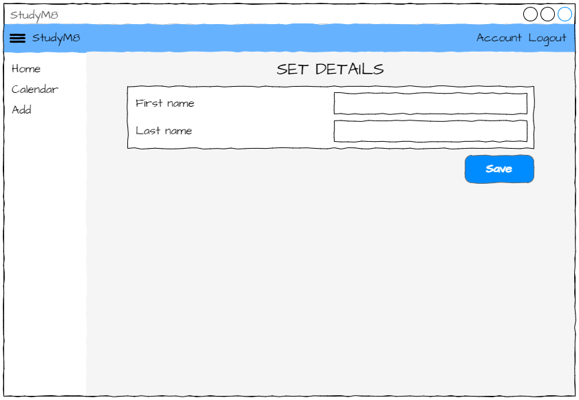
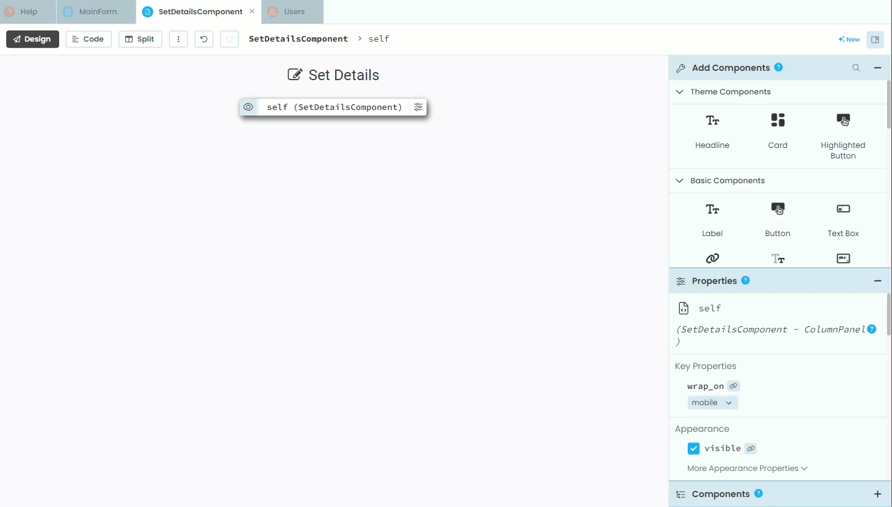
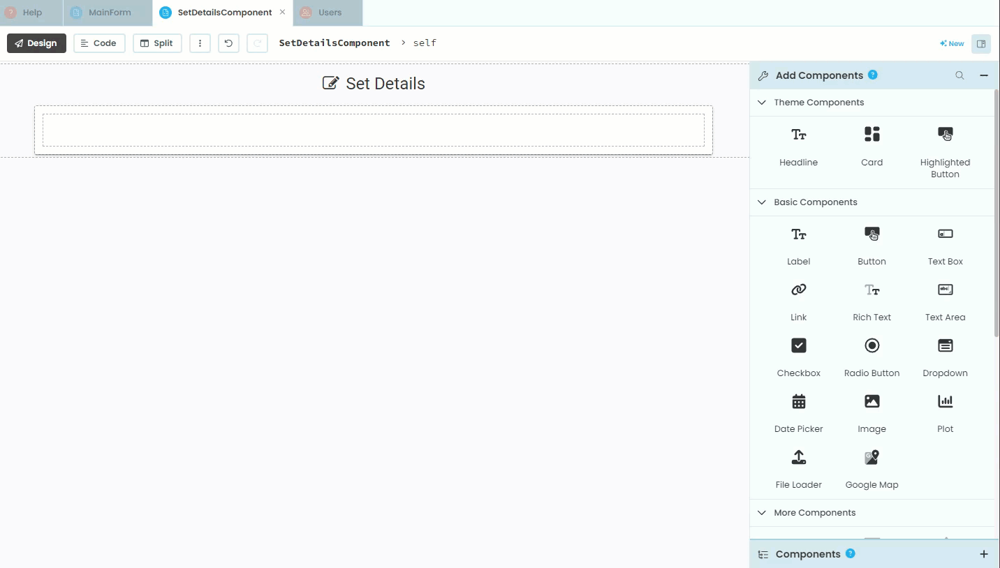
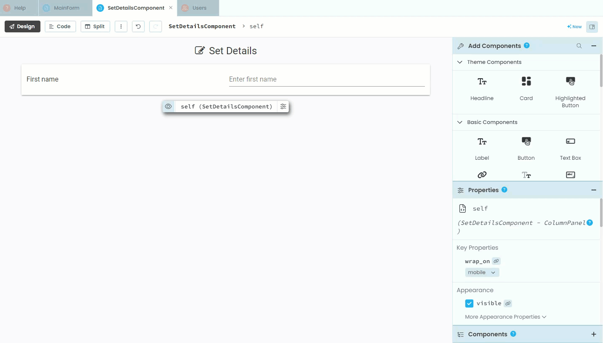
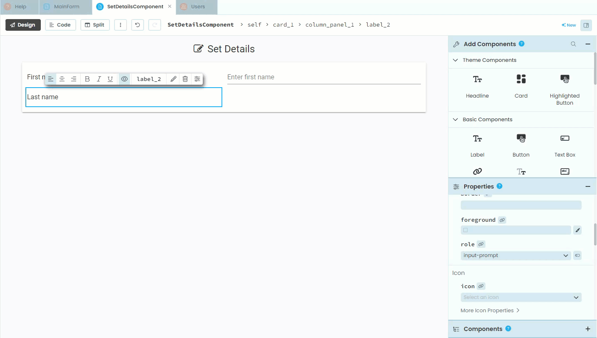
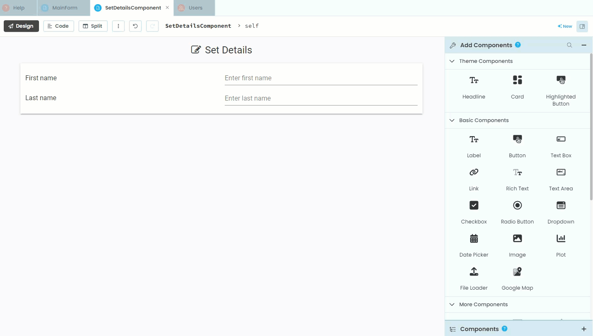
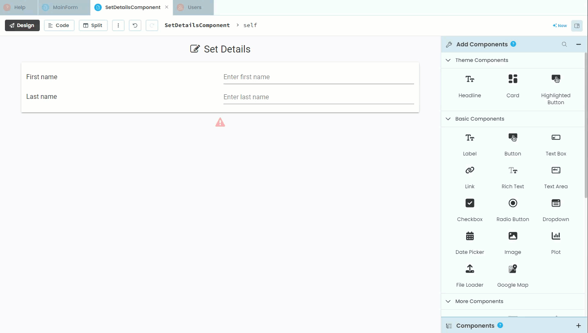
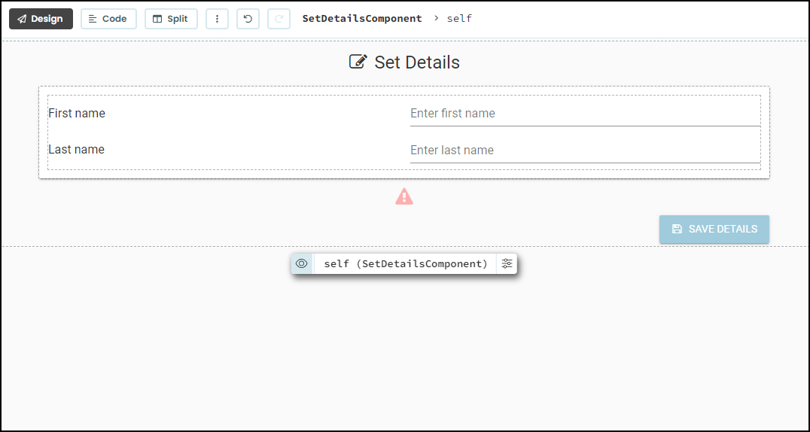

# SetDetailsComponent

```{topic} In this tutorial you will:
- Learn how to read values from text boxes
```

If you look at the **user table**, you will notice that our registered users are missing their first and last names. In this tutorial we will fix this issue.

## Planning

If yo urefer back to our **[design](./03_studyM8_design.md)** you will notice that we have a **SetDetailsComponent** which has a space for the user names.



At the moment, when a new user is registered, the  `link_register_click` method redirects them to the **HomeComponent**. We need to change that so it redirects to the **SetDetailsComponent**.

We then need to create an event handler for the **Save button** that reads the values and writes them to the **user table**. Our user table is expecting text values, what if they accidently leave one of the names blank? We need to validate the data to make sure that both text boxes have values, and only then write those values to the **user table**. 

```{admonition} Data validation
:class: note
Data validation of user input is crucial for several reasons:

1. **Security:** Validating data helps prevent security vulnerabilities such as SQL injection and cross-site scripting (XSS), protecting the application and its users from malicious attacks.
2. **Data Integrity:** Ensures that the data entered is accurate, consistent, and usable, maintaining the quality of the information stored.
3. **User Experience:** Provides immediate feedback to users when they enter incorrect or incomplete data, improving the overall user experience and reducing errors.
4. **Functionality:** Ensures that the application functions correctly by preventing invalid data from causing issues or crashes.
5. **Compliance:** Helps meet legal and regulatory requirements for data handling and privacy by ensuring that only valid data is processed and stored.
```

Finally, when that is all done, we need to load the **AccountComponent**, so they can see the names they just entered.

This is quite a bit, so we'll split it over the next three tutorials. 

1. Deals with the layout of the **SetDetailsComponent**
2. Coding the **SetDetailsComponent**
3. Addresses writting the information to the **user table**

## Designing

Before we can jump into our code we need to add all the appropriate elements to the layout of the **SetDetailsComponent**.

Open the **SetDetailsComponent** in design mode.

### Title

Currently, the only element on the component is the title. We'll start with adding an icon to the title.

1. Click on the title
2. Find **Icon** in the **Properties** panel
3. Choose the `fa:edit` icon


### Add Card

Cards are an essential design element in Material Design. They are a container used to group related information, which make content easy to scan and interact with. If you have used websites in the last decade, you have seen cards, you just might not have known what they are.

We are going to add a card under the title:

1. Find **Card** in the **Add Components** panel
2. Click on **Card**
3. Move to under the title (look for the blue line)
4. Click



Since our code is not going to interact with this card, we don't need to change it's name.

### Add Column Panel

In order to organise our labels and textboxes, we need to use a layout element called a **Column Panel**.

1. In the **Add Components** panel, find and click **Column Panel**
2. Click inside the **Card** in layout (make sure you have the blue line inside the card)


### Add First name elements

Now we can start adding the First name elements. We'll start with the lable.

1. In the **Add Component** panel, find and click **Label**
2. Click inside the **Card** in layout (make sure you have the blue line inside the card)
3. In **Text** in the **Properties** panel write `First name`
4. Find **role** in the **Appearance** section of the **Properties** panel and choose **input-prompt**
5. Again our code will not interact with this label, so we don't have to change the name.



Now the First name text box. Note, our code **will** interact with this element, so we should change the name to something that makes sense.

1. Click on **Text Box** in the **Add Component** panel
2. Click inside the **Card**. To ensure you're inside the **Column Panel** you need to pay very close attention to where the blue line is before you click. The line should be right beside a brown box surrounding the First name label.
3. Change the name of the text box to `text_box_first_name`
4. Find the **placeholder** property and add `Enter first name`


```{admonition} Placeholders
:class: note
Textbox placeholders are text displayed inside input fields on forms to give users a hint about what information is expected. They appear when the input field is empty and disappear once the user starts typing.
```

### Add Last name elements

Now to add the Last name lable.

1. Click **Label** in the **Add Component** panel
2. Click inside the **Card**, making sure that your blue line is directly under the the First name label
3. In **Text** in the **Properties** panel write `Last name`
4. Find **role** in the **Appearance** section of the **Properties** panel and choose **input-prompt**
5. Just like the First name label our code will not interact with this label, so we don't have to change the name.



Then the Last name text box, which is virtually the same the the First name text box.

1. Click on **Text Box** in the **Add Component** panel
2. Click inside the **Card**. Make sure the blue line is directly under the First name text box.
3. Change the name of the text box to `text_box_last_name`
4. Find the **placeholder** property and add `Enter last name`



### Error Message

Since we are going to validate the user's input, we need a way to explain any problems that might arrise. To do this we will add an error message label under the card. Our code **will** interact with this label, so we should name it appropriately.

1. Click **Label** in the **Add Component** panel
2. Click under the **Card** making sure the blue line is outside the card.
3. Change the name of the label to `label_error`
4. We are not adding text, since our code will dynamically set the text
5. Uncheck the **visible** property
6. Set **foreground** (text) colour to `#ff0000` (red)
7. Set **role** to `headline`
8. Select  `fa:warning` for the **icon** property
9. Finally set **align** to `center`



### Save Button

To finish off the **SetDetailsComponent** layout we need to add a button.

1. Select **Button** from the **Add Component** panel
2. Place the button under the Error label
3. Change the **name** the button to `button_save`
4. Change the **text** to `Save Details`
5. Choose the **role** that suits your design
6. Set the **icon** to `fa:save`
7. Set **align** to `right`



That completes the layout of the **SetDetailsComponent**. Your layout should look like the one below.



