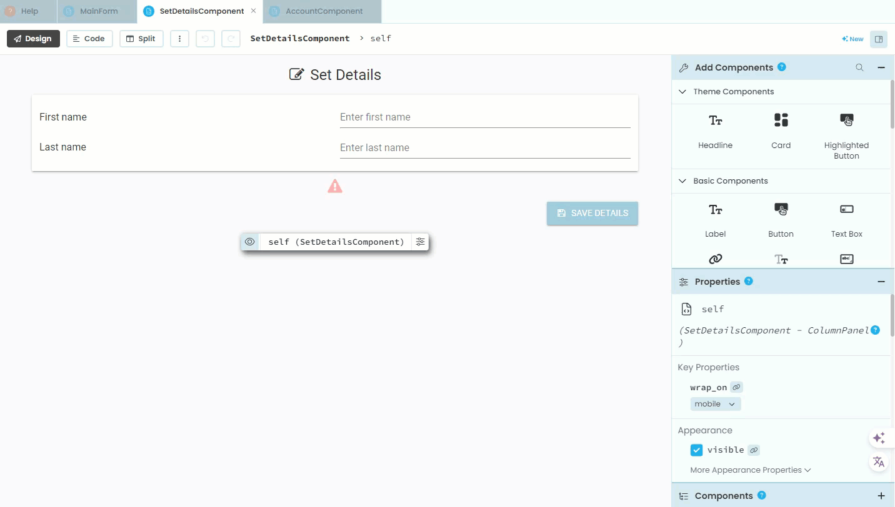
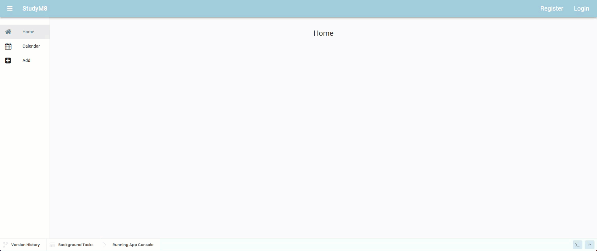

# SetDetailsComponent Code

```{topic} In this tutorial you will:
- Write code to process user input on a website.
- Validate that both first and last name fields are not empty.
- Display error messages for empty fields.
- Print input details to the terminal for testing purposes.
- Modify the registration process to load the SetDetailsComponent.
```

Now we have the **SetDetailsComponent** layout complete, it is time to start working on the code. This code will:

- Check that both the First name and Last name text boxes contain text
- Display an error message if either text box is empty
- Prints a message to terminal displaying the info that would be sent to the **User table** (this will be built on in the next tutorial)

## Save Button Code

### Create Handler

The code for this component will reside within the Save button click handler. We start by: 

1. clicking on the **Save** button
2. selecting **... on click event**
3. choosing the **Code** mode



### Check First name text box

First we will check that the First name text box is not blank. We will use a **guard clause** to achieve this. Basically it is an if statement that will use `return` to end the method if the the text box is empty. This will prevent the unnecessarily executing the rest of the method's code. 

```{admonition} Guard clauses
:class: note
Guard clauses are used in programming to check conditions at the start of a function. If the condition is `True`, the function stops right there. 

Guard clauses offer several benefits in programming:

- **Improved Readability:** They make the code easier to read by clearly showing conditions at the start of a function, allowing the main logic to follow without deep nesting.
- **Reduced Complexity:** By removing unnecessary else blocks and nested if statements, guard clauses reduce code complexity, making it simpler and more straightforward.
- **Early Exit:** They allow functions to exit early when conditions aren't met, which can enhance performance and prevent errors later in the code.
- **Better Maintenance:** With clearer code, maintenance becomes easier, as the logic is more apparent and debugging is simplified.
```

In the `button_save_click` hander, remove the comment and the `pass` statement, then add the highlighted code.

```{code-block} python
:linenos:
:lineno-start: 16
:emphasize-lines: 3-6
  def button_save_click(self, **event_args):
    
    if self.text_box_first_name.text == "":
      self.label_error.text = "First name cannot be blank"
      self.label_error.visible = True
      return
```

```{admonition} Code explaination
:class: notice
- **line 18:**
  - `self.text_box_first_name.text` &rarr; get the current value of the text in `text_box_first_name`
    - note: placeholders aren't considered text
  - `== ""` check if that text value is an empty string (nothing)
- **line 19:**
  - `self.label_error.text` &rarr; change the text of the error message label to inform user that first name is missing.
- **line 20:**
  - `self.label_error.visible = True` &rarr; make the error message label visible
- **line 21:**
  - `return` &rarr; stop executing this method by returning controll to the main loop
```  

### Check Last name text box

The obvious next step is to repeat this process for the Last name text box. 

Try and work out the code yourself before looking at the code below.

```{code-block} python
:linenos:
:lineno-start: 16
:emphasize-lines: 8-11
  def button_save_click(self, **event_args):
    
    if self.text_box_first_name.text == "":
      self.label_error.text = "First name cannot be blank"
      self.label_error.visible = True
      return

    if self.text_box_last_name.text == "":
      self.label_error.text = "Last name cannot be blank"
      self.label_error.visible = True
      return
```

### Save message

Once the user has passed both guard clauses, we want to save the details to the **User table**. We will write the code for this next tutorial, but in the meanwhile we need to test this code. So rather than writtng the results to the **User table** we will print them to the terminal. We also need to hide the error message.

Add the highlighted code to the `button_save_click` handler.

```{code-block} python
:linenos:
:lineno-start: 16
:emphasize-lines: 13-14
  def button_save_click(self, **event_args):
    
    if self.text_box_first_name.text == "":
      self.label_error.text = "First name cannot be blank"
      self.label_error.visible = True
      return

    if self.text_box_last_name.text == "":
      self.label_error.text = "Last name cannot be blank"
      self.label_error.visible = True
      return

    self.label_error.visible = False
    print(self.text_box_first_name.text, self.text_box_last_name.text)
```

```{admonition} Code explaination
:class: notice
- **line 28:**
  - `self.label_error.visible = False` &rarr; hides the error message
- **line 29:**
  - `self.text_box_first_name.text` &rarr; current value of `text_box_first_name`
  - `self.text_box_last_name.text` &rarr; current value of `text_box_last_name`
  - `print` &rarr; display in the terminal
```

### Redirect Register

Currently, when a user finish registering, we load the **HomeComponent**, we will need to change that to loading the **SetDetailsComponent**.

Open the **MainForm** in **code** mode.

First we need to import the **SetDetailsComponent**. So in the import section, add the highlighted code.

```{code-block} python
:linenos:
:lineno-start: 1
:emphasize-lines: 11
from ._anvil_designer import MainFormTemplate
from anvil import *
import anvil.tables as tables
import anvil.tables.query as q
from anvil.tables import app_tables
import anvil.users
from ..HomeComponent import HomeComponent
from ..CalendarComponent import CalendarComponent
from ..AddComponent import AddComponent
from ..AccountComponent import AccountComponent
from ..SetDetailsComponent import SetDetailsComponent
```

Change the `link_register_click` handler by replacing line 72-74 with the highlighted code below

```{code-block} python
:linenos:
:lineno-start: 69
:emphasize-lines: 4-6
  def link_register_click(self, **event_args):
    anvil.users.signup_with_form(allow_cancel=True)
    self.content_panel.clear()
    self.content_panel.add_component(SetDetailsComponent())
    self.label_title.text = self.breadcrumb_stem + " - Account - Details"
    self.set_active_link("details")
```

## Testing

Before testing, we need to remove the last user you registered. So go to the **Users table** and delete all rows then launch your website:

Testing:

1. Register a new account
2. Leave the First name text box blank and click **Save Details** &rarr; should produce error
3. Leave the Last name text box blank and click **Save Details** &rarr; should produce error
4. Click save with both First name and Last name entered, the error message should disappear and their values should appear in the **terminal**



## Final code state

By the end of this tutorial your code should be the same as below:

### Final SetDetailsComponent

```{code-block} python
:linenos:
from ._anvil_designer import SetDetailsComponentTemplate
from anvil import *
import anvil.server
import anvil.tables as tables
import anvil.tables.query as q
from anvil.tables import app_tables
import anvil.users


class SetDetailsComponent(SetDetailsComponentTemplate):
  def __init__(self, **properties):
    # Set Form properties and Data Bindings.
    self.init_components(**properties)

    # Any code you write here will run before the form opens.

  def button_save_click(self, **event_args):
    
    if self.text_box_first_name.text == "":
      self.label_error.text = "First name cannot be blank"
      self.label_error.visible = True
      return

    if self.text_box_last_name.text == "":
      self.label_error.text = "Last name cannot be blank"
      self.label_error.visible = True
      return

    self.label_error.visible = False
    print(self.text_box_first_name.text, self.text_box_last_name.text)
```

### Final MainForm

```{code-block} python
:linenos:
from ._anvil_designer import MainFormTemplate
from anvil import *
import anvil.tables as tables
import anvil.tables.query as q
from anvil.tables import app_tables
import anvil.users
from ..HomeComponent import HomeComponent
from ..CalendarComponent import CalendarComponent
from ..AddComponent import AddComponent
from ..AccountComponent import AccountComponent
from ..SetDetailsComponent import SetDetailsComponent


class MainForm(MainFormTemplate):
  def __init__(self, **properties):
    # Set Form properties and Data Bindings.
    self.init_components(**properties)
    self.breadcrumb_stem = self.label_title.text

    # Any code you write here will run before the form opens.
    self.content_panel.add_component(HomeComponent())
    self.set_active_link("home")

  def set_active_link(self, state):
    if state == "home":
      self.link_home.role = "selected"
    else:
      self.link_home.role = None
    if state == "add":
      self.link_add.role = "selected"
    else:
      self.link_add.role = None
    if state == "calendar":
      self.link_calendar.role = "selected"
    else:
      self.link_calendar.role = None

    self.link_register.visible = not anvil.users.get_user()
    self.link_login.visible = not anvil.users.get_user()
    self.link_account.visible = anvil.users.get_user()
    self.link_logout.visible = anvil.users.get_user()
  
  # --- link handlers
  def link_home_click(self, **event_args):
    self.content_panel.clear()
    self.content_panel.add_component(HomeComponent())
    self.label_title.text = self.breadcrumb_stem
    self.set_active_link("home")

  def link_calendar_click(self, **event_args):
    self.content_panel.clear()
    self.content_panel.add_component(CalendarComponent())
    self.label_title.text = self.breadcrumb_stem + " - Calendar"
    self.set_active_link("calendar")

  def link_add_click(self, **event_args):
    self.content_panel.clear()
    self.content_panel.add_component(AddComponent())
    self.label_title.text = self.breadcrumb_stem + " - Add"
    self.set_active_link("add")

  def link_account_click(self, **event_args):
    """This method is called when the link is clicked"""
    self.content_panel.clear()
    self.content_panel.add_component(AccountComponent())
    self.label_title.text = self.breadcrumb_stem + " - Account"
    self.set_active_link(("account"))

  def link_register_click(self, **event_args):
    anvil.users.signup_with_form(allow_cancel=True)
    self.content_panel.clear()
    self.content_panel.add_component(SetDetailsComponent())
    self.label_title.text = self.breadcrumb_stem + " - Account - Details"
    self.set_active_link("details")

  def link_login_click(self, **event_args):
    anvil.users.login_with_form(allow_cancel=True)
    self.content_panel.clear()
    self.content_panel.add_component(HomeComponent())
    self.label_title.text = self.breadcrumb_stem
    self.set_active_link("home")

  def link_logout_click(self, **event_args):
    anvil.users.logout()
    self.content_panel.clear()
    self.content_panel.add_component(HomeComponent())
    self.label_title.text = self.breadcrumb_stem
    self.set_active_link("home")