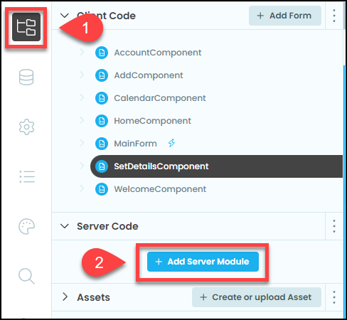
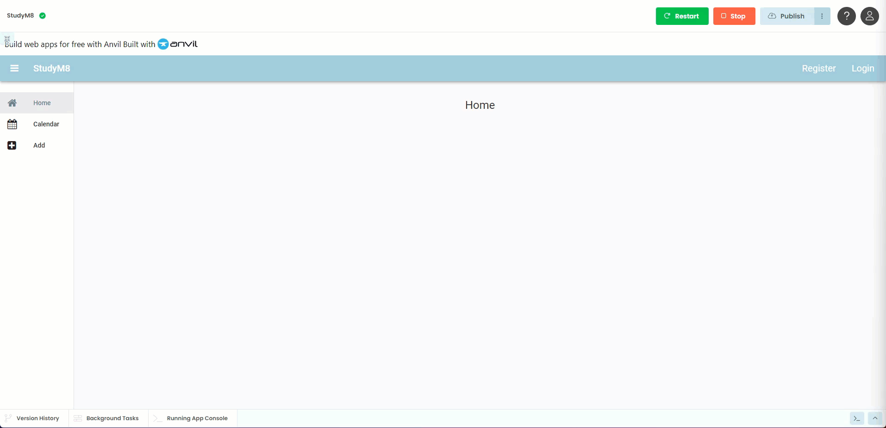

# User Server Module

```{topic} In this tutorial you will:
- Create code that access the backend database
```

## Backend databases

The **User table** that we have been dealing with is actually insdie a database. At the moment the database has only one table, but eventually we will add extra tables to it. There are four basic operations that databases need to do - create, read, update and delete, refered to as CRUD. We have already been using a read operation, the built in `get_user()`.

```{admonition} CRUD
:class: note
CRUD stands for Create, Read, Update, and Delete. These are the four basic operations that are fundamental to database management:

- **Create:** These operations add new records to a database.
- **Read:** These operations retrieve data from the database.
- **Update:** These operations modify existing records in the database.
- **Delete:** These operations remove records from the database.
```

All database operations occur server-side (backend). Server-side code provides methods that can be called by the client-side (frontend). When the client-side calls the methods, the server executes the server-side code and then sends the results back to the client-side.


To provide additional, custom methods we will need to create our first server-side code. We will call this module `user-service` as it will provide CRUD operations to user data.

## Code

To start we will need to create a **Server Module**.

1. Go to the file submenu
2. Click on **Add Server Module**
3. Then name the new server module `user_service`



### Making a callable method

If you look at the comment in the `user_service` it tells you how to create callable function for your server code. Making a function callable allows it to be used in the client-side code.

To make a function callable, you need to add `@anvil.server.callable` above it. This is called a **decorator**. Decorators are a bit beyond the scope of this course, and this is the only place that you will use them, so for our purposes, just use it as is.

```{admonition} Decorators
:class: note
Python decorators can change how other functions work. When you use a decorator, you attach it to another function to change its behavior. This lets you add extra features to your function without changing its main code.

More information can be found at **<a href="https://www.freecodecamp.org/news/python-decorators-explained/" target="_blank">Free Code Camps - Python Decorators Explained For Beginners</a>**
```

### Create the update user function

So to create a function for our website to use we must:

- create a function that accepts a first name and last name
- get's the current user
- updates the current user's first name and last name with the values provided
- then add the `@anvil.server.callable` decorator above the function

Remove all the comments within `user_services`, then add the code below:

```{code-block} python
:linenos:
:lineno-start: 7
:emphasize-lines: 1-6
@anvil.server.callable
def update_user(first_name, last_name):
  user = anvil.users.get_user()

  user["first_name"] = first_name
  user["last_name"] = last_name
```

```{admonition} Code explaination
:class: notice
- **line 7:**
  - `@anvil.server.callable` &rarr; the decorator that allows the client-side code to call this function
- **line 8:**
  - `def update_user` &rarr; names the function`update_user`
  - `(first_name, last_name)` &rarr; requires the values `first_name` and `last_name` to be passed when called
- **line 9:**
  - `anvil.users.get_user()` &rarr; get the details of the current user. Note these details are stored in a dictionary
  - `user =` &rarr; stores the dictionary of the current user details in a variable called user
- **line 11:**
  - `user["first_name"] = first_name` &rarr; change the first_name value of the user to the first_name passed to the function.
- **line 12:**
  - `user["last_name"] = last_name` &rarr; change the last_name value of the user to the last_name passed to the function.
```

### Call the update user function

Now that we have the a server-sdie function we need to call it, so return to the code of **SetDetailsComponent**.

Replace line 30 with the highlighted text.

```{code-block} python
:linenos:
:lineno-start: 17
:emphasize-lines: 14 - 16
  def button_save_click(self, **event_args):
    
    if self.text_box_first_name.text == "":
      self.label_error.text = "First name cannot be blank"
      self.label_error.visible = True
      return

    if self.text_box_last_name.text == "":
      self.label_error.text = "Last name cannot be blank"
      self.label_error.visible = True
      return

    self.label_error.visible = False
    anvil.server.call("update_user", 
                    self.text_box_first_name.text, 
                    self.text_box_last_name.text)
```

```{admonition} Code explaination
:class: notice
Note: lines 30 - 32 are one statement, it has just been spread over three lines to make it easier to read (you can split arguements after a `,`).

- **line 30:**
  - `anvil.server.call` &rarr; this is how you call functions that have the `@anvil.server.callable` decorator
  - `"update_user"` &rarr; when using `anvil.server.call` the first argument passed is the name of the function you want to call.
  - `self.text_box_first_name.text` &rarr; the text of the first name text box that will passed as `first_name` to the `update_user` function.
  - `self.text_box_last_name.text` &rarr; the text of the last name text box that will passed as `last_name` to the `update_user` function.
```

## Testing

Time to test if this all works.

1. Go to the **User table** and delete your users
2. Launch your website
3. Register a new user
4. Enter a first name and last name
5. Click on **Save Details**
6. Stop your website
7. Go to the **User table** and check that your new user has the correct `first_name` and `last_name`.



## Final code state

By the end of this tutorial your code should be the same as below:

### Final SetDetailsForm

```{code-block} python
:linenos:
from ._anvil_designer import SetDetailsComponentTemplate
from anvil import *
import anvil.server
import anvil.tables as tables
import anvil.tables.query as q
from anvil.tables import app_tables
import anvil.users


class SetDetailsComponent(SetDetailsComponentTemplate):
  def __init__(self, **properties):
    # Set Form properties and Data Bindings.
    self.init_components(**properties)

    # Any code you write here will run before the form opens.

  def button_save_click(self, **event_args):
    
    if self.text_box_first_name.text == "":
      self.label_error.text = "First name cannot be blank"
      self.label_error.visible = True
      return

    if self.text_box_last_name.text == "":
      self.label_error.text = "Last name cannot be blank"
      self.label_error.visible = True
      return

    self.label_error.visible = False
    anvil.server.call("update_user", 
                      self.text_box_first_name.text, 
                      self.text_box_last_name.text)
```

### Final user_service

```{code-block} python
:linenos:
import anvil.users
import anvil.tables as tables
import anvil.tables.query as q
from anvil.tables import app_tables
import anvil.server

@anvil.server.callable
def update_user(first_name, last_name):
  user = anvil.users.get_user()

  user["first_name"] = first_name
  user["last_name"] = last_name
```