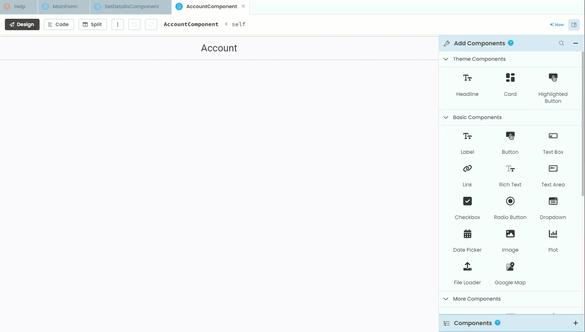
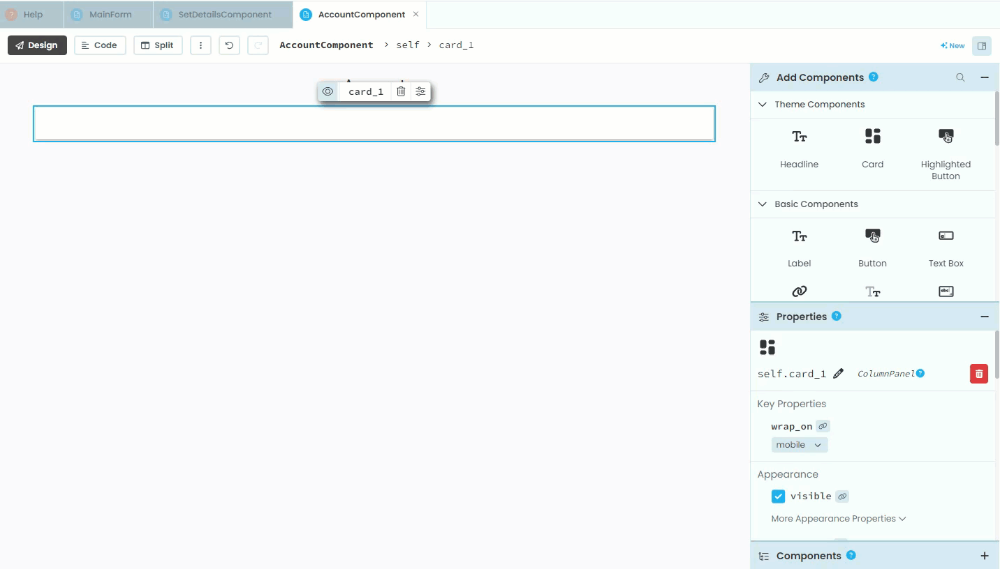
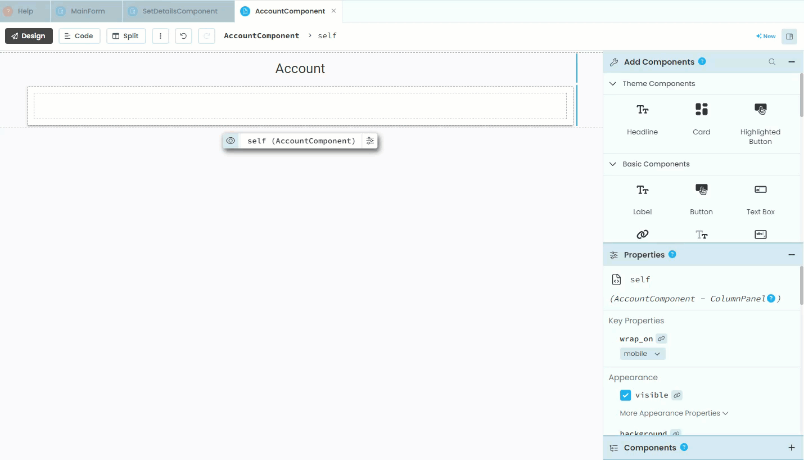
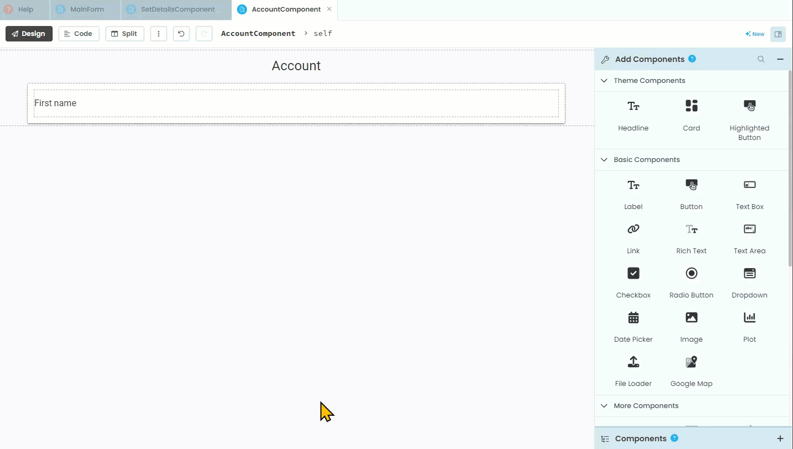
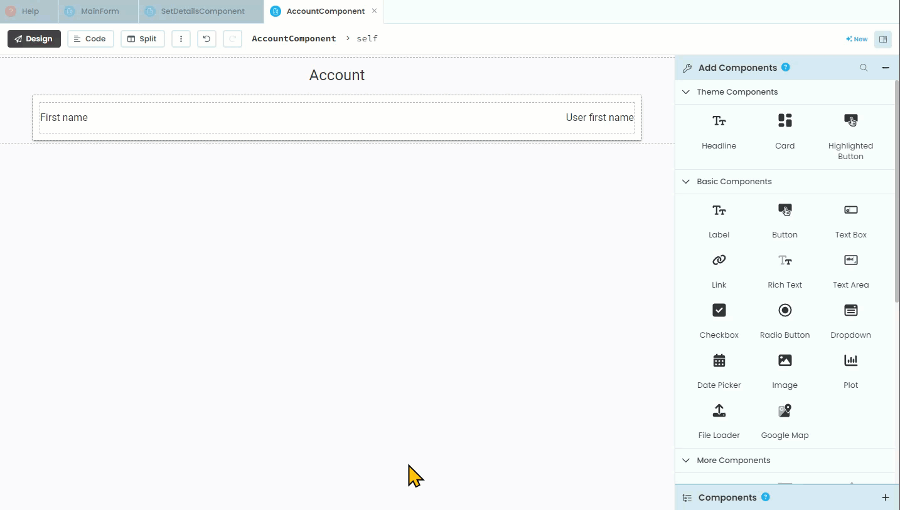
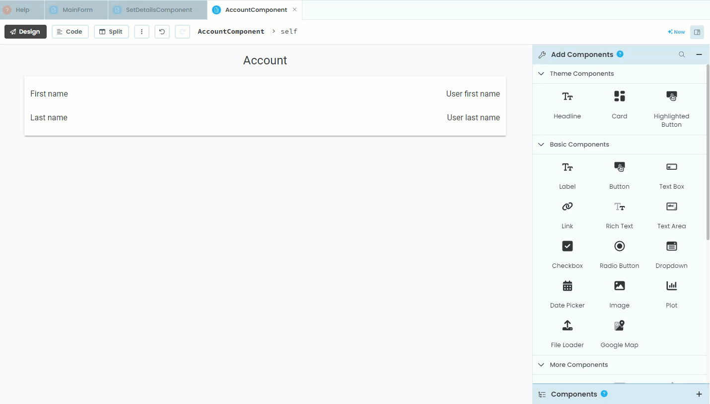

# AccountComponent Layout

```{topic} In this tutorial you will:
- Add a Card element to the layout.
- Insert a Column Panel inside the Card.
- Creat labels for displaying the user's first and last names.
- Add an Edit button to allow users to update their details.
```

Last tutorial we noted that we need to populate the **AccountComponent**. We will do this over two tutorials. This one will focus on creating the layout, while the next tutorial will address the code.

## Design

If we check back at our **[wireframes](./03_studyM8_design.md)** we will see that the **AccountComponent** displays the first name and last name as well as an edit button. The layout is very similar to the **SetDetailComponent**, so this should seem very familiar.


Unlike the **SetDetailsComponent** there are no text boxes, with labels being used to display the first name and last name values for the current user. We will still need to use a Column Panel and the Button will be used to load the **SetDetailsComponent** so users can change their details.

## The layout

Open the **AccountComponent** in **Design** mode. Most of this is revisiting the layout for the **[SetDesignComponent](./15_set_details.md)** so I will not be going into as much detail.

### Organisational elements

First we must add a **Card** element to the layout.



Then we need to add a **Column Panel** inside the **Card**



### First name elements

Now we need to add the first name label. 

- This is the one that says **First Name** which the code will not interact with, so no need to change its name.
- We will still set the role to **input-prompt** so we can keep the text formatting consistent between the **AccountComponent** and the **SetDetailsComponent**.



To the right of that label e need to add another label that will display the user's data.

- We will need to name this label calling it `label_first_name`
- We'll also set the default text to `"User first name"`
- The **role** will be **input-prompt**
- Finally **alignment** should be **right**



### Last name elements

Under the first name elements we need to add the exact same elements, only for the last name.



### Edit button

Finally we need to add an edit button:

- positioned under the **Card**
- **name** &rarr; `button_edit`
- **text** &rarr; `Edit Details`
- **role** &rarr; same as you chose for the **Save Details** button on the **SetDetailsComponent**
- **icon** &rarr; `fa:edit`
- **align** &rarr; **right**



Now that we have all the elements on the layout, it's time to move to the next tutorial to start coding.