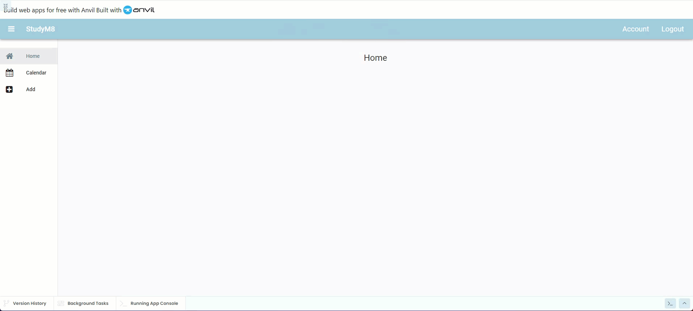
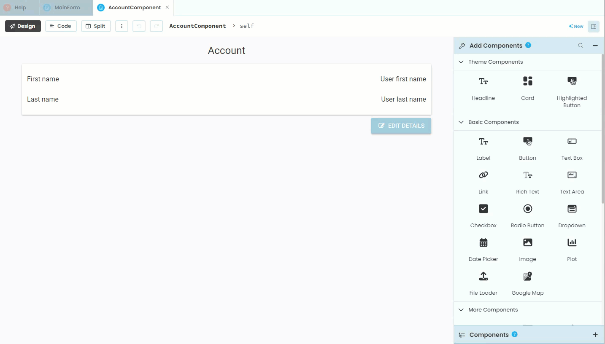
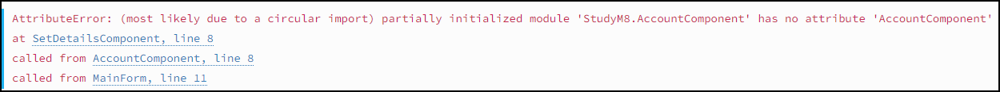

# AccountComponent Code

```{topic} In this tutorial you will:
- Retrieve and display the user's details using `anvil.users.get_user()`.
- Link the Edit Details button to the SetDetailsComponent.
- Understand and resolve circular references in code imports.
- Refactor navigation code for better organization and maintenance.
```

## Planning

Now that we have the **AccountComponent** layout completed we need to write the code that:

1. Retrieves and displays the user's details
2. Connects the **Edit Details** button to the **SetDetailsComponent**

We know that we can use `anvil.users.get_user()` to retrieve user details and we also know that we can access these details like a dictionary.

We also have create the code to load the **SetDetailsComponent**, so we just need to copy that.

## Code

Open the **AccountComponent** in code mode.

### Display users details

We want to load the first and last name before the form opens, so this means we are putting this code into the `__init__`. So add the highlighted code below.

```{code-block} python
:linenos:
:lineno-start: 11
:emphasize-lines: 6 - 8
  def __init__(self, **properties):
    # Set Form properties and Data Bindings.
    self.init_components(**properties)

    # Any code you write here will run before the form opens.
    user = anvil.users.get_user()
    self.label_first_name.text = user["first_name"]
    self.label_last_name.text = user["last_name"]
```

This should occur every time that the **AccountComponent** is loaded.

#### Test user details display

Let's test this first stage. Launch your website.

1. Login if you have to
2. Click on the Account link
3. Check that the names have been populated



### Link Edit Details Button

Now to link the **Edit Details** button. To do this we will need to change into Layout mode to create a handler for the **button_edit_click** event.



Now we need to copy the code from the **link_register_click** hander in the **MainForm** and add it to the **button_edit_click** handler.

```{code-block} python
:linenos:
:lineno-start: 20
:emphasize-lines: 2-5
  def button_edit_click(self, **event_args):
    self.content_panel.clear()
    self.content_panel.add_component(SetDetailsComponent())
    self.label_title.text = self.breadcrumb_stem + " - Account - Details"
    self.set_active_link("details")
```

Now, just like we did in the **SetDetailsComponent**, we need to use `get_open_form` to reference the **MainForm** and the change all the `self` references so they reference the **MainForm**.

```{code-block} python
:linenos:
:lineno-start: 20
:emphasize-lines: 2-6
  def button_edit_click(self, **event_args):
    main_form = get_open_form()
    main_form.content_panel.clear()
    main_form.content_panel.add_component(SetDetailsComponent())
    main_form.label_title.text = main_form.breadcrumb_stem + " - Account - Details"
    main_form.set_active_link("details")
```

Finally we need to import the **SetDetailsComponents**.

```{code-block} python
:linenos:
:lineno-start: 1
:emphasize-lines: 8
from ._anvil_designer import AccountComponentTemplate
from anvil import *
import anvil.server
import anvil.tables as tables
import anvil.tables.query as q
from anvil.tables import app_tables
import anvil.users
from ..SetDetailsComponent import SetDetailsComponent
```

#### Test button

Almost finished this, just the testing left to go.

Launch your website.

**YIKES!**

You will have got the following error:



**What on earth is a circular reference?**

## Solving our circular reference

### What is a circular reference

Our circular refence is caused by our imports.

The **SetDetailsComponent** import statements are as below:

```{code-block} python
:linenos:
:lineno-start: 1
:emphasize-lines: 8
from ._anvil_designer import SetDetailsComponentTemplate
from anvil import *
import anvil.server
import anvil.tables as tables
import anvil.tables.query as q
from anvil.tables import app_tables
import anvil.users
from ..AccountComponent import AccountComponent
```

While our **AccountComponent** import statements are like this:

```{code-block} python
:linenos:
:lineno-start: 1
:emphasize-lines: 8
from ._anvil_designer import AccountComponentTemplate
from anvil import *
import anvil.server
import anvil.tables as tables
import anvil.tables.query as q
from anvil.tables import app_tables
import anvil.users
from ..SetDetailsComponent import SetDetailsComponent
```

If you look at the highlighted lines your will notice that:

- the **AccountsComponent** imports the **SetDetailsComponent**
- the **SetDetailsComponent** imports the **AccountsComponent**

So when you website launches and it reads all the code, the **AccountsComponent** wants to load all the code from the **SetDetailsComponent** which wants to load all the code from the **AccountsComponent** which wants to load all the code from the **SetDetailsComponent** which wants to load all the code from the **AccountsComponent** which wants to load all the code from the **SetDetailsComponent** which wants to load all the code from the... you get the idea.

Two items of code are referring to each other, hence the term circular reference.

### Why did it occur

This circular reference was caused because we have been very messy with out code, in particular our navigating code. You might have already noticed that we haven't been too stringent in applying the DRY principle, for example:

- we have navigation code in the **MainForm**, the **SetDetailsComponent** and the **AccountComponent**
- we also have repetition of similar code in each of the **link click handlers** in the **MainCode**

### How to resolve it

We need to **refactor** our code and bring all the navigation code into one place. This we will do in the next tutorial.

```{admonition} Refactoring code
:class: note
Refactoring code means improving the structure and readability of your code without changing what it does. It's like cleaning up your room: you reorganize everything to make it easier to find and use, but you don't throw anything away or change how your room works. 

By refactoring, you make your code clearer, easier to understand, and simpler to maintain, which helps you and others work with it more effectively in the future.
```