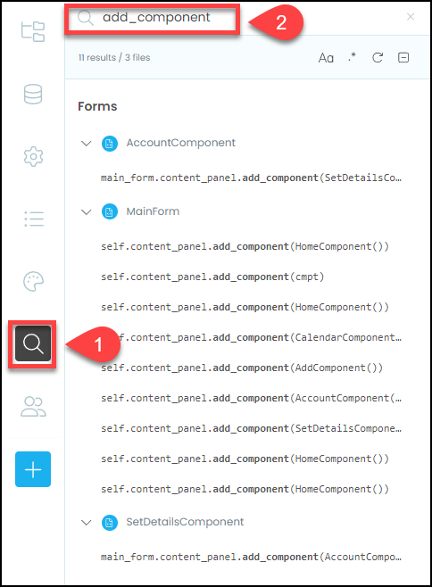
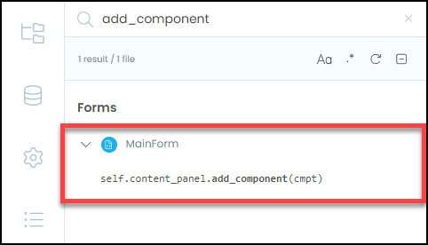

# Switch Component Method

```{topic} In this tutorial you will:
- Understanding the importance of refactoring for code maintainability.
- Creating a centralized navigation method (switch_component).
- Replacing distributed navigation code with calls to the new method.
- Ensuring that the refactored code functions correctly.
```

Last tutorial we encountered a problem that was caused by having our navigation code distributed throughout our codebase. This tutorial we will refactor the code so all this navigation code resides in the **MainForm**.

## Preparing to refactor

When refactoring, it is important to ensure that your refactored code works just the same as the old code. This presents a problem for us, in that our current code does not work. So we need to adjust the code so that it at least runs without causing an error.

To do this we will simply remove the import that causes the error. Open your **AccountComponent** in code mode and **delete** line 8

```{code-block} python
:linenos:
:lineno-start: 1
:emphasize-lines: 8
from ._anvil_designer import AccountComponentTemplate
from anvil import *
import anvil.server
import anvil.tables as tables
import anvil.tables.query as q
from anvil.tables import app_tables
import anvil.users
from ..SetDetailsComponent import SetDetailsComponent
```

```{admonition} Code explaination
:class: notice
It is important to note that clicking the **Edit Details** button will still cause an error. We will worry about fixing this problem after we have refactored the code.
```

## Planning

What we will do, is consolidate all the navigation code into one **MainForm** method called **switch_component**. Let's look at the **MainForm** current navigation code to establish what this **switch_component** method needs to do.

Below is the navigation code in the `link_home_click` handler, what can we identify?

```{code-block} python
:linenos:
:lineno-start: 45
:emphasize-lines: 2-5
  def link_home_click(self, **event_args):
    self.content_panel.clear()
    self.content_panel.add_component(HomeComponent())
    self.label_title.text = self.breadcrumb_stem
    self.set_active_link("home")
```

There are four highlighted lines indicate four steps to the navigation process:

1. **line 46** &rarr; removes the current component
2. **line 47** &rarr; adds the desired component
3. **line 48** &rarr; sets the correct breadcrumb title
4. **line 49** &rarr; set the correct active link

We need to include all four of these processes into our new **switch_component** method.

Remember in the **set_active_link** method, we passed a string to set the state of the **MainForm** (check below).

```{code-block} python
:linenos:
:lineno-start: 24
  def set_active_link(self, state):
    if state == "home":
      self.link_home.role = "selected"
    else:
      self.link_home.role = None
    if state == "add":
      self.link_add.role = "selected"
    else:
      self.link_add.role = None
    if state == "calendar":
      self.link_calendar.role = "selected"
    else:
      self.link_calendar.role = None
```

We can use this same concept to send a state to the **switch_component** (eg. `"home"`) and the **switch_component** method will respond to that state and load the **HomeComponent**

Ok, now put that into practice.

## Code

### Create the switch_component

#### Copy code from home_link_code

To implementing our plan:

1. Open the **MainForm** code mode
2. Create the new **switch_component** method above **set_active_link** - it will need to accept one argument called **state**.

```{code-block} python
:linenos:
:lineno-start: 25
:emphasize-lines: 1
  def switch_component(self, state):
```

3. Go to the **link_home_click** method
4. Copy the code that is highlighted below

```{code-block} python
:linenos:
:lineno-start: 50
:emphasize-lines: 2 - 5
  def link_calendar_click(self, **event_args):
    self.content_panel.clear()
    self.content_panel.add_component(CalendarComponent())
    self.label_title.text = self.breadcrumb_stem + " - Calendar"
    self.set_active_link("calendar")
```

5. Go back to the **switch_component** method.
6. Add the highlighted structural comment

```{code-block} python
:linenos:
:lineno-start: 25
:emphasize-lines: 2
  def switch_component(self, state):
    # execution
```

7. Then paste the code you copied

```{code-block} python
:linenos:
:lineno-start: 25
:emphasize-lines: 3-6
  def switch_component(self, state):
    # execution
    self.content_panel.clear()
    self.content_panel.add_component(HomeComponent())
    self.label_title.text = self.breadcrumb_stem
    self.set_active_link("home")
```

#### Make code generic

At the moment, the code just loads the **HomeComponent**. We want to change it so that it response to the `state` that is passed to **switch_component**.

Let's consider each line of code:

```{code-block} python
:linenos:
:lineno-start: 25
  def switch_component(self, state):
    # execution
    self.content_panel.clear()
    self.content_panel.add_component(HomeComponent())
    self.label_title.text = self.breadcrumb_stem
    self.set_active_link("home")
```

- **line 27** &rarr; it is generic, so there is no need to change it
- **line 28** &rarr; we want to change the component loaded, so lets change `HomeComponent()` to a variable called `cmpt`. This variable can be set to different components
- **line 29** &rarr; similarly, we want to change the bread_crumb according to the `state`, so let's replace `self.breadcrumb_stem` with a variable called `breadcrumb`
- **line 30** &rarr; we want to call `set_active_link` with the `state` that is passed, so replace `home` with `state`.

With these changes your code should look like:

```{code-block} python
:linenos:
:lineno-start: 25
:emphasize-lines: 4-6
  def switch_component(self, state):
    # execution
    self.content_panel.clear()
    self.content_panel.add_component(cmpt)
    self.label_title.text = breadcrumb
    self.set_active_link(state)
```

#### Add response to state

Now we just need to use `state` to establish the values of `cmpt` and `breadcrumb`.

We will use an `if ... elif` statement to establish these values.

There are five possible states for our app:

- `"home"` &rarr; `cmpt = HomeComponent()` and `breadcrumb = self.breadcrumb_stem`
- `"add"` &rarr; `cmpt = AddComponent()` and `breadcrumb = self.breadcrumb_stem + " - Account"`
- `"account"` &rarr; `cmpt = Account()` and `breadcrumb = self.breadcrumb_stem + " - Add"`
- `"calendar`" &rarr; `cmpt = CalendarComponent()` and `breadcrumb = self.breadcrumb_stem + " - Calendar"`
- `"details"` &rarr; `cmpt = SetDetailsComponent()` and `breadcrumb = self.breadcrumb_stem + " - Account - Set Details"`

So let's put this into an `if ... elif` statement in our code

```{code-block} python
:linenos:
:lineno-start: 25
:emphasize-lines: 2-17
  def switch_component(self, state):
    # set state
    if state == "home":
      cmpt = HomeComponent()
      breadcrumb = self.breadcrumb_stem
    elif state == "account":
      cmpt = AccountComponent()
      breadcrumb = self.breadcrumb_stem + " - Account"
    elif state == "add":
      cmpt = AddComponent()
      breadcrumb = self.breadcrumb_stem + " - Add"
    elif state == "calendar":
      cmpt = CalendarComponent()
      breadcrumb = self.breadcrumb_stem + " - Calendar"
    elif state == "details":
      cmpt = SetDetailsComponent()
      breadcrumb = self.breadcrumb_stem + " - Account - Set Details"
    
    # execution
    self.content_panel.clear()
    self.content_panel.add_component(cmpt)
    self.label_title.text = breadcrumb
    self.set_active_link(state)
```

### Replace old navigation

Now that we have create the `switch_component` method, we need to go through our codebase and replace all the navigation code with calls the the `switch_component` method.

The best way to find the navigation code is to do a search for the `add_component` method.

1. click on the search icon
2. type `add_component` into the search box



#### MainForm

We can see that the **MainForm** has the majority of the navigation, so lets start there.

##### `__init__`

In the `__init__` we have our first code to change, lines 22 and 23.

```{code-block} python
:linenos:
:lineno-start: 16
:emphasize-lines: 7, 8
  def __init__(self, **properties):
    # Set Form properties and Data Bindings.
    self.init_components(**properties)
    self.breadcrumb_stem = self.label_title.text

    # Any code you write here will run before the form opens.
    self.content_panel.add_component(HomeComponent())
    self.set_active_link("home")
```

They need to be replaced with a single call to `switch_component` passing the `"home"` state.

```{code-block} python
:linenos:
:lineno-start: 16
:emphasize-lines: 7
  def __init__(self, **properties):
    # Set Form properties and Data Bindings.
    self.init_components(**properties)
    self.breadcrumb_stem = self.label_title.text

    # Any code you write here will run before the form opens.
    self.switch_component("home")
```

##### link_click handlers

The rest of the old navigation code is in our various link_click handlers. We will use the link_home_click hander as an example. Below shows the code that needs to be removed.


```{code-block} python
:linenos:
:lineno-start: 68
:emphasize-lines: 2-5
  def link_home_click(self, **event_args):
    self.content_panel.clear()
    self.content_panel.add_component(HomeComponent())
    self.label_title.text = self.breadcrumb_stem
    self.set_active_link("home")
```

Which is replaced with the code below:

```{code-block} python
:linenos:
:lineno-start: 68
:emphasize-lines: 2
  def link_home_click(self, **event_args):
    self.switch_component("home")
```

Do the same for:

- `link_account_click` handler
- `link_add_click` handler
- `link_calendar_click` handler

##### `link_register_click` handler

In the `link_register_click` handler you will need to only replace the old navigation code (highlighted below).

```{code-block} python
:linenos:
:lineno-start: 81
:emphasize-lines: 3-6
  def link_register_click(self, **event_args):
    anvil.users.signup_with_form(allow_cancel=True)
    self.content_panel.clear()
    self.content_panel.add_component(SetDetailsComponent())
    self.label_title.text = self.breadcrumb_stem + " - Account - Details"
    self.set_active_link("details")
```

Add a `switch_component` call passing `details` as the state.

```{code-block} python
:linenos:
:lineno-start: 81
:emphasize-lines: 3
def link_register_click(self, **event_args):
    anvil.users.signup_with_form(allow_cancel=True)
    self.switch_component("details")
```

##### `link_login_click` and `link_logout_click` handlers

The last two **MainForm** handlers we need to fix are the `link_login_click` and `link_logout_click` handlers. We'll look at the `link_login_click` handler and then you can repeat the process for the `link_logout_click` handler.

Replace the highlighted text:

```{code-block} python
:linenos:
:lineno-start: 85
:emphasize-lines: 3-6
  def link_login_click(self, **event_args):
    anvil.users.login_with_form(allow_cancel=True)
    self.content_panel.clear()
    self.content_panel.add_component(HomeComponent())
    self.label_title.text = self.breadcrumb_stem
    self.set_active_link("home")
```

With a call to `switch_component`

```{code-block} python
:linenos:
:lineno-start: 85
:emphasize-lines: 3
  def link_login_click(self, **event_args):
    anvil.users.login_with_form(allow_cancel=True)
    self.switch_component("home")
```

#### Check search results

After all those changes in MainForm, the only use of `add_component` should be in the `switch_components` method. This can be easily seen in the search box.


#### SetDetailsComponent

Next we will change the **SetDetailsComponent**, so open it in code mode.

Below is the old navigation code. Remember **line 35** provides access to all methods in the **MainForm**.  **switch_component** is on the **MainForm**, so we need to keep this line so we can access the method.

```{code-block} python
:linenos:
:lineno-start: 35
:emphasize-lines: 1
    main_form = get_open_form()
    main_form.content_panel.clear()
    main_form.content_panel.add_component(AccountComponent())
    main_form.label_title.text = main_form.breadcrumb_stem + " - Account"
    main_form.set_active_link(("account"))
```

Remove the remaining navigation code, and replace it with a call to `main_form.switch_component`,

```{code-block} python
:linenos:
:lineno-start: 35
:emphasize-lines: 2
    main_form = get_open_form()
    main_form.switch_component("account")
```

Since we are no longer referencing `AccountComponent()` we can **delete** its import from the import section.

```{code-block} python
:linenos:
:lineno-start: 1
:emphasize-lines: 8
from ._anvil_designer import SetDetailsComponentTemplate
from anvil import *
import anvil.server
import anvil.tables as tables
import anvil.tables.query as q
from anvil.tables import app_tables
import anvil.users
from ..AccountComponent import AccountComponent
```

We should now only have two calls the `add_component` in our search box.


#### AccountComponent

Finally we will replace the code that started us down this refactoring path.

Open the **AccountComponent** in code mode.

**Delete** the highlighted lines from the `button_edit_click` handler

```{code-block} python
:linenos:
:lineno-start: 20
:emphasize-lines: 3-6
  def button_edit_click(self, **event_args):
    main_form = get_open_form()
    main_form.content_panel.clear()
    main_form.content_panel.add_component(SetDetailsComponent())
    main_form.label_title.text = main_form.breadcrumb_stem + " - Account - Details"
    main_form.set_active_link("details")
```

Then add your call to `main_form.switch_component`:

```{code-block} python
:linenos:
:lineno-start: 20
:emphasize-lines: 3
  def button_edit_click(self, **event_args):
    main_form = get_open_form()
    main_form.switch_component("details")
```

This should leave you with only one reference to `add_component` in your search results.



## Testing

Time to test our refactoring. This has been a significant change to our codebase so we have to be thorough in our testing.

Launch your website then:

1. Logout if you have to
2. Register a new user
3. Add user's name details and then **Save Details**
4. Click **Edit Details**
5. Re-enter the user name details and click **Save Details**
6. Click **Home**
7. Click **Calendar**
8. Click **Account**
9. Click **Logout**
10. Click **Login** and enter user credentials

If you have refactored correctly, you should get through all of these steps without error.

## Final code state

By the end of this tutorial your code should be the same as below:

### Final SetDetailsComponent

```{code-block} python
:linenos:
:lineno-start: 1
from ._anvil_designer import SetDetailsComponentTemplate
from anvil import *
import anvil.server
import anvil.tables as tables
import anvil.tables.query as q
from anvil.tables import app_tables
import anvil.users


class SetDetailsComponent(SetDetailsComponentTemplate):
  def __init__(self, **properties):
    # Set Form properties and Data Bindings.
    self.init_components(**properties)

    # Any code you write here will run before the form opens.

  def button_save_click(self, **event_args):
    
    if self.text_box_first_name.text == "":
      self.label_error.text = "First name cannot be blank"
      self.label_error.visible = True
      return

    if self.text_box_last_name.text == "":
      self.label_error.text = "Last name cannot be blank"
      self.label_error.visible = True
      return

    self.label_error.visible = False
    anvil.server.call("update_user", 
                      self.text_box_first_name.text, 
                      self.text_box_last_name.text)

    main_form = get_open_form()
    main_form.switch_component("account")
```

### Final AccountComponent

```{code-block} python
:linenos:
:lineno-start: 1
from ._anvil_designer import AccountComponentTemplate
from anvil import *
import anvil.server
import anvil.tables as tables
import anvil.tables.query as q
from anvil.tables import app_tables
import anvil.users


class AccountComponent(AccountComponentTemplate):
  def __init__(self, **properties):
    # Set Form properties and Data Bindings.
    self.init_components(**properties)

    # Any code you write here will run before the form opens.
    user = anvil.users.get_user()
    self.label_first_name.text = user["first_name"]
    self.label_last_name.text = user["last_name"]

  def button_edit_click(self, **event_args):
    main_form = get_open_form()
    main_form.switch_component("details")
```

### Final MainForm

```{code-block} python
:linenos:
:lineno-start: 1
from ._anvil_designer import MainFormTemplate
from anvil import *
import anvil.server
import anvil.tables as tables
import anvil.tables.query as q
from anvil.tables import app_tables
import anvil.users
from ..HomeComponent import HomeComponent
from ..CalendarComponent import CalendarComponent
from ..AddComponent import AddComponent
from ..AccountComponent import AccountComponent
from ..SetDetailsComponent import SetDetailsComponent


class MainForm(MainFormTemplate):
  def __init__(self, **properties):
    # Set Form properties and Data Bindings.
    self.init_components(**properties)
    self.breadcrumb_stem = self.label_title.text

    # Any code you write here will run before the form opens.
    self.switch_component("home")

  def switch_component(self, state):
    # set state
    if state == "home":
      cmpt = HomeComponent()
      breadcrumb = self.breadcrumb_stem
    elif state == "account":
      cmpt = AccountComponent()
      breadcrumb = self.breadcrumb_stem + " - Account"
    elif state == "add":
      cmpt = AddComponent()
      breadcrumb = self.breadcrumb_stem + " - Add"
    elif state == "calendar":
      cmpt = CalendarComponent()
      breadcrumb = self.breadcrumb_stem + " - Calendar"
    elif state == "details":
      cmpt = SetDetailsComponent()
      breadcrumb = self.breadcrumb_stem + " - Account - Set Details"
    
    # execution
    self.content_panel.clear()
    self.content_panel.add_component(cmpt)
    self.label_title.text = breadcrumb
    self.set_active_link(state)
  
  def set_active_link(self, state):
    if state == "home":
      self.link_home.role = "selected"
    else:
      self.link_home.role = None
    if state == "add":
      self.link_add.role = "selected"
    else:
      self.link_add.role = None
    if state == "calendar":
      self.link_calendar.role = "selected"
    else:
      self.link_calendar.role = None

    self.link_register.visible = not anvil.users.get_user()
    self.link_login.visible = not anvil.users.get_user()
    self.link_account.visible = anvil.users.get_user()
    self.link_logout.visible = anvil.users.get_user()
  
  # --- link handlers
  def link_home_click(self, **event_args):
    self.switch_component("home")

  def link_calendar_click(self, **event_args):
    self.switch_component("calendar")

  def link_add_click(self, **event_args):
    self.switch_component("add")

  def link_account_click(self, **event_args):
    """This method is called when the link is clicked"""
    self.switch_component("account")

  def link_register_click(self, **event_args):
    anvil.users.signup_with_form(allow_cancel=True)
    self.switch_component("details")

  def link_login_click(self, **event_args):
    anvil.users.login_with_form(allow_cancel=True)
    self.switch_component("home")

  def link_logout_click(self, **event_args):
    anvil.users.logout()
    self.switch_component("home")
```