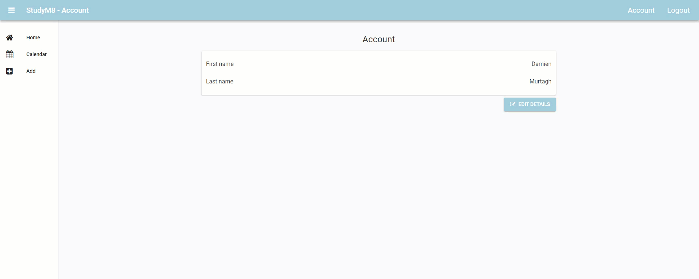

# Complete Account Component

```{topic} In this tutorial you will:
- Finalise entering into the **SetDetailsComponent** from the **AccountComponent**
```

Now that we have added the **switch_component** method, we have almost finished the **AccountComponent** code. If you recall your test, there was one annoying problem. When the **SetDetailsComponent** loaded, the First name and Last name text boxes were empty. Now this is fine when you are registering new users, but it is annoying when coming from the **AccountComponent**. 



This tutorial will fix that problem.

## Planning

What were are planning to do is quite simple. If the user has name details, show these in the First name and Last name text boxes. This is going to be executed in the **SetDetailsComponent** code before the component is loaded.

Open the **SetDetailsComponent** in code mode, then add the highlighted code to `__init__`:

```{code-block} python
:linenos:
:lineno-start: 11
:emphasize-lines: 6-10
  def __init__(self, **properties):
    # Set Form properties and Data Bindings.
    self.init_components(**properties)

    # Any code you write here will run before the form opens.
    user = anvil.users.get_user()
    if user["first_name"]:
      self.text_box_first_name.text = user["first_name"]
    if user["last_name"]:
      self.text_box_last_name.text = user["last_name"]
```

```{admonition} Code explaination
:class: notice
- **line 16:**
  - `user = anvil.users.get_user()` &rarr; retrieves the current user's row from the **User table**.
- **line 17:**
  - `if user["first_name"]:` &rarr; checks the truthiness of the current value of `"first_name"`
    - if there is a name, then `user["first_name"]` is a string and therefore `True`
    - if there is no name, then `user["first_name"]` is `None` and therefore `False`
- **line 18:**
  - `self.text_box_first_name.text = user["first_name"]` &rarr; sets the text of the **text_box_first_name** to the first name from the **Users table**
- - **line 17:**
  - `if user["last_name"]:` &rarr; checks the truthiness of the current value of `"last_name"`
    - if there is a name, then `user["last_name"]` is a string and therefore `True`
    - if there is no name, then `user["last_name"]` is `None` and therefore `False`
- **line 18:**
  - `self.text_box_first_name.text = user["last_name"]` &rarr; sets the text of the **text_box_last_name** to the last name from the **Users table**
```

## Testing

Time to test the code.

1. Launch your website and navigate to the **Account** page
2. Click on **Edit Detail**
3. Check that both the first name and last name are displayed on the **Set Details** page
4. Change one of the names
5. Click on **Save Details**
6. Check that the changed name is correctly displayed on the **Account** page

## Final code state

By the end of this tutorial your code should be the same as below:

### Final SetDetailsComponent

```{code-block} python
:linenos:
from ._anvil_designer import SetDetailsComponentTemplate
from anvil import *
import anvil.server
import anvil.tables as tables
import anvil.tables.query as q
from anvil.tables import app_tables
import anvil.users


class SetDetailsComponent(SetDetailsComponentTemplate):
  def __init__(self, **properties):
    # Set Form properties and Data Bindings.
    self.init_components(**properties)

    # Any code you write here will run before the form opens.
    user = anvil.users.get_user()
    if user["first_name"]:
      self.text_box_first_name.text = user["first_name"]
    if user["last_name"]:
      self.text_box_last_name.text = user["last_name"]

  def button_save_click(self, **event_args):
    
    if self.text_box_first_name.text == "":
      self.label_error.text = "First name cannot be blank"
      self.label_error.visible = True
      return

    if self.text_box_last_name.text == "":
      self.label_error.text = "Last name cannot be blank"
      self.label_error.visible = True
      return

    self.label_error.visible = False
    anvil.server.call("update_user", 
                      self.text_box_first_name.text, 
                      self.text_box_last_name.text)

    main_form = get_open_form()
    main_form.content_panel.clear()
    main_form.switch_component("account")
```