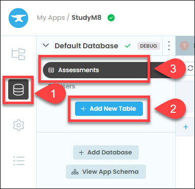
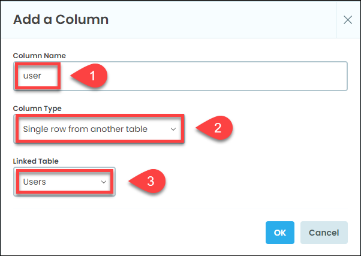
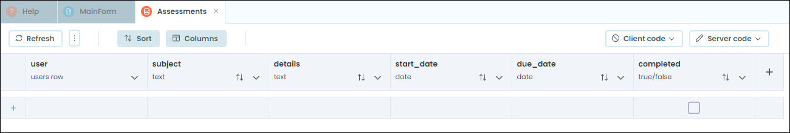

# The Assessments Table

```{topic} In this tutorial you will:
- Create a new custom table
- Add a column to link the custom table tot he user table
- Add columns with various data types
```

Now that we have the user all sorted, it is time to start working on the assessments aspect of the website. To do this we will need to store all the assessment details in a table. This information doesn't belong in the user table, so we will need to store it in a new table.

## Create new table

First we will need to create a new table:

1. Go to the data menu
2. Click on **+ Add New Table** in the submenu
3. Name the table **Assessments**



## Add columns

### User column

Now that the table is created we need to add columns.

The first column is very important, as it will link the assessment item with the correct user. Click on **+ New Column** then:

1. Type **user** as the column name
2. Choose **Single row from another table** from the **Column Type** dropdown
3. Choose **Users** from the **Linked Table** dropdown



### Other Columns

Now add the other columns by clicking the **+** sign. The column details are below.

| Column Name | Column Type |
| :--- | :--- |
| subject | Text |
| details | Text |
| start_date | Date |
| due_date | Date |
| completed | True/False |

## Testing

This is all the columns we should need. When you have finished your table should look as per below.

