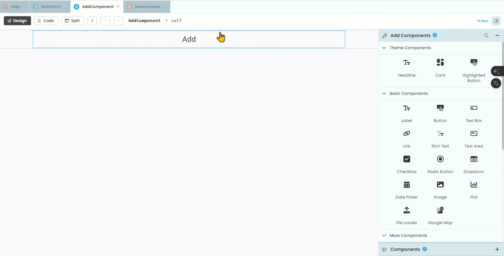
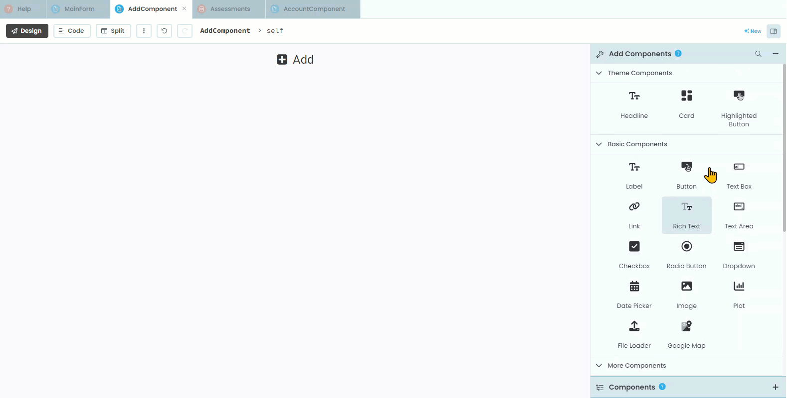
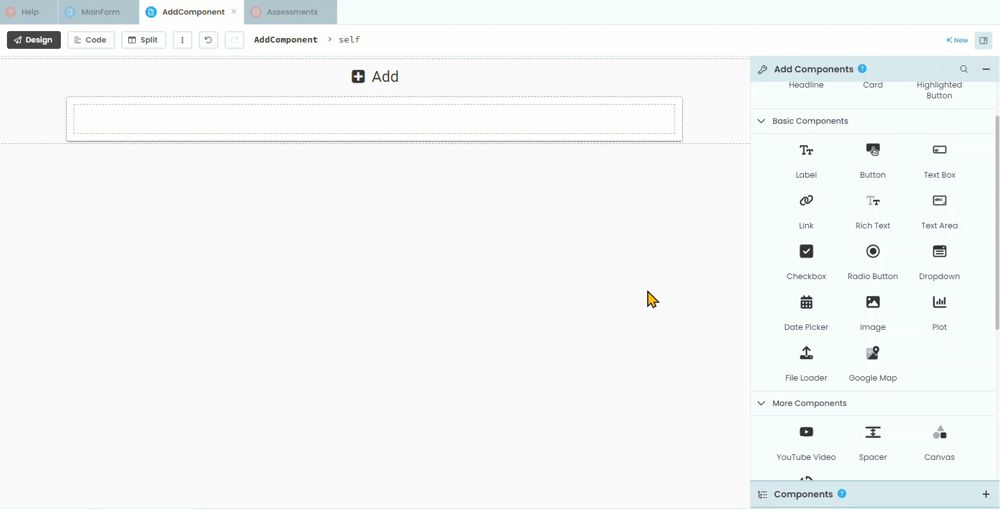
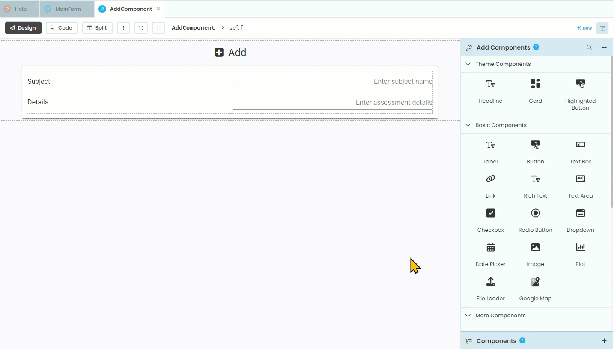
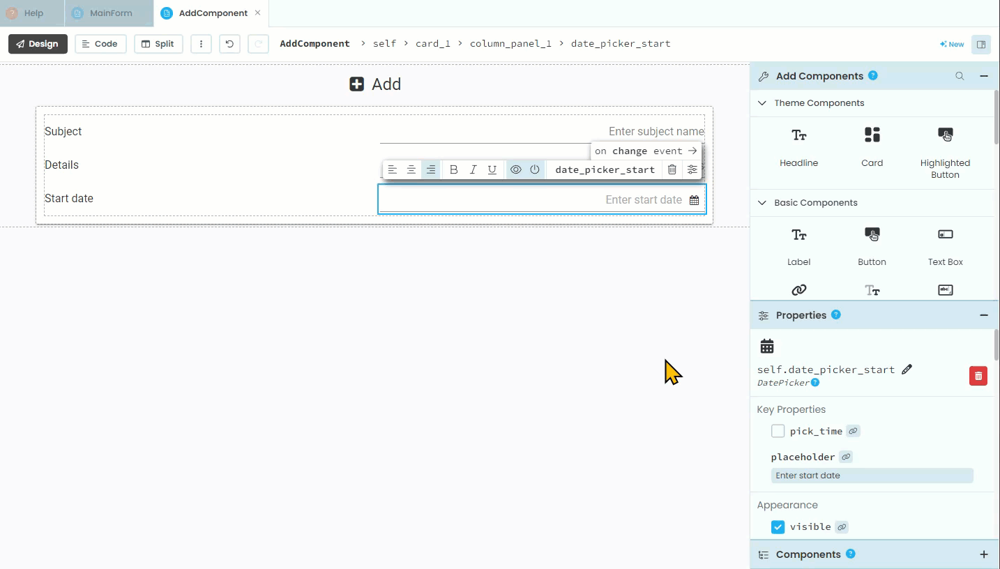
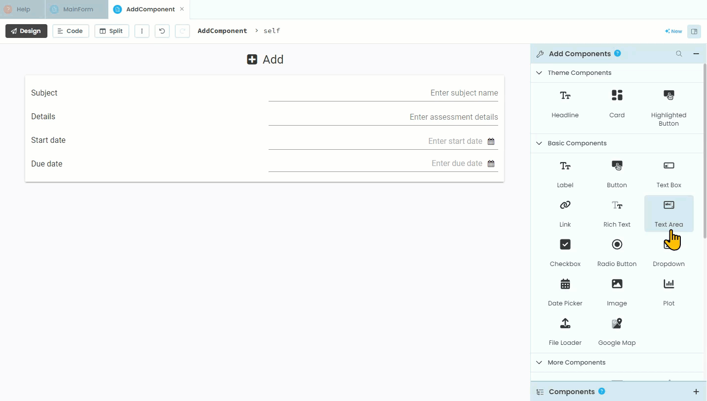
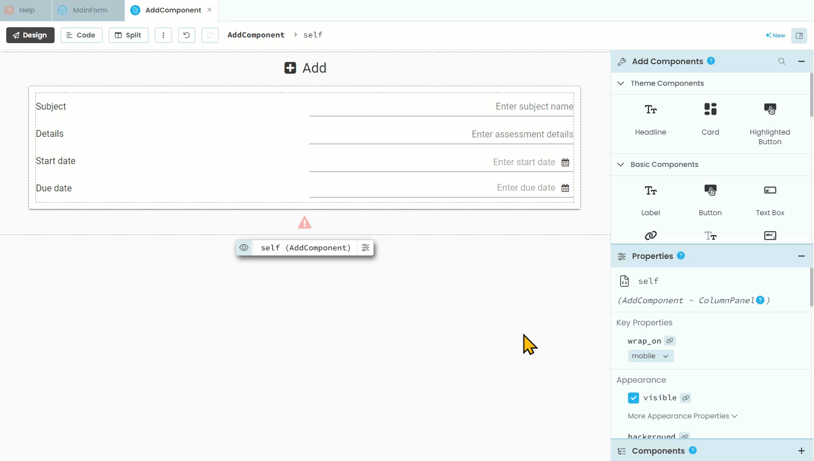
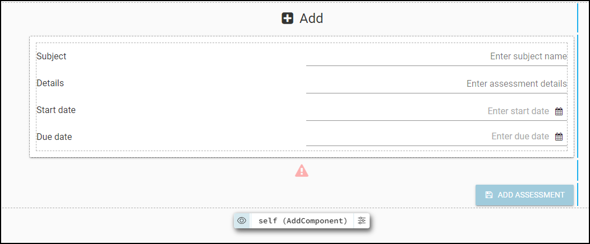

# Add Component Design

```{topic} In this tutorial you will:
- 
```

Now that we have somewhere to store assessment data, we need a way to input it. This will be completed through the **AddComponent**.

## Design

Checking our [design](./03_studyM8_design.md) we will see the layout of this component.


## The layout

Open the **AddComponent** in the design mode.

### Title

Currently the only element on the component is the title. We'll start by adding an icon to the title.

1. Click on the title
2. Find **Icon** in the **Properties** panel
3. Choose the `fa:plus-square`



### Organisational elements

Looking at our design we can see that we will need a **Card** that contains a **Column Panel** so add these to your layout.



### Labels and text boxes

Now we need to add the labels and text boxes.

First add the **subject** elements

1. Add a label
2. Change the **text** to `Subject`
3. Charge its **role** to `input-prompt`
4. Add a text box
5. Change the text box's **name** to `text_box_subject`
6. Change the text box's **placeholder** to `Enter subject name`
7. Change the text box's **align** to `right` 



Then add the **details** elements

1. Add a label
2. Change the **text** to `Details`
3. Charge its **role** to `input-prompt`
4. Add a text box
5. Change the text box's **name** to `text_box_details`
6. Change the text box's **placeholder** to `Enter assessment details`
7. Change the text box's **align** to right 


### Dates

We now need to add the two date fields, Start date and Due date. Anvil uses Python's **datetime** module to handle dates. This means that dates are stores as a Python object, with the day, month and year all stored as separate values (it does the same for time). This way you can use each of the values independently, which includes choose how to format the date. In our website, we will display our dates in the format of dd/mm/yyyy so that the 1st of April 2024 would be displayed as 01/04/2024. 

```{admonition} Date formats
:class: note
Date formats can be problematic because different regions use different conventions. The most common format is "DD/MM/YYYY", but it is far from dominate. The US uses "MM/DD/YYYY" , while Japan, South Korea, China and others use "YYYY/MM/DD". This can lead to confusion and errors when processing dates from various sources. Additionally, dates can be represented in many ways, such as strings, timestamps, or specific date objects, requiring careful handling to ensure accuracy.

Anvil simplifies working with dates by using Python's datetime module, which provides a standard way to create, manipulate, and format dates. Anvil's date pickers and forms automatically handle date input in a consistent format. When dates are stored in Anvil's database, they are stored as datetime objects, ensuring that date operations are performed correctly and consistently, regardless of the user's regional settings. Anvil also provides utilities to format dates for display and to parse dates from strings, making it easier to handle different date formats accurately.

For more information check out **<a href="Geeks for Geeks datetime tutorial" target="_blank">Geeks for Geeks datetime tutorial</a>**
```

First we need to add the **start** date:

1. Add a label
2. Change the **text** to `Start date`
3. Charge its **role** to `input-prompt`
4. Add a date picker
5. Change the date picker's **name** to `date_picker_start`
6. Change the date picker's **placeholder** to `Enter start date`
7. Change the date picker's **format** to `%d/%m/%Y`
8. Change the date picker's **align** to right



Then we need to add the **due** date:

1. Add a label
2. Change the **text** to `Due date`
3. Charge its **role** to `input-prompt`
4. Add a date picker
5. Change the date picker's **name** to `date_picker_due`
6. Change the date picker's **placeholder** to `Enter due date`
7. Change the date picker's **format** to `%d/%m/%Y`
8. Change the date picker's **align** to right



### Error message

Just like the **SetDetailsComponent** we will be validating the user's input, therefore we need an element to display warnings. Previously we have displayed warnings under the card, so we will continue this to maintain consistency.

1. Add a label
2. Change the **name** to `label.error`
3. Untick **visibility**
4. Change **foreground** to `#ff0000`
5. Change **role** to `headline`
6. Change **icon** to `fa:warning`
7. Change **align** to `center`



### Add Assessment Button

Finally we are going to insert an **Add Assessment Button**.

1. Add a button
2. Change the **name** to `button_add`
3. Change the **text** to `Add Assessment`
4. Change the **role** to the same as the other buttons you have used (check the **SetDetailsComponent**)
5. Change **icon** to `fa:save`
6. Change **align** to `right`



## Testing

That is all the elements that the **AddComponent** needs. Your finished layout should look like:

