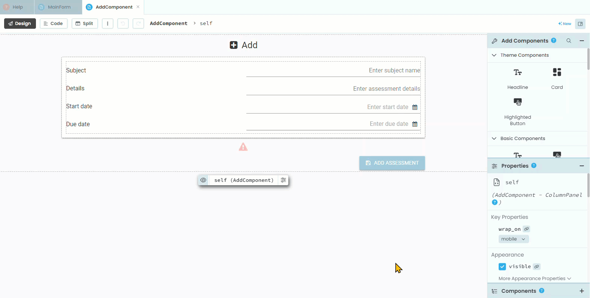
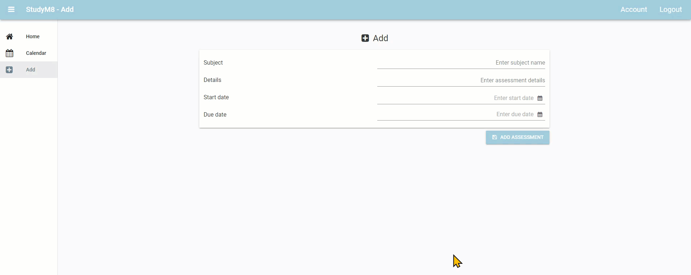
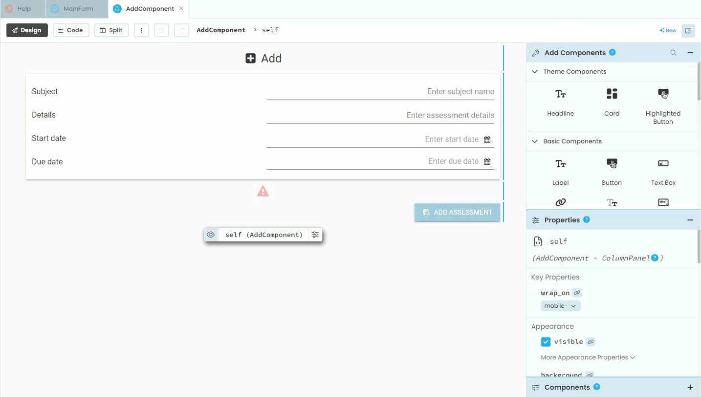
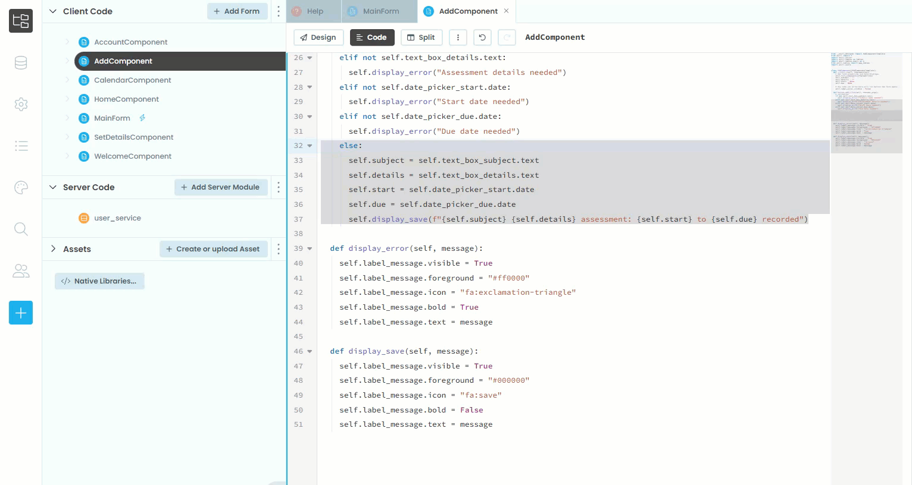
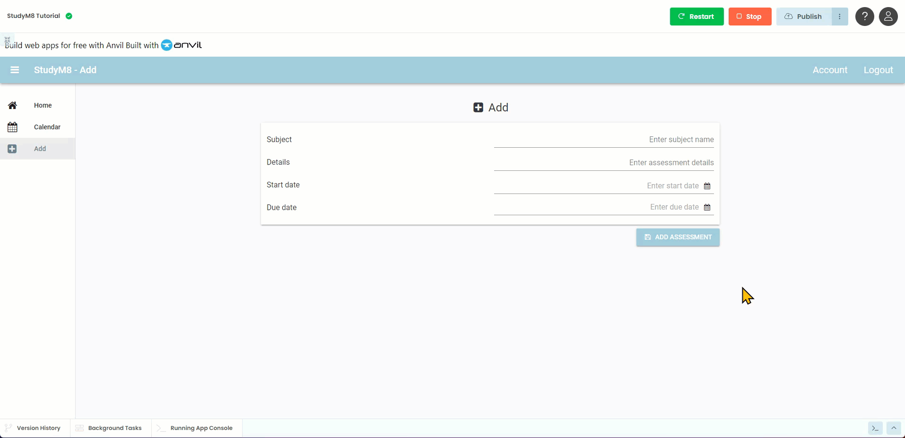
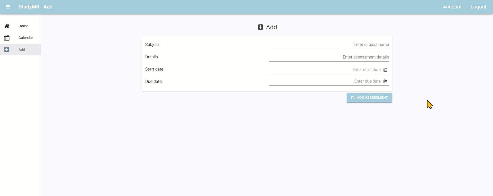

# Add Component Code

```{topic} In this tutorial you will:
- 
```

Now that we have create the layout for the AddComponent, we need to write the code to run it. Eventually we want to save the details to a table, but we haven't made a table yet, so we will simply display the data as a save message

## Planning

There are two events that will trigger code:

- loading the component &rarr; initialise variable to store the user input
- clicking the **Add Assessment** button &rarr; validate the user's input, display save message and reset the form.

## Coding

Now we know what we are doing, open the **AddComponent** in Code mode.

### Initialising variable

We need to create variables to store all the user's input. This needs to occur in the `__init__` method.

```{code-block} python
:linenos:
:lineno-start: 10
:emphasize-lines: 5 - 8
class AddComponent(AddComponentTemplate):
  def __init__(self, **properties):
    # Set Form properties and Data Bindings.
    self.init_components(**properties)
    self.subject = ""
    self.details = ""
    self.start = None
    self.due = None
```

```{admonition} Code explaination
:class: notice
- **lines 14 & 15** &rarr; since **Subject** and **Details** store text, we create empty strings for their variables.
- **lines 16 & 15** &rarr; **Start** and **Due** are both dates, which are objects, so their empty variables are set using `None`
```

We also need to make sure the error message is invisible.

```{code-block} python
:linenos:
:lineno-start: 10
:emphasize-lines: 11
class AddComponent(AddComponentTemplate):
  def __init__(self, **properties):
    # Set Form properties and Data Bindings.
    self.init_components(**properties)
    self.subject = ""
    self.details = ""
    self.start = None
    self.due = None

    # Any code you write here will run before the form opens.
    self.label_error.visible = False
```

```{admonition} Code explaination
:class: notice
- **line 20** &rarr; sets the label error to not vissible
```

### Validation

Now we need to make the `button_add_click` event handler.



The first code we add to the `button_add_click` event handler checks that the user has entered data.

```{code-block} python
:linenos:
:lineno-start: 22
:emphasize-lines: 2-14
  def button_add_click(self, **event_args):
    # validation
    if not self.text_box_subject.text:
      self.label_error.visible = True
      self.label_error.text = "Subject name needed"
    elif not self.text_box_details.text:
      self.label_error.visible = True
      self.label_error.text = "Assessment details needed"
    elif not self.date_picker_start.date:
      self.label_error.visible = True
      self.label_error.text = "Start date needed"
    elif not self.date_picker_due.date:
      self.label_error.visible = True
      self.label_error.text = "Due date needed"
```

```{admonition} Code explaination
:class: notice
- **lines 24 & 27** &rarr; checks that the text box has a value (remember string truthiness)
- **lines 30 & 33** &rarr; checks that a date has been picked (remember object truthiness)
- **lines 25, 28, 31 & 34** &rarr; make the error message visible
- **lines 26, 29, 32 & 35** &rarr; display the error message
```

#### Validation testing

Launch your website and check that it produces an error message for each input element.

### Save Message

Now we want to display a message to the user about what values will be saved.

```{code-block} python
:linenos:
:lineno-start: 22
:emphasize-lines: 15-21
  def button_add_click(self, **event_args):
    # validation
    if not self.text_box_subject.text:
      self.label_error.visible = True
      self.label_error.text = "Subject name needed"
    elif not self.text_box_details.text:
      self.label_error.visible = True
      self.label_error.text = "Assessment details needed"
    elif not self.date_picker_start.date:
      self.label_error.visible = True
      self.label_error.text = "Start date needed"
    elif not self.date_picker_due.date:
      self.label_error.visible = True
      self.label_error.text = "Due date needed"
    else:
      self.label_error.visible = True
      self.subject = self.text_box_subject.text
      self.details = self.text_box_details.text
      self.start = self.date_picker_start.date
      self.due = self.date_picker_due.date
      self.label_error.text = f"{self.subject} {self.details} assessment: {self.start} to {self.due} recorded"
```

```{admonition} Code explaination
:class: notice
- **line 37** &rarr; makes the message available
- **lines 38 - 41** &rarr; reads the values from the form and stores them in the variables
- **line 42** &rarr; creates a string displaying the message and displays it in the error message label.
```

#### Save testing

Launch your website and check if it works. Enter a subject, assessment details, start date and due date, then click the **Add Assessment** button.



We can make a few observations from this test:

1. The save message should look the same as the error message
2. When the same message is presented, the input values in the form should be reset

Let's fix those up.

### Fixing messaging

The problem we have with the save message is that it is using the same format at the error message. There are two solutions:

1. Add another label for the save message, or
2. Change the format of the error label.

Neither one has an advantage over the other, so, for no particular reason, we will change the format of the error label.

This will involve changing the following label properties:

- foreground colour
- icon
- bold

If we look at our code, this will need to happen for each of the error messages, as well as the save message. That means in five different locations. This is started to get quite repetitive. If we put this code through, and then decide to change the error foreground colour, we will need to fix it in multiple places. This is a classic example of the **DRY** principle. The means, it's time to **refactor**.

#### Refactor plan

What we will do is create two methods to:

- display an error message
- display a save message

These methods will contain the appropriate formatting and then change the label text.

Speaking of the label, the name **label_error** doesn't seem appropriate now, sow we will change it to **label_message**.

So, before refactoring the code, first change back to the **Design** mode and change the name of **label_error** to **label_message**.



#### Display error

Now, back in the **Code** mode, we will first create the **display_error** method

Under the **button_add_click** handler add the following code (be careful with your indentations).

```{code-block} python
:linenos:
:lineno-start: 44
:emphasize-lines: 1 - 6
  def display_error(self, message):
    self.label_message.visible = True
    self.label_message.foreground = "#ff0000"
    self.label_message.icon = "fa:exclamation-triangle"
    self.label_message.bold = True
    self.label_message.text = message
```

```{admonition} Code explaination
:class: notice
- **line 44** &rarr; creates the `display_error` method, which accepts an argument called `message`
- **line 45** &rarr; turns the label visible
- **line 46** &rarr; changes the font colour to red
- **line 47** &rarr; sets the label's icon
- **line 48** &rarr; makes the label bold
- **line 49** &rarr; makes the label display the message passed to it as an argument
```

Now go back to the **button_add_click** handler and replace all the error label code with a call to **display_error**.

```{code-block} python
:linenos:
:lineno-start: 22
:emphasize-lines: 4, 6, 8, 10
  def button_add_click(self, **event_args):
    # validation
    if not self.text_box_subject.text:
      self.display_error("Subject name needed")
    elif not self.text_box_details.text:
      self.display_error("Assessment details needed")
    elif not self.date_picker_start.date:
      self.display_error("Start date needed")
    elif not self.date_picker_due.date:
      self.display_error("Due date needed")
    else:
      self.label_error.visible = True
      self.subject = self.text_box_subject.text
      self.details = self.text_box_details.text
      self.start = self.date_picker_start.date
      self.due = self.date_picker_due.date
      self.label_error.text = f"{self.subject} {self.details} assessment: {self.start} to {self.due} recorded"
```

#### Display save

Now to add the **display_save** method.

Add the following code under the **display_error** method (remember to check indentation).

```{code-block} python
:linenos:
:lineno-start: 47
:emphasize-lines: 1 - 6
  def display_save(self, message):
    self.label_message.visible = True
    self.label_message.foreground = "#000000"
    self.label_message.icon = "fa:save"
    self.label_message.bold = False
    self.label_message.text = message
```

```{admonition} Code explaination
:class: notice
- **line 47** &rarr; creates the `display_save` method, which accepts an argument called `message`
- **line 48** &rarr; turns the label visible
- **line 49** &rarr; changes the font colour to black
- **line 50** &rarr; sets the label's icon
- **line 51** &rarr; makes the label not bold
- **line 52** &rarr; makes the label display the message passed to it as an argument
```

Now go back to the **button_add_click** handler and replace the save message code with a call to **display_save**.

```{code-block} python
:linenos:
:lineno-start: 32
:emphasize-lines: 6
    else:
      self.subject = self.text_box_subject.text
      self.details = self.text_box_details.text
      self.start = self.date_picker_start.date
      self.due = self.date_picker_due.date
      self.display_save(f"{self.subject} {self.details} assessment: {self.start} to {self.due} recorded")
```

#### Remove any other reference to **label_error**

Use Anvil's search function to check if there are any more references to **label_error** in **AddComponent** and then fix them.



#### Test messaging

Launch your website and check that all the error messages and the save message work as planned.



### Clear Form

The final step is to clear the user input and ready the form for the next assessment.

Under the **display_save** method add the following code:

```{code-block} python
:linenos:
:lineno-start: 54
:emphasize-lines: 1 - 9
  def reset_form(self):
    self.subject = ""
    self.details = ""
    self.start = None
    self.due = None
    self.text_box_subject.text = ""
    self.text_box_details.text = ""
    self.date_picker_start.date = None
    self.date_picker_due.date = None
```

```{admonition} Code explaination
:class: notice
- **line 54** &rarr; creates the `reset_form` method
- **lines 55 - 58** &rarr; returns all the variables to their initialisation state
- **lines 59 - 62** &rarr; clears all the input from the elements
```

Since we only want to clear the form after it's been saved, call the function from within the **else** section of the **button_add_click** handler.

```{code-block} python
:linenos:
:lineno-start: 32
:emphasize-lines: 7
    else:
      self.subject = self.text_box_subject.text
      self.details = self.text_box_details.text
      self.start = self.date_picker_start.date
      self.due = self.date_picker_due.date
      self.display_save(f"{self.subject} {self.details} assessment: {self.start} to {self.due} recorded")
      self.reset_form()
```

#### Test clear form

Launch your website one more time and correctly enter all the required data. When you click the **Add Assessment** button, the save message should appear and all the input should be cleared.



## Final code state

By the end of this tutorial your code should be the same as below:

### Final AddComponent

```{code-block} python
:linenos:
from ._anvil_designer import AddComponentTemplate
from anvil import *
import anvil.server
import anvil.tables as tables
import anvil.tables.query as q
from anvil.tables import app_tables
import anvil.users


class AddComponent(AddComponentTemplate):
  def __init__(self, **properties):
    # Set Form properties and Data Bindings.
    self.init_components(**properties)
    self.subject = ""
    self.details = ""
    self.start = None
    self.due = None

    # Any code you write here will run before the form opens.
    self.label_message.visible = False

  def button_add_click(self, **event_args):
    # validation
    if not self.text_box_subject.text:
      self.display_error("Subject name needed")
    elif not self.text_box_details.text:
      self.display_error("Assessment details needed")
    elif not self.date_picker_start.date:
      self.display_error("Start date needed")
    elif not self.date_picker_due.date:
      self.display_error("Due date needed")
    else:
      self.subject = self.text_box_subject.text
      self.details = self.text_box_details.text
      self.start = self.date_picker_start.date
      self.due = self.date_picker_due.date
      self.display_save(f"{self.subject} {self.details} assessment: {self.start} to {self.due} recorded")
      self.reset_form()

  def display_error(self, message):
    self.label_message.visible = True
    self.label_message.foreground = "#ff0000"
    self.label_message.icon = "fa:exclamation-triangle"
    self.label_message.bold = True
    self.label_message.text = message

  def display_save(self, message):
    self.label_message.visible = True
    self.label_message.foreground = "#000000"
    self.label_message.icon = "fa:save"
    self.label_message.bold = False
    self.label_message.text = message

  def reset_form(self):
    self.subject = ""
    self.details = ""
    self.start = None
    self.due = None
    self.text_box_subject.text = ""
    self.text_box_details.text = ""
    self.date_picker_start.date = None
    self.date_picker_due.date = None
```