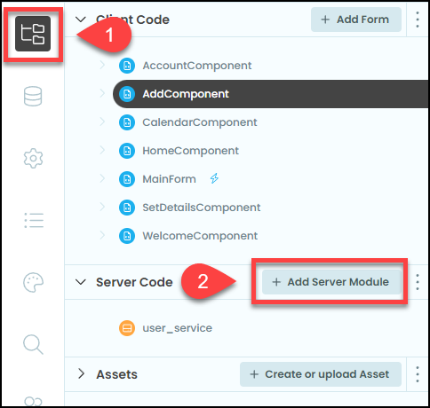
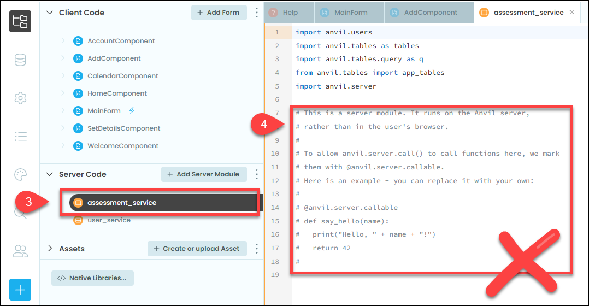
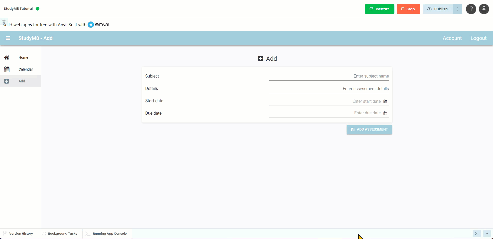

# Assessment Service Module

```{topic} In this tutorial you will:
- Create a server module to handle assessment data.
- Write a function to add assessment details to the database.
- Modify the frontend to call the server function when adding an assessment.
- Verify that the assessment data is correctly saved to the database.
```

Now that we have the **AddComponent** set and the user can input their data, we can save that data to the **Assessments** table. Just like we used a **user_service** to interact with the **Users** table, we will create an **assessment_service** to interact with the **Assessments** table.

## Planning

We will need to make a method that accepts the assessment details and writes it to the **Assessments** table. This will reside in a **Server-side** module, so let's start by creating that module.

1. Go to the file submenu
2. Click on the **+ Add Server Module** button



3. Name the module **assessment_service**
4. Delete all the comments from the code



## Code

Now to add our assessment_service code

### Add Assessment Function

Below the import section add the following code:

```{code-block} python
:linenos:
:lineno-start: 7
:emphasize-lines: 1 - 10
@anvil.server.callable
def add_assessment(subject, details, start_date, due_date):
  user = anvil.users.get_user()
  
  app_tables.assessments.add_row(user= user,
                                 subject= subject,
                                 details=details,
                                 start_date=start_date,
                                 due_date=due_date,
                                 completed=False)
```

```{admonition} Code explaination
:class: notice
- **line 7** &rarr; this is the decorator that tells Anvil that this function can be called from the **frontend**
- **line 8** &rarr; creates the **add_assessment** function which expects the values of subject, details, start_date, and due_date to be passed.
- **line 9** &rarr; gets the details of the current user from the user table
- **lines 11-16** &rarr; this is one command split over multiple lines and adds the provided details to the assessment table.
```

```{admonition} Splitting statements over multiple lines
:class: note
Python commands can become quite long, especially if you are using meaningful names (eg. line 11 in the above code). This can make them difficult to read. Fortunately Python provides ways to split commmands over muilitple lines. 

1. You can use a backslach `\` after a operations symbol
2. Within parentheses `()`, brackets `[]` or braces `{}`, you can press `return` after a comma `,`
```

Now that we have a function to add the user data to the **Assessments** table, we need to call that function from the **AddComponent**.

### Call from Add Component

Open the **AddComponent** in **Code** mode.

In the **else** section of the **button_add_click** handler, add the highlighted code between the call to **display_save** and the call to **reset_form**.

```{code-block} python
:linenos:
:lineno-start: 32
:emphasize-lines: 7
    else:
      self.subject = self.text_box_subject.text
      self.details = self.text_box_details.text
      self.start = self.date_picker_start.date
      self.due = self.date_picker_due.date
      self.display_save(f"{self.subject} {self.details} assessment: {self.start} to {self.due} recorded")
      anvil.server.call('add_assessment', self.subject, self.details, self.start, self.due)
      self.reset_form()
```

```{admonition} Code explaination
:class: notice
- **line 38** &rarr; calls the **add_assessments** function that we just created. 
  - It is important that this is called before the **reset_form**, as **reset_form** deletes all the values we wish to save to the **Assessments** table.
```

### Testing

Let's test the code. 

1. Launch your web app and then navigate to the Add page.
2. Enter the details for an assessment, click on the **Add Assessment** button.
3. Once the save message is displayed, stop the web app
4. Go to the **Assessments** table and check if the data you entered is in the table.



## Final code state

By the end of this tutorial your code should be the same as below:

### Final AddComponent

```{code-block} python
:linenos:
from ._anvil_designer import AddComponentTemplate
from anvil import *
import anvil.server
import anvil.tables as tables
import anvil.tables.query as q
from anvil.tables import app_tables
import anvil.users


class AddComponent(AddComponentTemplate):
  def __init__(self, **properties):
    # Set Form properties and Data Bindings.
    self.init_components(**properties)
    self.subject = ""
    self.details = ""
    self.start = None
    self.due = None

    # Any code you write here will run before the form opens.
    self.label_message.visible = False

  def button_add_click(self, **event_args):
    # validation
    if not self.text_box_subject.text:
      self.display_error("Subject name needed")
    elif not self.text_box_details.text:
      self.display_error("Assessment details needed")
    elif not self.date_picker_start.date:
      self.display_error("Start date needed")
    elif not self.date_picker_due.date:
      self.display_error("Due date needed")
    else:
      self.subject = self.text_box_subject.text
      self.details = self.text_box_details.text
      self.start = self.date_picker_start.date
      self.due = self.date_picker_due.date
      self.display_save(f"{self.subject} {self.details} assessment: {self.start} to {self.due} recorded")
      anvil.server.call('add_assessment', self.subject, self.details, self.start, self.due)
      self.reset_form()

  def display_error(self, message):
    self.label_message.visible = True
    self.label_message.foreground = "#ff0000"
    self.label_message.icon = "fa:exclamation-triangle"
    self.label_message.bold = True
    self.label_message.text = message

  def display_save(self, message):
    self.label_message.visible = True
    self.label_message.foreground = "#000000"
    self.label_message.icon = "fa:save"
    self.label_message.bold = False
    self.label_message.text = message

  def reset_form(self):
    self.subject = ""
    self.details = ""
    self.start = None
    self.due = None
    self.text_box_subject.text = ""
    self.text_box_details.text = ""
    self.date_picker_start.date = None
    self.date_picker_due.date = None
```

### Final assessment_service

```{code-block} python
:linenos:
import anvil.users
import anvil.tables as tables
import anvil.tables.query as q
from anvil.tables import app_tables
import anvil.server

@anvil.server.callable
def add_assessment(subject, details, start_date, due_date):
  user = anvil.users.get_user()
  
  app_tables.assessments.add_row(user= user,
                                 subject= subject,
                                 details=details,
                                 start_date=start_date,
                                 due_date=due_date,
                                 completed=False)
```
