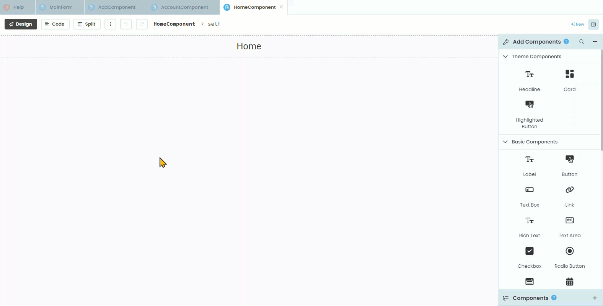
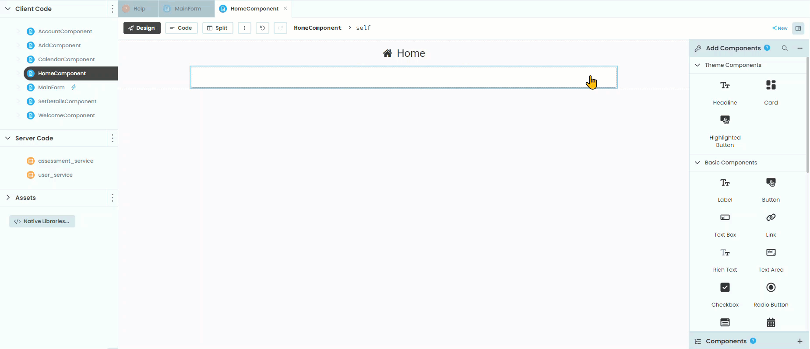
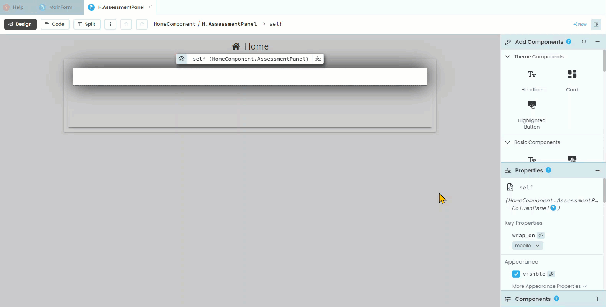
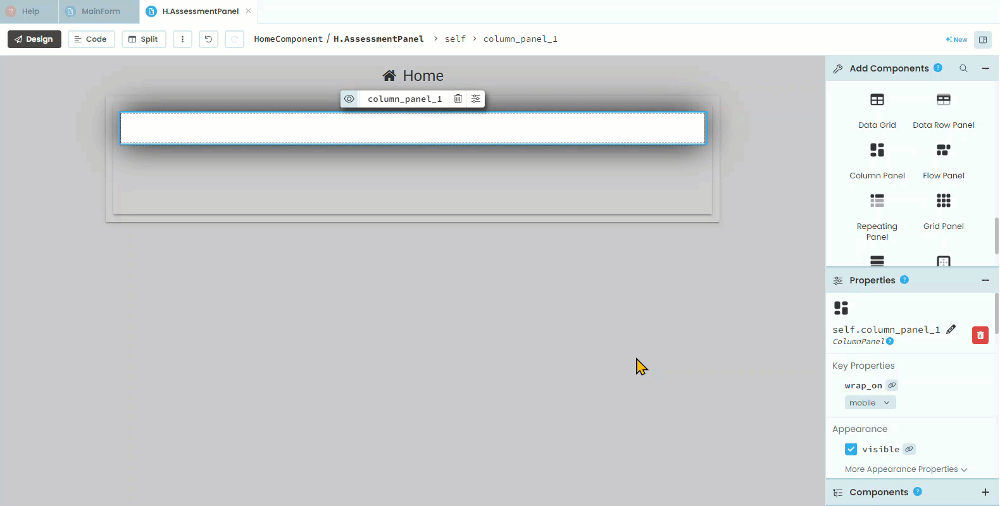
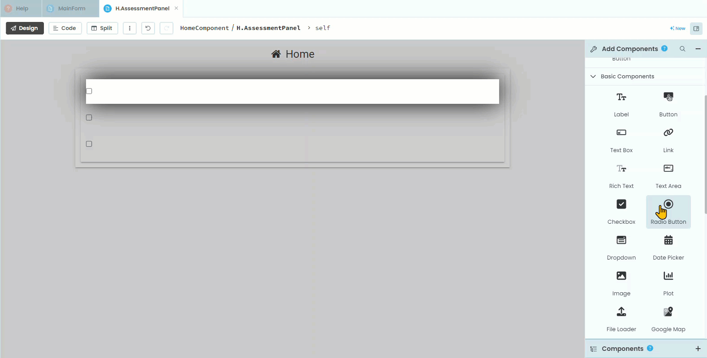
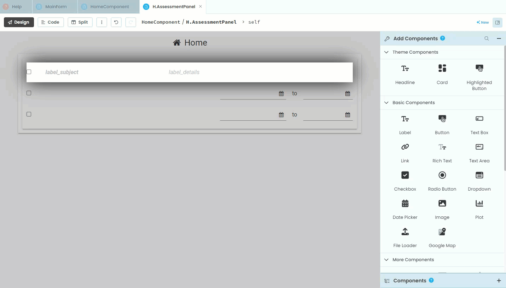
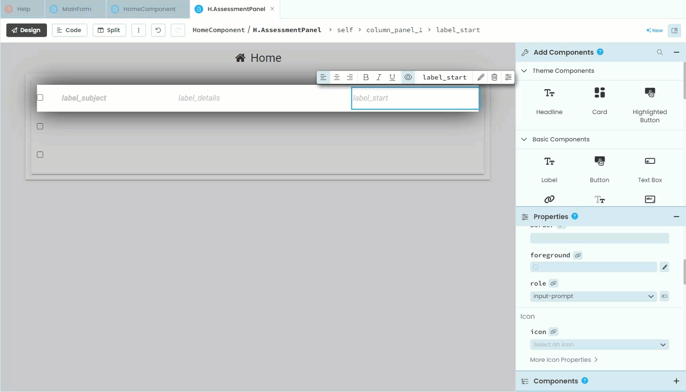
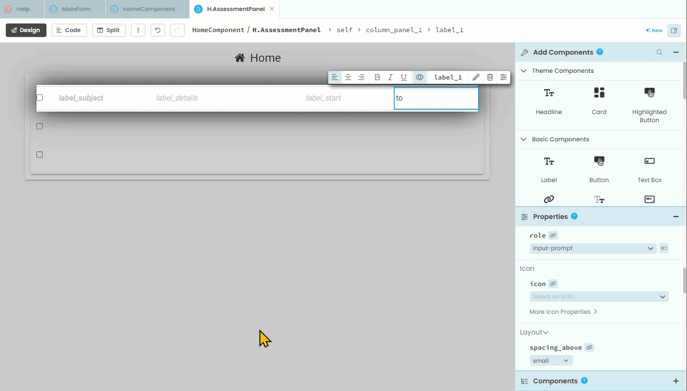
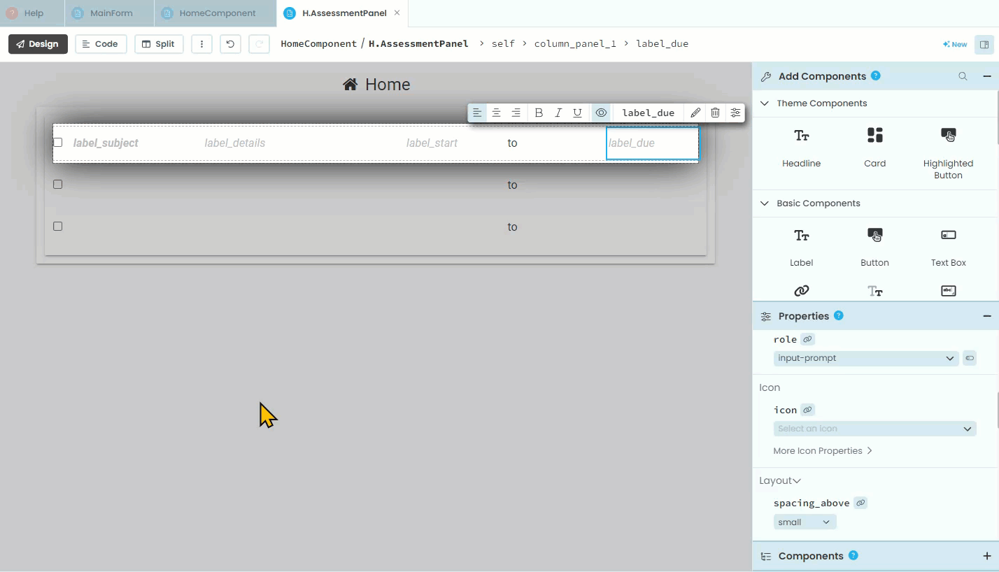

# HomeComponent Design

```{topic} In this tutorial you will:
- Use a Repeating Panel to display the list dynamically.
- Add and configure components within the Repeating Panel, such as checkboxes, labels, and date pickers, to display assessment details appropriately.
```

Now we can turn to the **HomeComponent**. This component lists all the current assessments and their respective details. Lets plan this out

## Planning

This is where we start to get tricky. Remember this web app is dynamic, that means how it looks is dependent on the stored data. In the case, the number of rows in our **HomeComponent** is dependent on the number of relevant assessments stored in our **Assessments** table.

There are two things we need to achieve this:

1. We need to retrieve a list of assessments data items from the **Assessments** table.
2. We need a layout element that will display the rows from that list.

To retrieve the list we will create a new function called **get_assessments** in the **assessment_service** module.

To display the list we will use a layout element called a **Repeating Panel**. **Repeating Panels** display a list of items in a repeated pattern. When it is connected to a list of data items, the panel repeats for each data item. It is probably easier to understand in practice, so let's get started.

## Layout

### Add repeating panel

Open the **HomeComponent** in the **Design** mode.

First step:

1. add the `fa:home` icon to the title
2. add a card under the title



Next you need to:

3. find and click on **Repeating Panel** in the **Layout Components**
4. place it in the layout by clicking on the card (check the blue line)
5. Anvil will automatically open the repeating panel, rename it **AssessmentPanel**
6. return to the **HomeComponent** click on **repeating_panel_1** and change it's role to **card**



### Repeating panel layout

Now we need to add elements to the **AssessmentPanel**, so open it in **Design** mode.

1. find the **Column Panel** and add it to the **AssessmentPanel**



2. locate the **Check Box** and add it.
3. rename the **self.check_box_1** to **self.check_box_completed**
4. delete **text** leaving it blank



5. add a **label** beside the check box (watch the blue line)
6. rename it as **label_subject**
7. change the role to the format you desire
8. find and check **bold**



9. add another label beside the **label_subject**
10. rename the new label to **label_details**
11. change the role to be the same as **label_subject**


12. add another label beside **label_details**
13. rename it **label_start**
14. change the role to be the same as **label_subject**



15. add a label beside **label_start**
16. change the **text** to `to`
17. choose the same role as **label_subject**



18. add another label beside **to**
19. rename it **label_due**
20. change the role to be the same as **label_subject**



21. click on the **column panel**
22. using the blue lines, change the column widths to best suit your content



We have now finished the layout, time to turn towards the code.
