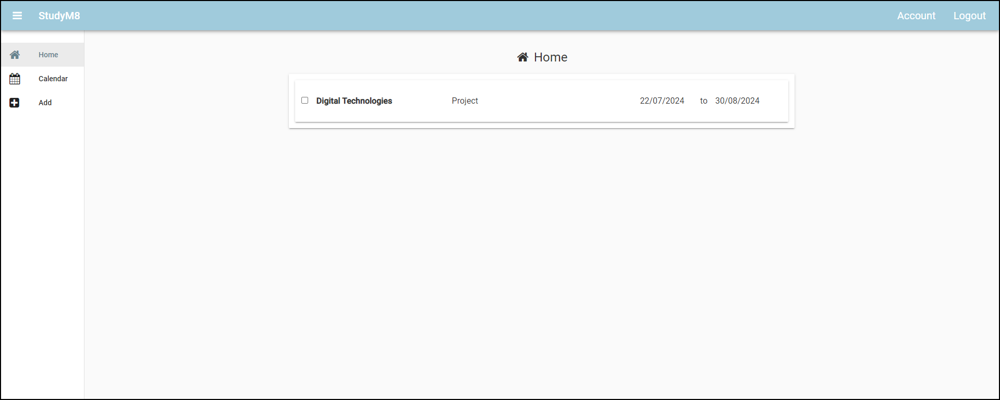

# HomeComponent Code

```{topic} In this tutorial you will:
- Retrieve and sort assessments from the database using **assessment_services**.
- Link assessment data to the **HomeComponent**'s repeating panel.
- Format and display assessment details in the **AssessmentPanel**.
- Test the functionality by viewing assessments on the Home page.
```

## Assessments service

We noted in the last tutorial that the repeating panel needs to be linked to a list of items. For the **HomeComponent** the list of items will be a list of the assessments. This means that we will have to retrieve the list of assessments from the **Assessments** table, therefore, using the **assessments_services**.

Before we look at the code, we need to consider exactly what we are retrieving from the **Assessments** table:

- the app can have multiple users, so we only want the assessments that belong to the current user.
- the assessments are listed in the order they were entered, which is not much use. We will need to sort the list so the assessments are listed according to their due date.

### Assessment services code

In the **Server Code** open the **assessment_services**.

Then add the new **get_assessments** function below:

```{code-block} python
:linenos:
:lineno-start: 18
:emphasize-lines: 1 - 6
@anvil.server.callable
def get_assessment():
  user = anvil.users.get_user()

  return app_tables.assessments.search(tables.order_by('due_date'),
                                       user=user)
```

```{admonition} Code explaination
:class: notice
- **line 18** &rarr; the decorator that allows the frontend to call this backend function
- **line 19** &rarr; defines the **get_assessment** function, note no arguments required
- **line 20** &rarr; retrieves the details of the currently logged in user
- **lines 22 - 23** &rarr; retrieves the assessments from the **Assessments** table and returns them to the front end:
  - `app_table.assessments` &rarr; working with the **Assessments** table
  - `search` &rarr; command used to retrieve row from the table
  - `tables.order_by('due_date')` &rarr; sorts the results according to the assessments due date
  - `user=user` &rarr; only retrieves assessments that belong to the current user
```

## HomeComponent

Now that we can retrieve the assessment items, we need to link them to the repeating panel. We do this in **HomeComponent**. It will also need to happen before the **HomeComponent** opens.

### HomeComponent code

Open the **HomeComponent** in the **code** mode and then add the highlighted code to the `__init__` method:

```{code-block} python
:linenos:
:lineno-start: 11
:emphasize-lines: 6
  def __init__(self, **properties):
    # Set Form properties and Data Bindings.
    self.init_components(**properties)

    # Any code you write here will run before the form opens.
    self.repeating_panel_1.items = anvil.server.call('get_assessment')
```

```{admonition} Code explaination
:class: notice
- **line 6** &rarr; calls the **get_assessment** function and then connects the returned list to **repearing_panel_1** items.
```

## AssessmentPanel

Now that we have connected the list of assessments to the repeating panel, we can now connect the assessment values to their respective element in the **AssessmentPanel**. This needs to happen in the **AssessmentPanel** before it opens.

### AssessmentPanel code

Open the **AssessmentPanel** in the **code** mode. Before we work on the `__init__` method we need to import `datetime` so we can format the date correctly. So in the import section add the highlighted code:

```{code-block} python
:linenos:
:lineno-start: 1
:emphasize-lines: 8
from ._anvil_designer import AssessmentPanelTemplate
from anvil import *
import anvil.server
import anvil.users
import anvil.tables as tables
import anvil.tables.query as q
from anvil.tables import app_tables
import datetime
```

Now add the following code to the `__init__` method.

```{code-block} python
:linenos:
:lineno-start: 12
:emphasize-lines: 6 - 10
  def __init__(self, **properties):
    # Set Form properties and Data Bindings.
    self.init_components(**properties)

    # Any code you write here will run before the form opens.
    self.check_box_completed.checked = self.item['completed']
    self.label_subject.text = self.item['subject']
    self.label_details.text = self.item['details']
    self.label_start.text = self.item['start_date'].strftime('%d/%m/%Y')
    self.label_due.text = self.item['due_date'].strftime('%d/%m/%Y')
```

```{admonition} Repeating panel an items
:class: note
The repeating panel is connected to a list of items. This means that each instance of the panel is connected to one of the items.

When the code uses `self.item` is refers to the specific data item belonging to this specific panel. This means you can acces the values in the item just like a dicitonary.
```

```{admonition} Code explaination
:class: notice
- **line 17** &rarr; read the **completed** value for this panel's item and display it in the **check_box_completed**
- **line 18** &rarr; read the **subject** value for this panel's item and display it in the **label_subject**
- **line 19** &rarr; read the **details** value for this panel's item and display it in the **label_details**
- **line 20** &rarr; read the **start_date** value for this panel's item. Format it to show dd/mm/yyyy and then display it in the **label_start**
- **line 21** &rarr; read the **due_date** value for this panel's item. Format it to show dd/mm/yyyy and then display it in the **label_due**
```

## Testing

Time to launch your website and see if the assessments are displayed on the **Home** page. Make sure that you are logged in.

The **Home** page should look like this:



We're starting to get a functional web app. Try adding more assessment items and seeing how they display on the **Home** page.

## Final code state

By the end of this tutorial your code should be the same as below:

### Final assessment_service

```{code-block} python
:linenos:
import anvil.users
import anvil.tables as tables
import anvil.tables.query as q
from anvil.tables import app_tables
import anvil.server

@anvil.server.callable
def add_assessment(subject, details, start_date, due_date):
  user = anvil.users.get_user()
  
  app_tables.assessments.add_row(user= user,
                                 subject= subject,
                                 details=details,
                                 start_date=start_date,
                                 due_date=due_date,
                                 completed=False)

@anvil.server.callable
def get_assessment():
  user = anvil.users.get_user()

  return app_tables.assessments.search(tables.order_by('due_date'),
                                       user=user)
```

### Final HomeComponent

```{code-block} python
:linenos:
from ._anvil_designer import HomeComponentTemplate
from anvil import *
import anvil.server
import anvil.tables as tables
import anvil.tables.query as q
from anvil.tables import app_tables
import anvil.users


class HomeComponent(HomeComponentTemplate):
  def __init__(self, **properties):
    # Set Form properties and Data Bindings.
    self.init_components(**properties)

    # Any code you write here will run before the form opens.
    self.repeating_panel_1.items = anvil.server.call('get_assessment')
```

### Final AssessmentPanel

```{code-block} python
:linenos:
from ._anvil_designer import AssessmentPanelTemplate
from anvil import *
import anvil.server
import anvil.users
import anvil.tables as tables
import anvil.tables.query as q
from anvil.tables import app_tables
import datetime


class AssessmentPanel(AssessmentPanelTemplate):
  def __init__(self, **properties):
    # Set Form properties and Data Bindings.
    self.init_components(**properties)

    # Any code you write here will run before the form opens.
    self.check_box_completed.checked = self.item['completed']
    self.label_subject.text = self.item['subject']
    self.label_details.text = self.item['details']
    self.label_start.text = self.item['start_date'].strftime('%d/%m/%Y')
    self.label_due.text = self.item['due_date'].strftime('%d/%m/%Y')
```
