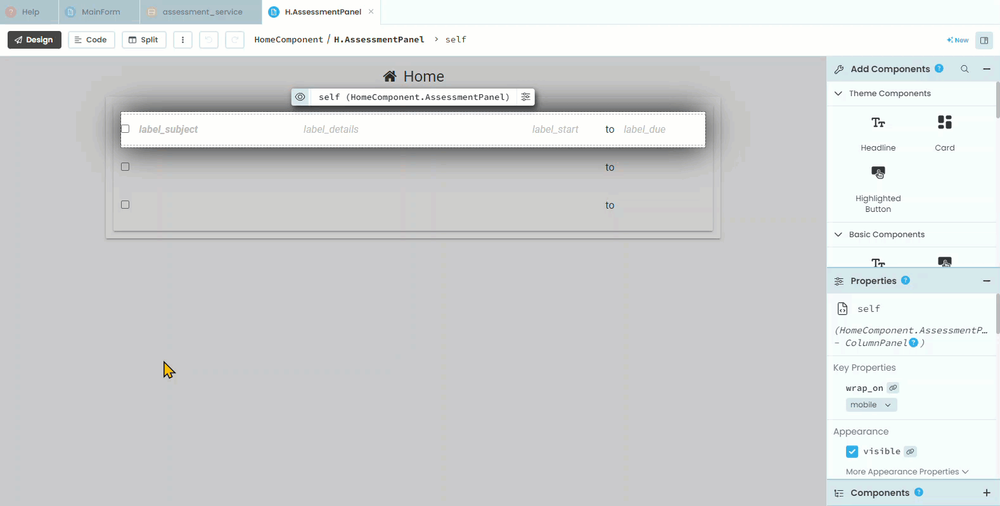

# Complete Assessments

```{topic} In this tutorial you will:
- 
```

We can enter assessment details and we can view them. We even have a check box on the **AssessmentPanel** that allows the user to tick whether they have completed an assessment. Only problem is, this doesn't change the information saved in our **Assessment** table. let's fix that.

## Plan

We want Anvil to respond when the **check_box_completed** is ticked, this will require an event handler. We know from working with buttons and links, that we create event handlers in the **Design** screen.

We want that handler to take the current value of the **check_box_completed** and write it to the **completed** field for the item belonging to that specific panel. Since this happens server-side, we need to create a new function in the **assessment_service**.

## Code

### AssessmentsPanel Code

We will start with the code in the **AssessmentsPanel**, so open it in **Design** mode.

1. Click on the **check_box_completed**
2. Click **on change event** 
3. Switch to **Code** mode



In the **check_box_completed_change** event handler, replace lines 24 and 25 with the highlighted code.

```{code-block} python
:linenos:
:lineno-start: 23
:emphasize-lines: 2, 3
  def check_box_completed_change(self, **event_args):
    new_value = self.check_box_completed.checked
    anvil.server.call('update_assessment_completed', self.item.get_id(), new_value)
```

```{admonition} Code explaination
:class: notice
- **line 24** &rarr; takes the current value from **check_box_completed**
- **line 25** &rarr; sends that value to the server
  - `'update_assessment_completed'` &rarr; a function we will have to write
  - `self.item.get_id()` &rarr; gets the id for the item for this specific panel
  - `new_value` &rarr; the value we retrieved from **check_box_completed**
```

