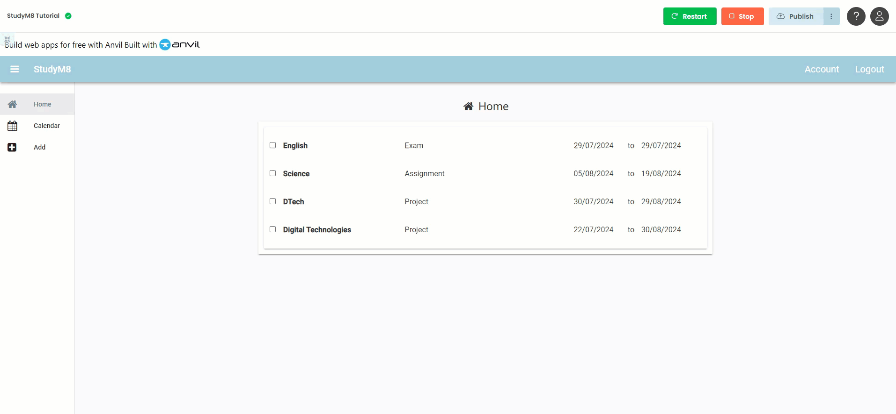

# Complete Assessments

```{topic} In this tutorial you will:
- 
```

We can enter assessment details and we can view them. We even have a check box on the **AssessmentPanel** that allows the user to tick whether they have completed an assessment. Only problem is, this doesn't change the information saved in our **Assessment** table. let's fix that.

## Plan

We want Anvil to respond when the **check_box_completed** is ticked, this will require an event handler. We know from working with buttons and links, that we create event handlers in the **Design** screen.

We want that handler to take the current value of the **check_box_completed** and write it to the **completed** field for the item belonging to that specific panel. Since this happens server-side, we need to create a new function in the **assessment_service**.

## Code

### AssessmentsPanel Code

We will start with the code in the **AssessmentsPanel**, so open it in **Design** mode.

1. Click on the **check_box_completed**
2. Click **on change event** 
3. Switch to **Code** mode


In the **check_box_completed_change** event handler, replace lines 24 and 25 with the highlighted code.

```{code-block} python
:linenos:
:lineno-start: 23
:emphasize-lines: 2, 3
  def check_box_completed_change(self, **event_args):
    new_value = self.check_box_completed.checked
    anvil.server.call('update_assessment_completed', self.item.get_id(), new_value)
```

```{admonition} Code explaination
:class: notice
- **line 24** &rarr; takes the current value from **check_box_completed**
- **line 25** &rarr; sends that value to the server
  - `'update_assessment_completed'` &rarr; a function we will have to write
  - `self.item.get_id()` &rarr; gets the id for the item for this specific panel
  - `new_value` &rarr; the value we retrieved from **check_box_completed**
```

Now we have to create the **update_assessment_completed** function.

### assessment_service Code

Open the **update_assessment_completed** function in the **assessment_service** module under the **Server Code**.

At the bottom of the file add the following code:

```{code-block} python
:linenos:
:lineno-start: 25
:emphasize-lines: 1 - 5
@anvil.server.callable
def update_assessment_completed(assessment_id, completed):
  assessment = app_tables.assessments.get_by_id(assessment_id)
  if assessment:
    assessment["completed"] = completed
```

```{admonition} Code explaination
:class: notice
- **line 25** &rarr; makes the functional callable by frontend code
- **line 26** &rarr; creates the `update_assessment_completed` function which accept 2 arguments:
  - `assessment_id` &rarr; the unique identifier for the assessment
  - `completed` &rarr; the completed state (`True` or `False`) of the assessment
- **line 27** &rarr; retrieves the row from the **assessment** table that has the passed `assessment_id` and stores it in the **assessment variable**
- **line 28** &rarr; checks the truthiness of the **assessment variable**
  - if an assessment was retrieved, it will be `True`
  - if an assessment wasn't retrieved (ie. doesn't exist), it will be `False`
- **line 29** &rarr; changes the **completed** value of the assessment to match the value passed to the function
```

## Testing

Now to test your code. Launch your web app.

1. Click on the completed checkbox for one of the assessments
2. Stop your web app
3. Click on the **data menu**
4. In the submenu choose **Assessments**
5. Check to see if the assessment's completed box is now ticked.



## Final code state

By the end of this tutorial your code should be the same as below:

### Final AssessmentPanel

```{code-block} python
:linenos:
from ._anvil_designer import AssessmentPanelTemplate
from anvil import *
import anvil.server
import anvil.users
import anvil.tables as tables
import anvil.tables.query as q
from anvil.tables import app_tables
import datetime


class AssessmentPanel(AssessmentPanelTemplate):
  def __init__(self, **properties):
    # Set Form properties and Data Bindings.
    self.init_components(**properties)

    # Any code you write here will run before the form opens.
    self.check_box_completed.checked = self.item['completed']
    self.label_subject.text = self.item['subject']
    self.label_details.text = self.item['details']
    self.label_start.text = self.item['start_date'].strftime('%d/%m/%Y')
    self.label_due.text = self.item['due_date'].strftime('%d/%m/%Y')

  def check_box_completed_change(self, **event_args):
    new_value = self.check_box_completed.checked
    anvil.server.call('update_assessment_completed', self.item.get_id(),new_value)
```

### Final assessment_service

```{code-block} python
:linenos:
import anvil.users
import anvil.tables as tables
import anvil.tables.query as q
from anvil.tables import app_tables
import anvil.server

@anvil.server.callable
def add_assessment(subject, details, start_date, due_date):
  user = anvil.users.get_user()
  
  app_tables.assessments.add_row(user= user,
                                 subject= subject,
                                 details=details,
                                 start_date=start_date,
                                 due_date=due_date,
                                 completed=False)

@anvil.server.callable
def get_assessment():
  user = anvil.users.get_user()

  return app_tables.assessments.search(tables.order_by('due_date'),
                                       user=user)

@anvil.server.callable
def update_assessment_completed(assessment_id, completed):
  assessment = app_tables.assessments.get_by_id(assessment_id)
  if assessment:
    assessment["completed"] = completed
```