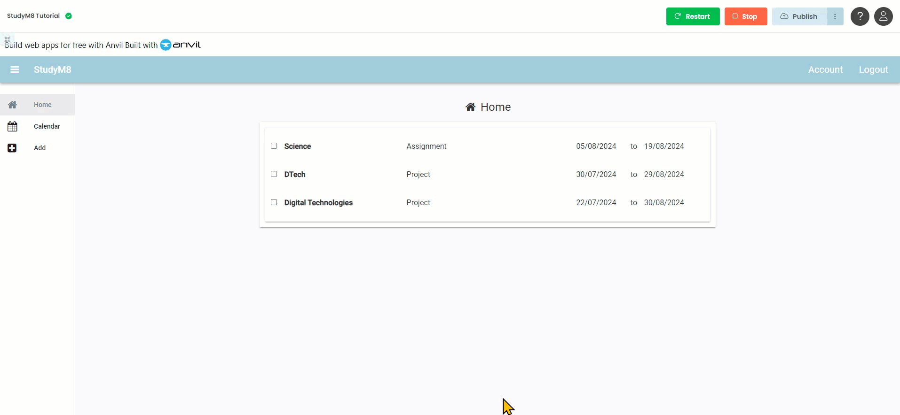

# Adjust Assessments Display

```{topic} In this tutorial you will:
- Modify the **HomeComponent** to display only outstanding assessments.
- Update the **get_assessment** function in **assessment_service** to filter out completed assessments.
```

We can enter assessment details and we can view them. We even change the value of completed via a check box on the **AssessmentPanel**.

We can display all our assessments, but do we really want to display all assessments. What about assessments that have been completed?

In this tutorial you will adjust the **HomeComponent** so that it only displays the assessments that are still outstanding.

## Change assessments displayed

Since the information on the repeating panel is derived from it's items list, we will need to change the item list. The item list comes from the **get_assessment** function in the **assessment_service**, so we need to make changes there.

### get_assessment code

Open the **get_assessment** function in the **assessment_service** and make the highlighted change to the code:

```{code-block} python
:linenos:
:lineno-start: 25
:emphasize-lines: 3
  return app_tables.assessments.search(tables.order_by('due_date'),
                                       user=user,
                                       completed=False)
```

```{admonition} Code explaination
:class: notice
- **`completed=False`** &rarr; just like line 26, this is a restriction on the rows that will be retrieved. Only those assessments that have not been completed will be retrieved.
```

## Testing

Time to check if the code works.

1. Launch your web app
2. You should not see the assignment that you marked as completed in the previous tutorial.
3. To make sure, stop your web app
4. Go to the **assessments** table in the **data** section
5. Find and un-tick the assessment you marked as complete in the last tutorial
6. Relaunch your web app
7. You should now see that assessment on the **Home** page



## Final code state

By the end of this tutorial your code should be the same as below:

### Final assessment_service

```{code-block} python
:linenos:
import anvil.users
import anvil.tables as tables
import anvil.tables.query as q
from anvil.tables import app_tables
import anvil.server

@anvil.server.callable
def add_assessment(subject, details, start_date, due_date):
  user = anvil.users.get_user()
  
  app_tables.assessments.add_row(user= user,
                                 subject= subject,
                                 details=details,
                                 start_date=start_date,
                                 due_date=due_date,
                                 completed=False)

@anvil.server.callable
def get_assessment():
  user = anvil.users.get_user()

  return app_tables.assessments.search(tables.order_by('due_date'),
                                      user=user,
                                      completed=False)

@anvil.server.callable
def update_assessment_completed(assessment_id, completed):
  assessment = app_tables.assessments.get_by_id(assessment_id)
  if assessment:
    assessment["completed"] = completed
```
