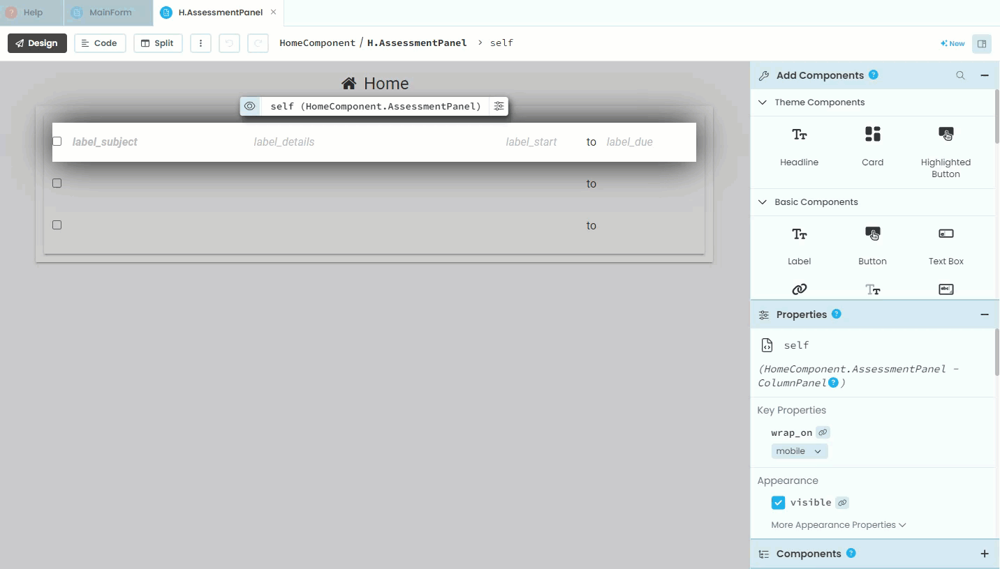
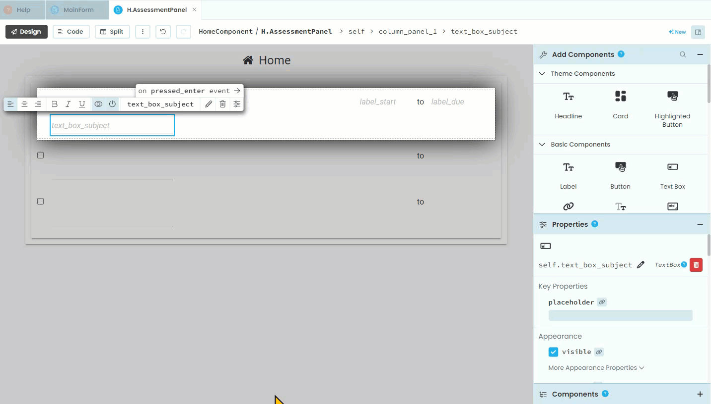
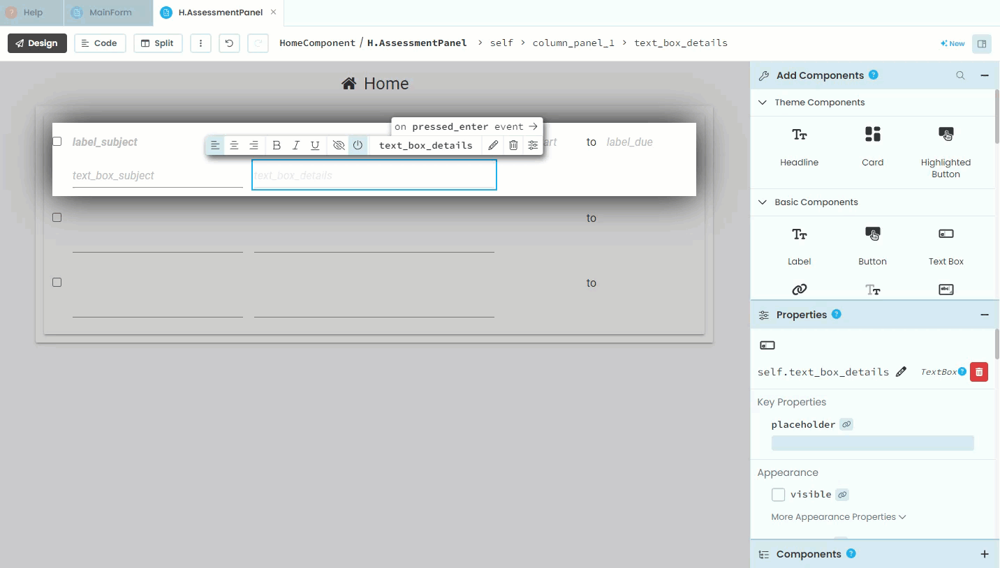
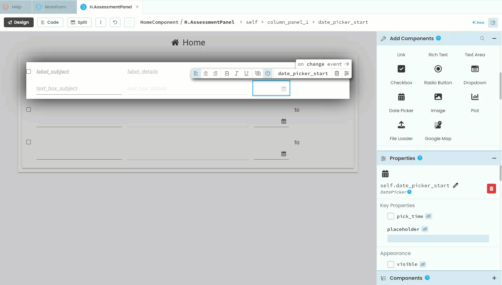
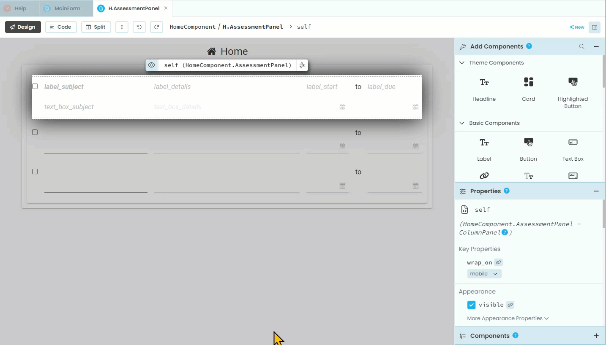
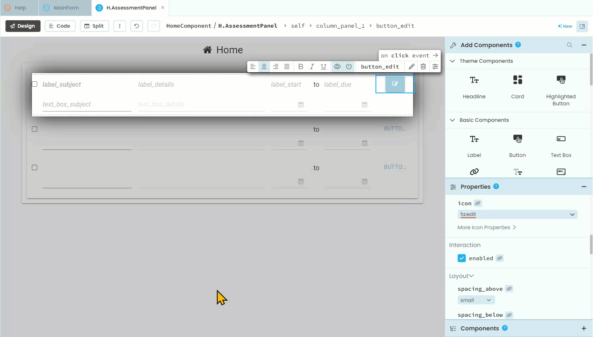

# Edit Assessments Layout

```{topic} In this tutorial you will:
- 
```

The functionality of the website allows the user to add an assessment, and check an assessment off as being completed, but what if the details of the assessment changes. For example, what if the due date is changed? What the user needs is a way to edit the assessment details.

Rather than creating a whole new component to edit assessment details, we will redesign the **AssessmentPanel** to allow the user to edit the assessments.

## Planning

What we will do is have each panel contain both the display and the editing elements for its specific assessment. The visibility of these elements will depend upon whether the panel is in display mode or edit mode.

We already have the display elements, so we will need to add the edit elements to the **AssessmentPanel**. These elements will be:

- subject text box
- details text box
- start date picker
- due date picker

We won't need edit elements for:

- completed check box - since the user can already edit this
- to label - since it doesn't change

## Layout

Open the **AssessmentPanel** in **Design** mode, then:

1. add a text box under **label_subject**
2. rename it **text_box_subject**
3. uncheck the **visible** tick **(warning: in the gif, I missed the click)**



4. similarly, add a text box under **label_subject**
5. rename it **text_box_details**
6. uncheck the **visible** tick



7. next, add a date picker under **label_start**
8. rename it **date_picker_start**
9. untick **visible**



10. add a date picker under **label_due**
11. rename it **date_picker_due**
12. untick **visible**



Now we need to add the buttons to allow this switching.

13. add a button to the right of **label_due**
14. rename it **button_edit**
15. delete the **text** - the button is not big enough for text
16. change the **role** to your desired formatting
17. change **icon** to `fa:edit` - this icon is familiar enough that we don't need text to explain the purpose of the button.



18. add another button under the **button_edit**
19. rename it **button_save*
20. delete the **text** - the button is not big enough for text
21. untick the **visible** check box
22. change the **role** to your desired formatting
23. change **icon** to `fa:save` - this icon is familiar enough that we don't need text to explain the purpose of the button. 



That's the layout. Time for the code.
