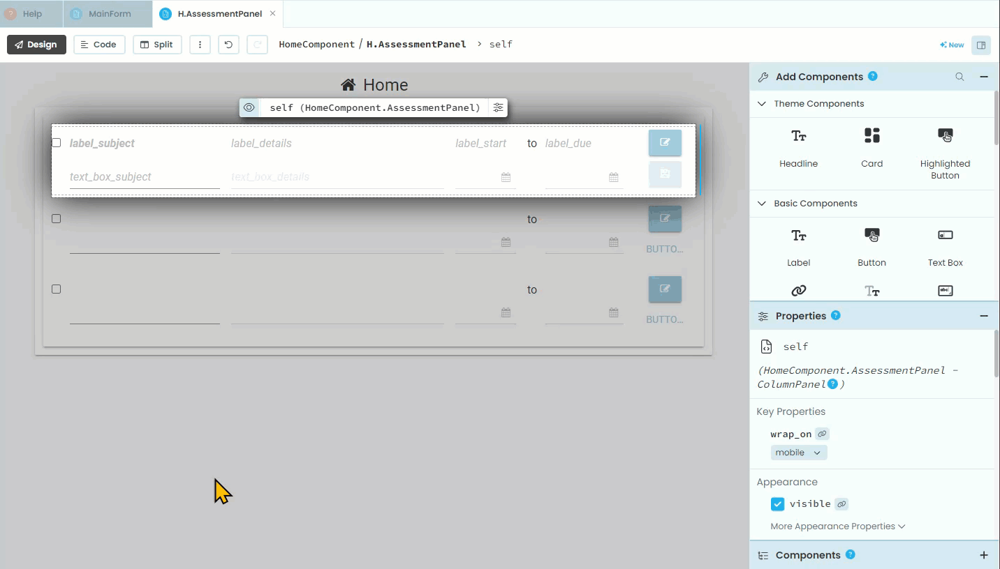

# Edit Assessments Code

```{topic} In this tutorial you will:
- 
```

## Planning

The code is going to react to two events:

- **button_edit** click
- **button_save** click

So, lets go ahead and create those two event handlers.

Open the **AssessmentPanel** in **Design** mode:

1. click on each button
2. select **on click event**



## Code

### Button edit click

When the user clicks the edit button, we want to web app to:

- take the values of the assessment item from this specific panel and write them into the edit elements
- make all the display element invisible
- make all the edit elements visible

Open the **AssessmentPanel** in **Code** mode.

In the **button_edit_click** handler use the code below to copy the values from the display elements.

```{code-block} python
:linenos:
:lineno-start: 27
:emphasize-lines: 2-5
  def button_edit_click(self, **event_args):
    self.text_box_subject.text = self.item["subject"]
    self.text_box_details.text = self.item["details"]
    self.date_picker_start.date = self.item["start_date"]
    self.date_picker_due.date = self.item["due_date"]
```

```{admonition} Code explaination
:class: notice
- **line 28** &rarr; takes **subject** value for specific assessment for this panel and saves it as the text for the subject text box.
- **line 29** &rarr; takes **details** value for specific assessment for this panel and saves it as the text for the details text box.
- **line 30** &rarr; takes **start_date** value for specific assessment for this panel and saves it as the date for the start date picker
- **line 31** &rarr; takes **due_date** value for specific assessment for this panel and saves it as the date for the due date picker
```

Now we need to change the visibility of the elements. To do this we will create a separate function that swaps the visibility of each element, ie. if visibility was `True` it will make it `False`.

We will do this with one function that will work for both event handlers. Add the highlighted code below to the bottom of the **AssessmentPanel** code.

```{code-block} python
:linenos:
:lineno-start: 33
:emphasize-lines: 5-18
  def button_save_click(self, **event_args):
    """This method is called when the button is clicked"""
    pass
    
  def switch_components(self):
    # display elements
    self.label_subject.visible = not self.label_subject.visible
    self.label_details.visible = not self.label_details.visible
    self.label_start.visible = not self.label_start.visible
    self.label_due.visible = not self.label_due.visible
    self.button_edit.visible = not self.button_edit.visible
    
    # edit elements
    self.text_box_subject.visible = not self.text_box_subject.visible
    self.text_box_details.visible = not self.text_box_details.visible
    self.date_picker_start.visible = not self.date_picker_start.visible
    self.date_picker_due.visible = not self.date_picker_due.visible
    self.button_save.visible = not self.button_save.visible
```

```{admonition} Code explaination
:class: notice
- **line 37** &rarr; create the **switch_components** method
- **lines 39 - 43** &rarr; swaps the **visibility** value for each of the display elements
- **lines 46 - 50** &rarr; swaps the **visibility** value for each of the edit elements
```

Finally, to call the **switch_components** method from the **button_edit_click** handler, add the highlighted code.

```{code-block} python
:linenos:
:lineno-start: 27
:emphasize-lines: 6
  def button_edit_click(self, **event_args):
    self.text_box_subject.text = self.item["subject"]
    self.text_box_details.text = self.item["details"]
    self.date_picker_start.date = self.item["start_date"]
    self.date_picker_due.date = self.item["due_date"]
    self.switch_components()
```

```{admonition} Code explaination
:class: notice
- **line 32** &rarr; called the **switch_component** method
```

#### Test the edit button

Launch your website and test if the edit button works. You may need to adjust the width of your columns to make everything fit.


If you have fixed you column widths, then it is time to make the save button work.

### Button save click

When the user clicks the Save button we want the following to happen:

- take the values of all the edit elements and write them the **Assessments** table
- take the values from the edit elements and write them to the display elements
- make all the edit elements invisible
- make all the display elements visible

#### assessment_update

To achieve the first step, we will need to call a backend function to save the values to the **Assessments** table. So open the **assessments_service**, and add the highlighted code to the end.

```{code-block} python
:linenos:
:lineno-start: 26
:emphasize-lines: 7 - 15
@anvil.server.callable
def update_assessment_completed(assessment_id, completed):
  assessment = app_tables.assessments.get_by_id(assessment_id)
  if assessment:
    assessment["completed"] = completed

@anvil.server.callable
def update_assessment(assessment_id, subject, details, start_date, due_date, completed):
    assessment = app_tables.assessments.get_by_id(assessment_id)
    if assessment:
        assessment['subject'] = subject
        assessment['details'] = details
        assessment['start_date'] = start_date
        assessment['due_date'] = due_date
        assessment['completed'] = completed
```

```{admonition} Code explaination
:class: notice
- **line 26** &rarr; makes this function callable by the frontend
- **line 27** &rarr; create the `update_assessments` function which requires the following data to be passed:
  - assessment_id
  - subject
  - details
  - start_date
  - due_date
  - completed
- **line 34** &rarr; loads the assessment that has the passed `assessment_id`
- **line 35** &rarr; checks to see if there is an assessment with the passed `assessment_id`
- **lines 36 - 40** &rarr; overwrites the stored values of the assessment with the values passed
```

Now that we have our backend function to call, we can work on the **button_save_click** handler.

#### button_save_click

Open the **AssessmentPanel** in code mode.

First thing we will do is write the values to the **Assessments** table. Go to the button_save_click handler and replace lines 35 and 36 with the highlighted code below:

```{code-block} python
:linenos:
:lineno-start: 34
:emphasize-lines: 2 - 9
  def button_save_click(self, **event_args):
    # write to server
    anvil.server.call('update_assessment', 
                     self.item.get_id(),
                     self.text_box_subject.text,
                     self.text_box_details.text,
                     self.date_picker_start.date,
                     self.date_picker_due.date,
                     self.check_box_completed.checked)
```

```{admonition} Code explaination
:class: notice
- **line 35** &rarr; a comment to help structure the method
- **lines 36 - 42** &rarr; calls the function we just created in the **assessment_service**. The first argument needs to be the name of the function being called. The other arguments are the date the function needs passed.
- **line 37** &rarr; gets the id of the assessment for this specific panel.
```

Next we need to take all the values from the edit elements and write them to the display elements, so the display reflects the changes made.

Add the highlighted code to the end of the **button_save_click** event handler.

```{code-block} python
:linenos:
:lineno-start: 34
:emphasize-lines: 11 - 15
  def button_save_click(self, **event_args):
    # write to server
    anvil.server.call('update_assessment', 
                     self.item.get_id(),
                     self.text_box_subject.text,
                     self.text_box_details.text,
                     self.date_picker_start.date,
                     self.date_picker_due.date,
                     self.check_box_completed.checked)

    # update display
    self.label_subject.text = self.text_box_subject.text
    self.label_details.text = self.text_box_details.text
    self.label_start.text = self.date_picker_start.date.strftime('%d/%m/%Y')
    self.label_due.text = self.date_picker_due.date.strftime('%d/%m/%Y')
```

```{admonition} Code explaination
:class: notice
- **line 44** &rarr; a comment to help structure the method
- **line 45** &rarr; assigns the value in the subject text box to the subject label
- **line 46** &rarr; assigns the value in the details text box to the details label
- **line 47** &rarr; assigns the date in the start date picker to the start label
- **line 48** &rarr; assigns the date in the due date picker to the due label
```

Finally, we need to turn all the edit elements invisible and all the display elements visible. Luckily we created a method that swaps all those elements visibility values, so we can just call that.

```{code-block} python
:linenos:
:lineno-start: 34
:emphasize-lines: 16
  def button_save_click(self, **event_args):
    # write to server
    anvil.server.call('update_assessment', 
                     self.item.get_id(),
                     self.text_box_subject.text,
                     self.text_box_details.text,
                     self.date_picker_start.date,
                     self.date_picker_due.date,
                     self.check_box_completed.checked)

    # update display
    self.label_subject.text = self.text_box_subject.text
    self.label_details.text = self.text_box_details.text
    self.label_start.text = self.date_picker_start.date.strftime('%d/%m/%Y')
    self.label_due.text = self.date_picker_due.date.strftime('%d/%m/%Y')
    self.switch_components()
```

- **line 49** &rarr; call the switch component method to reverse the visibility of the edit and display elements.

## Testing

You should be able to change the values of your assessments. Launch your webapp, and try to change the details. Make sure that you test all values (subject, details, start date and due date).

## Final code state

By the end of this tutorial your code should be the same as below:

### AssessmentPanel

```{code-block} python
:linenos:
from ._anvil_designer import AssessmentPanelTemplate
from anvil import *
import anvil.server
import anvil.users
import anvil.tables as tables
import anvil.tables.query as q
from anvil.tables import app_tables
import datetime


class AssessmentPanel(AssessmentPanelTemplate):
  def __init__(self, **properties):
    # Set Form properties and Data Bindings.
    self.init_components(**properties)

    # Any code you write here will run before the form opens.
    self.check_box_completed.checked = self.item['completed']
    self.label_subject.text = self.item['subject']
    self.label_details.text = self.item['details']
    self.label_start.text = self.item['start_date'].strftime('%d/%m/%Y')
    self.label_due.text = self.item['due_date'].strftime('%d/%m/%Y')

  def check_box_completed_change(self, **event_args):
    new_value = self.check_box_completed.checked
    anvil.server.call('update_assessment_completed', self.item.get_id(),new_value)

  def button_edit_click(self, **event_args):
    self.text_box_subject.text = self.item["subject"]
    self.text_box_details.text = self.item["details"]
    self.date_picker_start.date = self.item["start_date"]
    self.date_picker_due.date = self.item["due_date"]
    self.switch_components()

  def button_save_click(self, **event_args):
    # write to server
    anvil.server.call('update_assessment', 
                     self.item.get_id(),
                     self.text_box_subject.text,
                     self.text_box_details.text,
                     self.date_picker_start.date,
                     self.date_picker_due.date,
                     self.check_box_completed.checked)

    # update display
    self.label_subject.text = self.text_box_subject.text
    self.label_details.text = self.text_box_details.text
    self.label_start.text = self.date_picker_start.date.strftime('%d/%m/%Y')
    self.label_due.text = self.date_picker_due.date.strftime('%d/%m/%Y')
    self.switch_components()
  
  def switch_components(self):
    # display elements
    self.label_subject.visible = not self.label_subject.visible
    self.label_details.visible = not self.label_details.visible
    self.label_start.visible = not self.label_start.visible
    self.label_due.visible = not self.label_due.visible
    self.button_edit.visible = not self.button_edit.visible
    
    # edit elements
    self.text_box_subject.visible = not self.text_box_subject.visible
    self.text_box_details.visible = not self.text_box_details.visible
    self.date_picker_start.visible = not self.date_picker_start.visible
    self.date_picker_due.visible = not self.date_picker_due.visible
    self.button_save.visible = not self.button_save.visible
```

### assessment_service

```{code-block} python
:linenos:
import anvil.users
import anvil.tables as tables
import anvil.tables.query as q
from anvil.tables import app_tables
import anvil.server

@anvil.server.callable
def add_assessment(subject, details, start_date, due_date):
  user = anvil.users.get_user()
  
  app_tables.assessments.add_row(user= user,
                                 subject= subject,
                                 details=details,
                                 start_date=start_date,
                                 due_date=due_date,
                                 completed=False)

@anvil.server.callable
def get_assessment():
  user = anvil.users.get_user()

  return app_tables.assessments.search(tables.order_by('due_date'),
                                      user=user,
                                      completed=False)

@anvil.server.callable
def update_assessment_completed(assessment_id, completed):
  assessment = app_tables.assessments.get_by_id(assessment_id)
  if assessment:
    assessment["completed"] = completed

@anvil.server.callable
def update_assessment(assessment_id, subject, details, start_date, due_date, completed):
    assessment = app_tables.assessments.get_by_id(assessment_id)
    if assessment:
        assessment['subject'] = subject
        assessment['details'] = details
        assessment['start_date'] = start_date
        assessment['due_date'] = due_date
        assessment['completed'] = completed
```