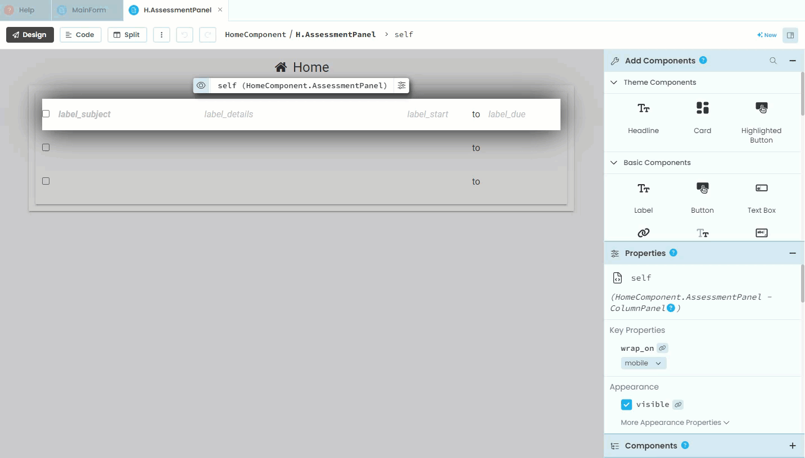
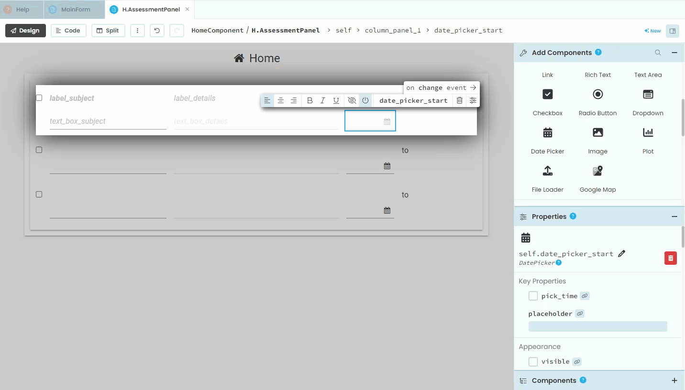
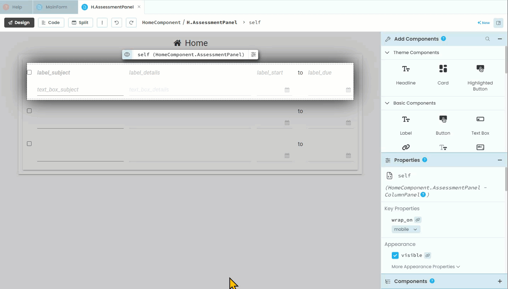
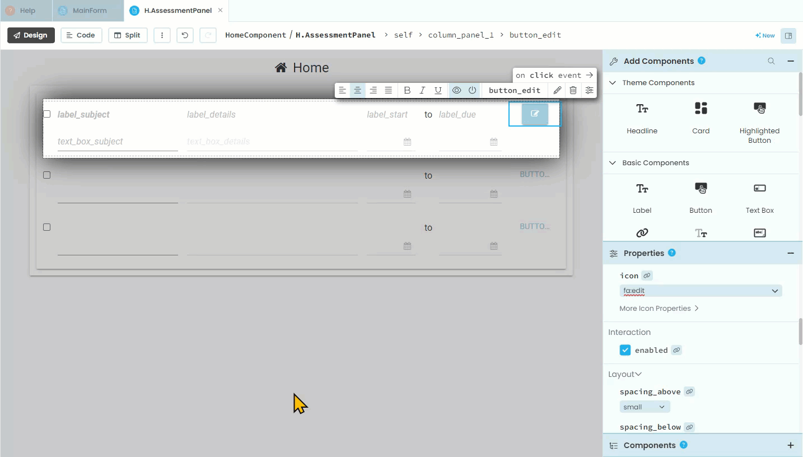

# Edit Assessments Layout

```{topic} In this tutorial you will:
- 
```

The functionality of the website allows the user to add an assessment, and check an assessment off as being completed, but what if the details of the assessment changes. For example, what if the due date is changed? What the user needs is a way to edit the assessment details.

Rather than creating a whole new component to edit assessment details, we will redesign the **AssessmentPanel** to allow the user to edit the assessments.

## Planning

What we will do is have each panel contain both the display and the editing elements for its specific assessment. The visibility of these elements will depend upon whether the panel is in display mode or edit mode.

We already have the display elements, so we will need to add the edit elements to the **AssessmentPanel**. These elements will be:

- subject text box
- details text box
- start date picker
- due date picker

We won't need edit elements for:

- completed check box - since the user can already edit this
- to label - since it doesn't change

## Layout

Open the **AssessmentPanel** in **Design** mode, then:

1. add a text box under **label_subject**
2. rename it **text_box_subject**
3. uncheck the **visible** tick **(warning: in the gif, I missed the click)**



4. similarly, add a text box under **label_subject**
5. rename it **text_box_details**
6. uncheck the **visible** tick


7. next, add a date picker under **label_start**
8. rename it **date_picker_start**
9. untick **visible**


10. add a date picker under **label_due**
11. rename it **date_picker_due**
12. untick **visible**



Now we need to add the buttons to allow this switching.

13. add a button to the right of **label_due**
14. rename it **button_edit**
15. delete the **text** - the button is not big enough for text
16. change the **role** to your desired formatting
17. change **icon** to `fa:edit` - this icon is familiar enough that we don't need text to explain the purpose of the button.



18. add another button under the **button_edit**
19. rename it **button_save*
20. delete the **text** - the button is not big enough for text
21. untick the **visible** check box
22. change the **role** to your desired formatting
17. change **icon** to `fa:save` - this icon is familiar enough that we don't need text to explain the purpose of the button. 



That's the layout. Time for the code.

## Code

The code is going to react to two events:

- **button_edit** click
- **button_save** click

So, lets go ahead and create those two event handlers.

Open the **AssessmentPanel** in **Design** mode:

1. click on each button
2. select **on click event**


### Button edit click

When the user clicks the edit button, we want to web app to:

- take the values of the assessment item from this specific panel and write them into the edit elements
- make all the display element invisible
- make all the edit elements visible

Open the **AssessmentPanel** in **Code** mode.

In the **button_edit_click** handler use the code below to copy the values from the display elements.

```{code-block} python
:linenos:
:lineno-start: 27
:emphasize-lines: 2-5
  def button_edit_click(self, **event_args):
    self.text_box_subject.text = self.item["subject"]
    self.text_box_details.text = self.item["details"]
    self.date_picker_start.date = self.item["start_date"]
    self.date_picker_due.date = self.item["due_date"]
```

```{admonition} Code explaination
:class: notice
- **line 28** &rarr; takes **subject** value for specific assessment for this panel and saves it as the text for the subject text box.
- **line 29** &rarr; takes **details** value for specific assessment for this panel and saves it as the text for the details text box.
- **line 30** &rarr; takes **start_date** value for specific assessment for this panel and saves it as the date for the start date picker
- **line 31** &rarr; takes **due_date** value for specific assessment for this panel and saves it as the date for the due date picker
```

Now we need to change the visibility of the elements. To do this we will create a separate function that swaps the visibility of each element, ie. if visibility was `True` it will make it `False`.

We will do this with one function that will work for both event handlers. Add the highlighted code below to the bottom of the **AssessmentPanel** code.

```{code-block} python
:linenos:
:lineno-start: 33
:emphasize-lines: 5-18
  def button_save_click(self, **event_args):
    """This method is called when the button is clicked"""
    pass
    
  def switch_components(self):
    # display elements
    self.label_subject.visible = not self.label_subject.visible
    self.label_details.visible = not self.label_details.visible
    self.label_start.visible = not self.label_start.visible
    self.label_due.visible = not self.label_due.visible
    self.button_edit.visible = not self.button_edit.visible
    
    # edit elements
    self.text_box_subject.visible = not self.text_box_subject.visible
    self.text_box_details.visible = not self.text_box_details.visible
    self.date_picker_start.visible = not self.date_picker_start.visible
    self.date_picker_due.visible = not self.date_picker_due.visible
    self.button_save.visible = not self.button_save.visible
```

```{admonition} Code explaination
:class: notice
- **line 37** &rarr; create the **switch_components** method
- **lines 39 - 43** &rarr; swaps the **visibility** value for each of the display elements
- **lines 46 - 50** &rarr; swaps the **visibility** value for each of the edit elements
```

Finally, to call the **switch_components** method from the **button_edit_click** handler, add the highlighted code.

```{code-block} python
:linenos:
:lineno-start: 27
:emphasize-lines: 6
  def button_edit_click(self, **event_args):
    self.text_box_subject.text = self.item["subject"]
    self.text_box_details.text = self.item["details"]
    self.date_picker_start.date = self.item["start_date"]
    self.date_picker_due.date = self.item["due_date"]
    self.switch_components()
```

```{admonition} Code explaination
:class: notice
- **line 32** &rarr; called the **switch_component** method
```

#### Test the edit button

Launch your website and test if the edit button works. You may need to adjust the width of your columns to make everything fit.


If you have fixed you column widths, then it is time to make the save button work

## Save Button Actions

### Update Assessment Function

### Repopulate Display Components

### Return Visibility
