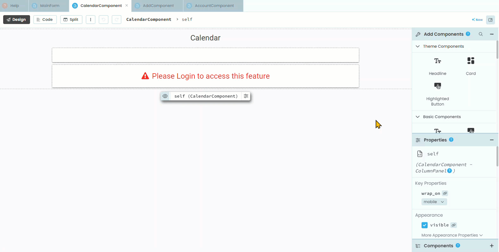

# Calendar Component Layout

```{topic} In this tutorial you will:
- Understanding how to integrate a Gantt chart into the web app.
- Adding and configuring a Plot component in the CalendarComponentLayout.
```

The calendar component of our web app is actually a specific chart called a Gantt chart. We are going to use the Anvil plotting mechanism to create it.

Our current **CalendarComponentLayout** already has a card to contain our details, so all we have to do is add the plot.

## Add Plot to Calendar

Let add our plot

1. Open **CalendarComponentLayout** in **Design** mode.
2. Find the **Plot** component
3. Add it to **self.card_details**
4. Rename the plot to **self.plot_timeline**



That's all done. Let's add the code.