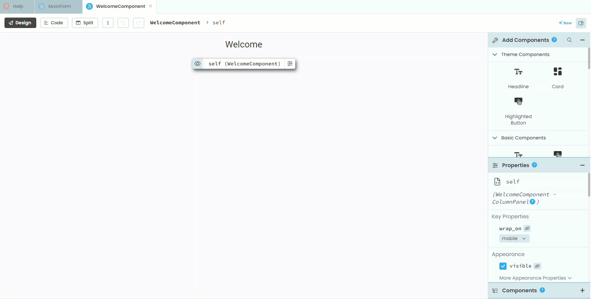
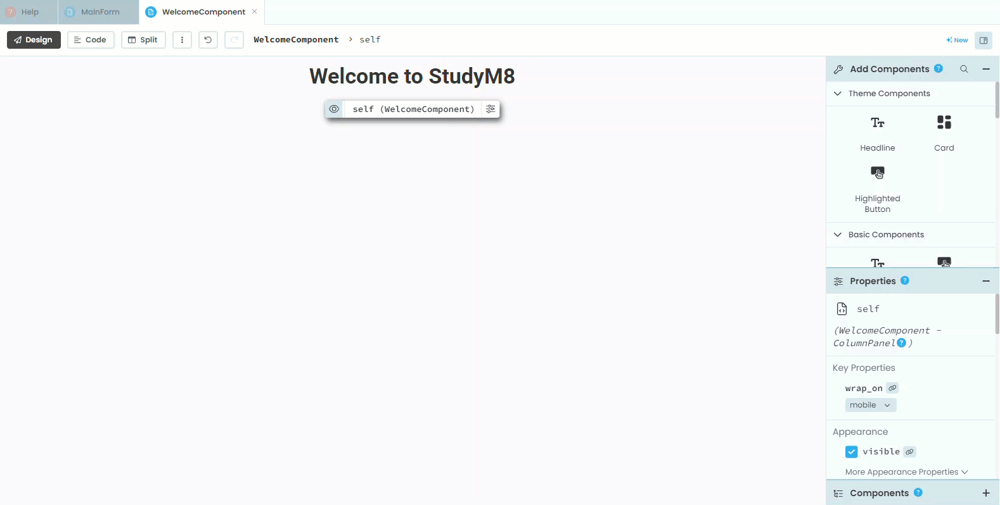
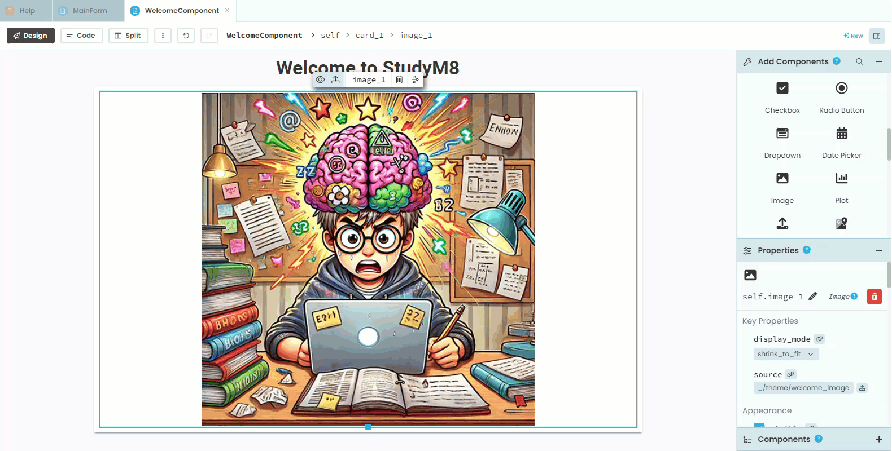
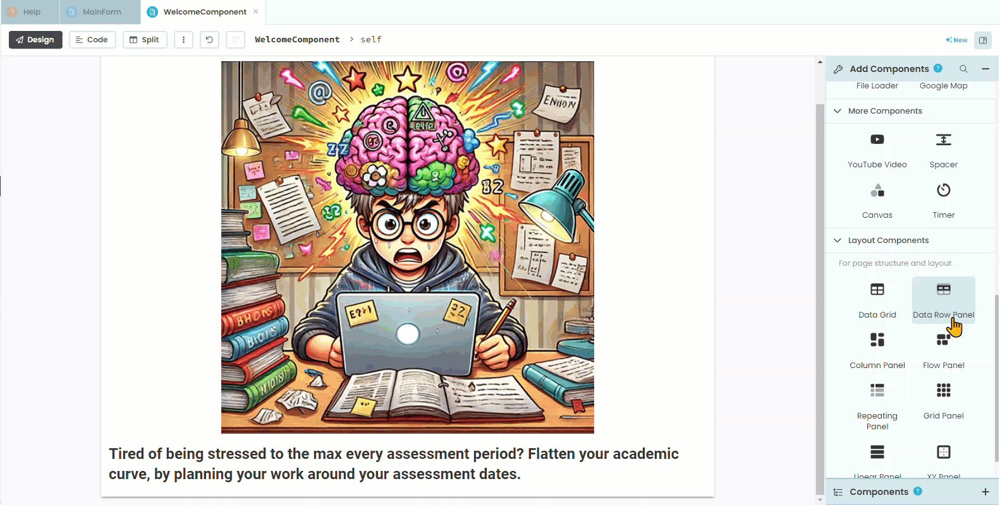
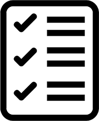

# Welcome Page

```{topic} In this tutorial you will:
- Format a landing page using the WelcomeComponent.
- Add and style text, images, and cards to the page.
- Highlight key features of the web app with icons and descriptive text.
- Create a call-to-action to encourage user registration.
```

In this tutorial we will create a landing page for our web app, so that new users (who do not have an account) can see what the app is about.

## Plan

To achieve this we need to:

- format our **WelcomeComponent** as our landing page

This is all pretty straight forward. So lets get to it.

## Layout

### Main card

We need to setup the **WelcomeComponent**.

1. Open the **WelcomeComponent** in **Design** mode.
2. Change the title to **Welcome to StudyM8**.
3. Change the title's font to **bold**.
4. Make the title bigger. I chose **34**, but you can choose whatever you want.



5. Next we need to add a **Card** (**Outline Card**)



Now we will add an image to the welcome page

6. Right mouse click and **save** the image below.


7. Find the **Image** element and add it to the card.
8. In the **Properties** look for **source** and click the upload button to the right of the text box.
9. Select the **welcome_image.png** you just downloaded.
10. Use the handles to resize the image to your desired size.


Next we want to add a the following text:

```
Tired of being stressed to the max every assessment period? Flatten your academic curve, by planning your work around your assessment dates.
```

11. Add a label to the card under the image
12. Copy the text above and paste it into the **text** property
13. Change the text formatting so that you are happy with it.



### Features

Now we want advertise the web app features at the bottom of the card

14. Add another **card** element under the last label.
15. Change the new card's formatting to make it contrast with the background card (I chose to change it's background colour).
16. Add a **Column Panel** to the new card.



First we will add the images. So save the following images to your computer




17. Add a Image element to the column panel
18. Click on **source** the upload icon
19. Select **calendar_icon.png**
20. Repeat for the **graph_icon.png** and the **checklist_icon.png**


Next we need to add text below each image.

21. Add a label below the calendar icon
22. Paste the following text into the **text** property

```
Record your assessment details
```

23. Add a label below the graph icon
24. Paste the following text into the **text** property

```
Identify times with high assessment demands
```

25. Add a label below the checklist icon
26. Paste the following text into the **text** property

```
See all future assessments and when they are due
```


### Call to action

Finally we want to put a call-to-action at the bottom.

27. Add a label at the bottom under all the cards
28. Add the text below to the label

```
Register to get started
```

29. **Centre** the text
30. Change the **font_size**


## Testing

Launch your website, and logout. You should now see the Welcome Page.