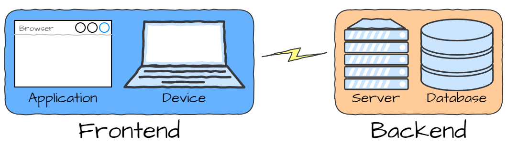
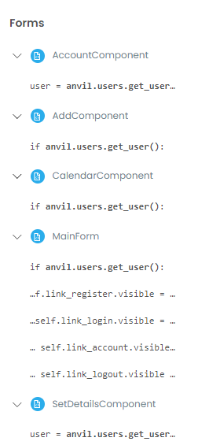
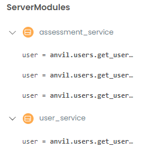

# Optimisation

```{topic} In this tutorial you will:
- 
```

We now have a functioning web app. Congratulations, at this point you have all the skills you need to create a website in Anvil. The rest of these tutorials are about improving the web app. In particular we are going to speed it up.

You will notice that our webapp is not very responsive. Navigating between pages often shows a process swirl as the component loads. This is called **latency** and it is not ideal. People are used to websites loading quickly, so we need to do something about that.

## Causes of Latency

There can be a wide range of causes for latency, involving networks, and service providers, but these are beyond our control. We are going to focus on the latency that is caused by the architecture of our code.

### Remote Database Access

Remember talking about frontend and backend architecture?



Remember we also discussed that the slowest link in this process is the communication between the Frontend and the Backend? That's why we created a single-page application, to minimise the amount for data being transferred between the our two halves.

Keeping all that in mind let's look at our code.

Below is the code for the **MainForm**. Notice the highlighted code.

```{code-block} python
:linenos:
:lineno-start: 1
:emphasize-lines: 28, 66-69
from ._anvil_designer import MainFormTemplate
from anvil import *
import anvil.server
import anvil.tables as tables
import anvil.tables.query as q
from anvil.tables import app_tables
import anvil.users
from ..HomeComponent import HomeComponent
from ..CalendarComponent import CalendarComponent
from ..AddComponent import AddComponent
from ..AccountComponent import AccountComponent
from ..SetDetailsComponent import SetDetailsComponent
from ..WelcomeComponent import WelcomeComponent


class MainForm(MainFormTemplate):
  def __init__(self, **properties):
    # Set Form properties and Data Bindings.
    self.init_components(**properties)
    self.breadcrumb_stem = self.label_title.text

    # Any code you write here will run before the form opens.
    self.switch_component("home")

  def switch_component(self, state):
    # set state
    if state == "home":
      if anvil.users.get_user():
        cmpt = HomeComponent()
      else:
        cmpt = WelcomeComponent()
      breadcrumb = self.breadcrumb_stem
    elif state == "account":
      cmpt = AccountComponent()
      breadcrumb = self.breadcrumb_stem + " - Account"
    elif state == "add":
      cmpt = AddComponent()
      breadcrumb = self.breadcrumb_stem + " - Add"
    elif state == "calendar":
      cmpt = CalendarComponent()
      breadcrumb = self.breadcrumb_stem + " - Calendar"
    elif state == "details":
      cmpt = SetDetailsComponent()
      breadcrumb = self.breadcrumb_stem + " - Account - Set Details"
    
    # execution
    self.content_panel.clear()
    self.content_panel.add_component(cmpt)
    self.label_title.text = breadcrumb
    self.set_active_link(state)
  
  def set_active_link(self, state):
    if state == "home":
      self.link_home.role = "selected"
    else:
      self.link_home.role = None
    if state == "add":
      self.link_add.role = "selected"
    else:
      self.link_add.role = None
    if state == "calendar":
      self.link_calendar.role = "selected"
    else:
      self.link_calendar.role = None

    self.link_register.visible = not anvil.users.get_user()
    self.link_login.visible = not anvil.users.get_user()
    self.link_account.visible = anvil.users.get_user()
    self.link_logout.visible = anvil.users.get_user()
  
  # --- link handlers
  def link_home_click(self, **event_args):
    self.switch_component("home")

  def link_calendar_click(self, **event_args):
    self.switch_component("calendar")

  def link_add_click(self, **event_args):
    self.switch_component("add")

  def link_account_click(self, **event_args):
    """This method is called when the link is clicked"""
    self.switch_component("account")

  def link_register_click(self, **event_args):
    anvil.users.signup_with_form(allow_cancel=True)
    self.switch_component("details")

  def link_login_click(self, **event_args):
    anvil.users.login_with_form(allow_cancel=True)
    self.switch_component("home")

  def link_logout_click(self, **event_args):
    anvil.users.logout()
    self.switch_component("home")
```

Each call to `anvil.users.get_user()` is a communication between the frontend and backend of our web app. It's not just here. If you do a search for `anvil.users.get_user()` you will notice that we also call it in four other frontend modules. 



So there are a heap of times when the frontend is communicating with the backend. What's more, most of these are unnecessary. It is not as if the user logs in on every page. This means that the frontend is repeatedly requesting the same information from the backend.

So our first step in optimising our code is to reduce the number of times the frontend remotely accesses the database on the backend.

### Local Database Access

There is another way we can speed our web app up. We've already established that network communication is the slowest link in our chain. The next slowest link is retrieving data from the database, because it lives on a hard drive.

Returning to our search, we will notice that the server modules also calls to `anvil.users.get_user()` four times. Although, not as expensive as a remote access to the database, it will still slow the website down.



So how do we improve this?

### Caching data

The answer is to cache data. Caching is a way of temporarily storing data so that it can be accessed more quickly the next time it’s needed. The first time we make a call to the database, the returned data should be stored in a variable so it can be quickly reused when needed. The only time that the database is accessed is when that data has changed.

The principle of caching is this: store frequently used data in the fastest place. For our website that means in frontend variables.

The rest of the tutorials will show how we will apply this principle to our website.