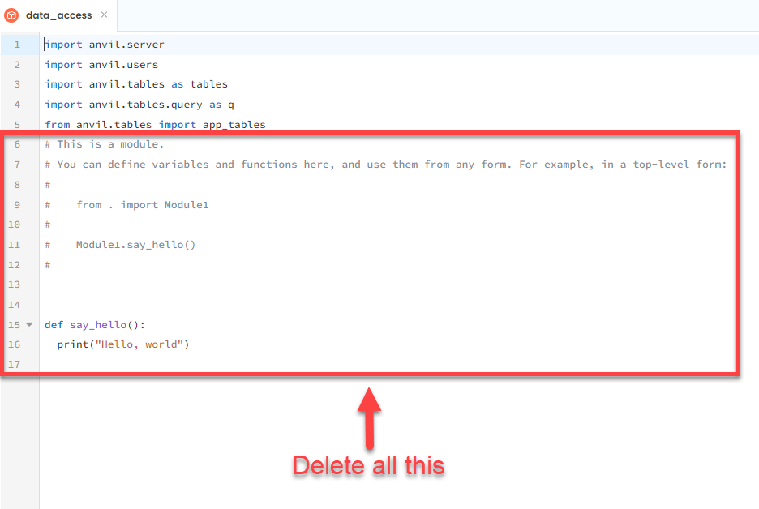

# Reduce Remote Database Access

```{topic} In this tutorial you will:
- Learn how to create a module in the frontend to store cached data, specifically user data, and ensure it's only accessed by that module using Python's private variables.
- Learn to create a function that first checks if user data is cached; if not, it retrieves the data from the database and caches it for future use.
- Learn to modify existing components (AccountComponent, AddComponent, CalendarComponent, SetDetailsComponent, MainForm) to use the cached user data instead of repeatedly querying the database.
- Learn to test the web app to ensure the changes improve performance, and identify issues with logging out, updating user details, and page load speed.
```

To implement caching in our web app we need to create a variables in the frontend to store our data variables. These data will need to be accessed by multiple frontend modules. Best practice for storing cached data is in it's own module. So that's what we will do.

## Create Data Access Module

We have previously made a server module, but this module will be made client-side, since the data needs to be stored in the frontend. To be precise, it will be stored in the user's browser.

1. In the files menu
2. Click on the **Client Code** ellipses
3. Then choose **Add Module**
4. Name the module **data_access**


5. Clean up the module by deleting everything except the imports.



### Cached User

We can now cache the user data. The idea is the front end will ask this module for the user data. If the data is saved in the variable, this module will return it. If there is no data in the variable, this module will retrieve it from the database, store the data for later user and then return the user data to the frontend.

First we need to create a variable to store the user data.

1. copy the code below into the **data_access** module.

```{code-block} python
:linenos:
:lineno-start: 7
:emphasize-lines: 1-2
# cached values
__user = None
```

```{admonition} Code explaination
:class: notice
- **line 7** &rarr; a comment to help structure the code
- **line 8** &rarr; creates the variable we will use to store the user data
```

```{admonition} Dunder variables
:class: note
In Python, we use double underscores before a variable (like __variable) for variables that can meant to be only used by the module they are in. This is called making them variable private to the module it's in. 

Doing this means the variable cannot be easily accessed or changed from outside the module. This is important because it makes sure that important parts of your code can't be accidentally messed up.
```

Now we need to make a function that the frontend will use instead of `anvil.users.get_user()`.

2. Add the highlighted code to the bottom of the **data_access** module.

```{code-block} python
:linenos:
:lineno-start: 10
:emphasize-lines: 1-10
def the_user():
  global __user

  if __user:
    print("Using cached user")
    return __user

  print("Accessing user from database")
  __user = anvil.users.get_user()
  return __user
```

```{admonition} Code explaination
:class: notice
- **line 10** &rarr; creates the function **the_user**
- **line 11** &rarr; makes the `__user` global, which allows this function to edit it
- **line 13** &rarr; checks to see if there is any data stored in `__user`. Note `__user` starts with the value `None` which is `False`
- **line 14** &rarr; lets us know when the program is using cached user data
- **line 15** &rarr; returns the user data to the frontend (this will end the function if there is user data)
- **line 17** &rarr; lets us know when the program is retrieving user data from the backend
- **line 18** &rarr; gets current user data and stores it in the `__user` variable
- **line 19** &rarr; returns the user data to the frontend
```

We now have our caching user function, next we have to add it to our code

## Refactor Code

Remember when we created the **switch_component** and we searched for code and replaced it. We will use that process now.

1. Click on the search icon in the side menu
2. Search for `anvil.users.get_user()`


You can see that five components have a call to `anvil.users.get_user()`. lets work through those from top to bottom.

### AccountComponent

First component on our list is the **AccountComponent**.

1. Open the **AccountComponent** in **Code** mode
2. In the import section add the following highlighted line

```{code-block} python
:linenos:
:lineno-start: 1
:emphasize-lines: 8
from ._anvil_designer import AccountComponentTemplate
from anvil import *
import anvil.server
import anvil.tables as tables
import anvil.tables.query as q
from anvil.tables import app_tables
import anvil.users
from .. import data_access
```

```{admonition} Code explaination
:class: notice
- **line 8** &rarr; allows **AccountComponent** to use the **data_access** module
```

We need to get rid of the `anvil.users.get_user()` in **line 17**

3. In the `__init__` change **line 17** to the highlighted code below

```{code-block} python
:linenos:
:lineno-start: 12
:emphasize-lines: 6
  def __init__(self, **properties):
    # Set Form properties and Data Bindings.
    self.init_components(**properties)

    # Any code you write here will run before the form opens.
    user = data_access.the_user()
    self.label_first_name.text = user["first_name"]
    self.label_last_name.text = user["last_name"]
```

```{admonition} Code explaination
:class: notice
- **line 17** &rarr; uses our new **the_user** function to retrieve user data
```

Check that the **AccountComponent** is no longer in the search results, and then move onto the next one.

### AddComponent

Next in our search results is the **AddComponent**

1. Open **AddComponent** in **Code** mode.
2. Add **data_access** to the import section

```{code-block} python
:linenos:
:lineno-start: 1
:emphasize-lines: 8
from ._anvil_designer import AddComponentTemplate
from anvil import *
import anvil.server
import anvil.tables as tables
import anvil.tables.query as q
from anvil.tables import app_tables
import anvil.users
from .. import data_access
```

```{admonition} Code explaination
:class: notice
- **line 8** &rarr; allows **AccountComponent** to use the **data_access** module
```

We need to get rid of the `anvil.users.get_user()` in **line 22**

3. In the `__init__` change **line 22** to the highlighted code below

```{code-block} python
:linenos:
:lineno-start: 12
:emphasize-lines: 11
  def __init__(self, **properties):
    # Set Form properties and Data Bindings.
    self.init_components(**properties)
    self.subject = ""
    self.details = ""
    self.start = None
    self.due = None

    # Any code you write here will run before the form opens.
    self.label_message.visible = False
    if data_access.the_user():
      self.card_details.visible = True
      self.card_error.visible = False
      self.button_add.visible = True
    else:
      self.card_details.visible = False
      self.card_error.visible = True
      self.button_add.visible = False
```

```{admonition} Code explaination
:class: notice
- **line 22** &rarr; uses our new **the_user** function to retrieve user data
```

Check the **AddComponent** is no longer in your search results, then onto the next one.

### CalendarComponent

The next module we need to change is the **CalendarComponent**.

1. Open **CalendarComponent** in **Code** mode.
2. Add **data_access** to the import section

```{code-block} python
:linenos:
:lineno-start: 1
:emphasize-lines: 9
from ._anvil_designer import CalendarComponentTemplate
from anvil import *
import plotly.graph_objects as go
import anvil.server
import anvil.tables as tables
import anvil.tables.query as q
from anvil.tables import app_tables
import anvil.users
from .. import data_access
```

```{admonition} Code explaination
:class: notice
- **line 9** &rarr; allows **AccountComponent** to use the **data_access** module
```

Once again we need to remove of the `anvil.users.get_user()` from the `__init__`

3. In the `__init__` change **line 18** to the highlighted code below

```{code-block} python
:linenos:
:lineno-start: 13
:emphasize-lines: 6
  def __init__(self, **properties):
    # Set Form properties and Data Bindings.
    self.init_components(**properties)

    # Any code you write here will run before the form opens.
    if anvil.users.get_user():
      self.card_details.visible = True
      self.card_error.visible = False
      self.load_chart()
    else:
      self.card_details.visible = False
      self.card_error.visible = True
```

```{admonition} Code explaination
:class: notice
- **line 18** &rarr; uses our new **the_user** function to retrieve user data
```

If **CalendarComponent** is no longer in your search results time to move on.

### SetDetailsComponent

I know that **MainForm** is next in our search results, but we'll come back to that, since **SetDetailsComponent** is pretty much the same as the all the other components.

1. Open **SetDetailsComponent** in **Code** mode.
2. Add **data_access** to the import section

```{code-block} python
:linenos:
:lineno-start: 1
:emphasize-lines: 8
from ._anvil_designer import SetDetailsComponentTemplate
from anvil import *
import anvil.server
import anvil.tables as tables
import anvil.tables.query as q
from anvil.tables import app_tables
import anvil.users
from .. import data_access
```

```{admonition} Code explaination
:class: notice
- **line 8** &rarr; allows **AccountComponent** to use the **data_access** module
```

Remove of the `anvil.users.get_user()` from the `__init__`

3. In the `__init__` change **line 17** to the highlighted code below

```{code-block} python
:linenos:
:lineno-start: 12
:emphasize-lines: 6
  def __init__(self, **properties):
    # Set Form properties and Data Bindings.
    self.init_components(**properties)

    # Any code you write here will run before the form opens.
    user = data_access.the_user()
    if user["first_name"]:
      self.text_box_first_name.text = user["first_name"]
    if user["last_name"]:
      self.text_box_last_name.text = user["last_name"]
```

```{admonition} Code explaination
:class: notice
- **line 17** &rarr; uses our new **the_user** function to retrieve user data
```

Now, the only form in our search should be **MainForm**, so time to move onto that.

### MainForm

In the **MainForm** we have a number of instances of `anvil.users.get_user()`. We will have to replace each one, but before we do, we need to import **data_access**

1. Open **MainForm** in **Code** mode
2. Add the highlighted code to the end of the import section

```{code-block} python
:linenos:
:lineno-start: 1
:emphasize-lines: 14
from ._anvil_designer import MainFormTemplate
from anvil import *
import anvil.server
import anvil.tables as tables
import anvil.tables.query as q
from anvil.tables import app_tables
import anvil.users
from ..HomeComponent import HomeComponent
from ..CalendarComponent import CalendarComponent
from ..AddComponent import AddComponent
from ..AccountComponent import AccountComponent
from ..SetDetailsComponent import SetDetailsComponent
from ..WelcomeComponent import WelcomeComponent
from .. import data_access
```

```{admonition} Code explaination
:class: notice
- **line 14** &rarr; allows **AccountComponent** to use the **data_access** module
```

Our first call to `anvil.users.get_user()` occurs in the **switch_component** method.

3. Change the highlighted code in the **switch_component** method.

```{code-block} python
:linenos:
:lineno-start: 26
:emphasize-lines: 4
  def switch_component(self, state):
    # set state
    if state == "home":
      if data_access.the_user():
        cmpt = HomeComponent()
      else:
        cmpt = WelcomeComponent()
      breadcrumb = self.breadcrumb_stem
```

```{admonition} Code explaination
:class: notice
- **line 29** &rarr; uses our new **the_user** function to retrieve user data
```

The remaining four calls to `anvil.users.get_user()` are in the **set_active_link** method.

4. Change the four highlighted lines below:

```{code-block} python
:linenos:
:lineno-start: 53
:emphasize-lines: 15-18
  def set_active_link(self, state):
    if state == "home":
      self.link_home.role = "selected"
    else:
      self.link_home.role = None
    if state == "add":
      self.link_add.role = "selected"
    else:
      self.link_add.role = None
    if state == "calendar":
      self.link_calendar.role = "selected"
    else:
      self.link_calendar.role = None

    self.link_register.visible = not data_access.the_user()
    self.link_login.visible = not data_access.the_user()
    self.link_account.visible = data_access.the_user()
    self.link_logout.visible = data_access.the_user()
```

```{admonition} Code explaination
:class: notice
- **lines 67 - 70** &rarr; use our new **the_user** function to retrieve user data
```

Now, the only modules in our search results should be **data_access** and server modules.

Time to test.

## Testing

Launch your web app and navigate to all the pages we change:

- Account Page
- Add Page
- Calendar Page
- Set Details Page
- Home Page
- Logout

Are things notably faster?

### Problems

You will notice that there are some problems with:

- Logging out
- Updating user details

You will also notice that pages that load assessment data are still slow.

We will fix these problems in the next three tutorials.

## Final code state

By the end of this tutorial your code should be the same as below:

### Final MainForm

```{code-block} python
:linenos:
from ._anvil_designer import MainFormTemplate
from anvil import *
import anvil.server
import anvil.tables as tables
import anvil.tables.query as q
from anvil.tables import app_tables
import anvil.users
from ..HomeComponent import HomeComponent
from ..CalendarComponent import CalendarComponent
from ..AddComponent import AddComponent
from ..AccountComponent import AccountComponent
from ..SetDetailsComponent import SetDetailsComponent
from ..WelcomeComponent import WelcomeComponent
from .. import data_access


class MainForm(MainFormTemplate):
  def __init__(self, **properties):
    # Set Form properties and Data Bindings.
    self.init_components(**properties)
    self.breadcrumb_stem = self.label_title.text

    # Any code you write here will run before the form opens.
    self.switch_component("home")

  def switch_component(self, state):
    # set state
    if state == "home":
      if data_access.the_user():
        cmpt = HomeComponent()
      else:
        cmpt = WelcomeComponent()
      breadcrumb = self.breadcrumb_stem
    elif state == "account":
      cmpt = AccountComponent()
      breadcrumb = self.breadcrumb_stem + " - Account"
    elif state == "add":
      cmpt = AddComponent()
      breadcrumb = self.breadcrumb_stem + " - Add"
    elif state == "calendar":
      cmpt = CalendarComponent()
      breadcrumb = self.breadcrumb_stem + " - Calendar"
    elif state == "details":
      cmpt = SetDetailsComponent()
      breadcrumb = self.breadcrumb_stem + " - Account - Set Details"
    
    # execution
    self.content_panel.clear()
    self.content_panel.add_component(cmpt)
    self.label_title.text = breadcrumb
    self.set_active_link(state)
  
  def set_active_link(self, state):
    if state == "home":
      self.link_home.role = "selected"
    else:
      self.link_home.role = None
    if state == "add":
      self.link_add.role = "selected"
    else:
      self.link_add.role = None
    if state == "calendar":
      self.link_calendar.role = "selected"
    else:
      self.link_calendar.role = None

    self.link_register.visible = not data_access.the_user()
    self.link_login.visible = not data_access.the_user()
    self.link_account.visible = data_access.the_user()
    self.link_logout.visible = data_access.the_user()
  
  # --- link handlers
  def link_home_click(self, **event_args):
    self.switch_component("home")

  def link_calendar_click(self, **event_args):
    self.switch_component("calendar")

  def link_add_click(self, **event_args):
    self.switch_component("add")

  def link_account_click(self, **event_args):
    """This method is called when the link is clicked"""
    self.switch_component("account")

  def link_register_click(self, **event_args):
    anvil.users.signup_with_form(allow_cancel=True)
    self.switch_component("details")

  def link_login_click(self, **event_args):
    anvil.users.login_with_form(allow_cancel=True)
    self.switch_component("home")

  def link_logout_click(self, **event_args):
    anvil.users.logout()
    self.switch_component("home")
```

### Final AccountComponent

```{code-block} python
:linenos:
from ._anvil_designer import AccountComponentTemplate
from anvil import *
import anvil.server
import anvil.tables as tables
import anvil.tables.query as q
from anvil.tables import app_tables
import anvil.users
from .. import data_access


class AccountComponent(AccountComponentTemplate):
  def __init__(self, **properties):
    # Set Form properties and Data Bindings.
    self.init_components(**properties)

    # Any code you write here will run before the form opens.
    user = data_access.the_user()
    self.label_first_name.text = user["first_name"]
    self.label_last_name.text = user["last_name"]

  def button_edit_click(self, **event_args):
    main_form = get_open_form()
    main_form.switch_component("details")
```

### Final AddComponent

```{code-block} python
:linenos:
from ._anvil_designer import AddComponentTemplate
from anvil import *
import anvil.server
import anvil.tables as tables
import anvil.tables.query as q
from anvil.tables import app_tables
import anvil.users
from .. import data_access


class AddComponent(AddComponentTemplate):
  def __init__(self, **properties):
    # Set Form properties and Data Bindings.
    self.init_components(**properties)
    self.subject = ""
    self.details = ""
    self.start = None
    self.due = None

    # Any code you write here will run before the form opens.
    self.label_message.visible = False
    if data_access.the_user():
      self.card_details.visible = True
      self.card_error.visible = False
      self.button_add.visible = True
    else:
      self.card_details.visible = False
      self.card_error.visible = True
      self.button_add.visible = False

  def button_add_click(self, **event_args):
    # validation
    if not self.text_box_subject.text:
      self.display_error("Subject name needed")
    elif not self.text_box_details.text:
      self.display_error("Assessment details needed")
    elif not self.date_picker_start.date:
      self.display_error("Start date needed")
    elif not self.date_picker_due.date:
      self.display_error("Due date needed")
    else:
      self.subject = self.text_box_subject.text
      self.details = self.text_box_details.text
      self.start = self.date_picker_start.date
      self.due = self.date_picker_due.date
      self.display_save(f"{self.subject} {self.details} assessment: {self.start} to {self.due} recorded")
      anvil.server.call('add_assessment', self.subject, self.details, self.start, self.due)
      self.reset_form()

  def display_error(self, message):
    self.label_message.visible = True
    self.label_message.foreground = "#ff0000"
    self.label_message.icon = "fa:exclamation-triangle"
    self.label_message.bold = True
    self.label_message.text = message

  def display_save(self, message):
    self.label_message.visible = True
    self.label_message.foreground = "#000000"
    self.label_message.icon = "fa:save"
    self.label_message.bold = False
    self.label_message.text = message

  def reset_form(self):
    self.subject = ""
    self.details = ""
    self.start = None
    self.due = None
    self.text_box_subject.text = ""
    self.text_box_details.text = ""
    self.date_picker_start.date = None
    self.date_picker_due.date = None
```

### Final CalendarComponent

```{code-block} python
:linenos:
from ._anvil_designer import CalendarComponentTemplate
from anvil import *
import plotly.graph_objects as go
import anvil.server
import anvil.tables as tables
import anvil.tables.query as q
from anvil.tables import app_tables
import anvil.users
from .. import data_access


class CalendarComponent(CalendarComponentTemplate):
  def __init__(self, **properties):
    # Set Form properties and Data Bindings.
    self.init_components(**properties)

    # Any code you write here will run before the form opens.
    if data_access.the_user():
      self.card_details.visible = True
      self.card_error.visible = False
      self.load_chart()
    else:
      self.card_details.visible = False
      self.card_error.visible = True

  def load_chart(self):
    fig = anvil.server.call('get_chart')
        
    # Assign the Plotly figure to the Anvil Plot component
    self.plot_timeline.figure = fig
```

### Final SetDetailsComponent

```{code-block} python
:linenos:
from ._anvil_designer import SetDetailsComponentTemplate
from anvil import *
import anvil.server
import anvil.tables as tables
import anvil.tables.query as q
from anvil.tables import app_tables
import anvil.users
from .. import data_access


class SetDetailsComponent(SetDetailsComponentTemplate):
  def __init__(self, **properties):
    # Set Form properties and Data Bindings.
    self.init_components(**properties)

    # Any code you write here will run before the form opens.
    user = data_access.the_user()
    if user["first_name"]:
      self.text_box_first_name.text = user["first_name"]
    if user["last_name"]:
      self.text_box_last_name.text = user["last_name"]

  def button_save_click(self, **event_args):
    
    if self.text_box_first_name.text == "":
      self.label_error.text = "First name cannot be blank"
      self.label_error.visible = True
      return

    if self.text_box_last_name.text == "":
      self.label_error.text = "Last name cannot be blank"
      self.label_error.visible = True
      return

    self.label_error.visible = False
    anvil.server.call("update_user", 
                      self.text_box_first_name.text, 
                      self.text_box_last_name.text)

    main_form = get_open_form()
    main_form.switch_component("account")
```
