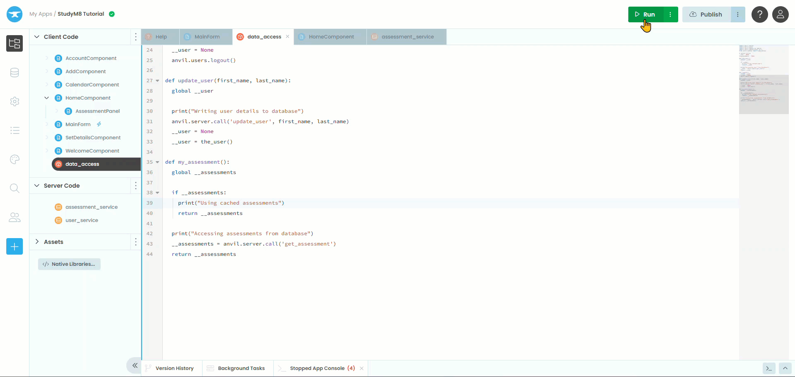
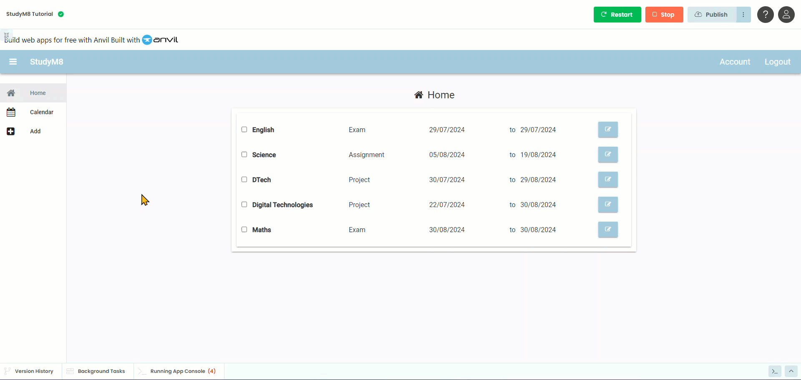
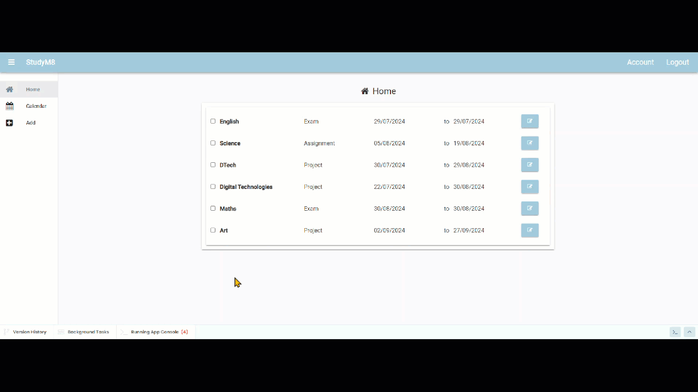

# My Assessments Function

```{topic} In this tutorial you will:
- Implement a caching mechanism for assessment data in a web app.
- Modify existing methods to use cached data to improve performance.
- Test the caching mechanism to ensure the data is retrieved correctly.
- Address issues with adding or updating assessments, ensuring the cache is refreshed appropriately.
```

Now that we have cached the user data, our web app is fasters, but there are still some places where accessing the database slows it down.

If we look at the **assessment_service** we will notice two functions which retrieve data from the database:

- **get_assessment**
- **get_chart**

This implies that there are two more sets of data that we can cache. In this tutorial we will look to cache the **get_assessment** data, and we will deal with the **get_chart** data next tutorial.

## Planning

The impact of using the **get_assessment** method is not as significant as **get_user**. It is only used in the **HomeComponent**. Never-the-less, this will be called every time the user goes to the **HomeComponent**, so it will still have an impact.

We will use the same process that we used for the **get_user** method:

1. Create a variable to store assessment data in the **data_access** module.
2. Create a frontend method that caches the assessment data if it is not currently cached, and then returns the cached data.
3. Replace calls to **get_assessment** with calls to the new frontend method.

Lets get to it.

## Code

### Create the caching method

First we need to make a new variable to cache the assessment data.

1. Open the **data_access** module,
2. At the top, under the `cached values` section add the highlighted code

```{code-block} python
:linenos:
:lineno-start: 7
:emphasize-lines: 3
# cached values
__user = None
__assessments = None
```

```{admonition} Code explaination
:class: notice
- **line 9** &rarr; creates the private variable `__assessments` to store the assessment data
```

Now to create the method

3. At the bottom of the **data_access** module add the following highlighted code.

```{code-block} python
:linenos:
:lineno-start: 35
:emphasize-lines: 1 - 10
def my_assessment():
  global __assessments

  if __assessments:
    print("Using cached assessments")
    return __assessments

  print("Accessing assessments from database")
  __assessments = anvil.server.call('get_assessment', user)
  return __assessments
```

```{admonition} Code explaination
:class: notice
- **line 35** &rarr; creates the **my_assessment** method
- **line 36** &rarr; allows the method to edit the value of `__assessments`
- **line 38** &rarr; checks if the assessment data is already cached
- **line 39** &rarr; informs the developer that cached data is being used
- **line 40** &rarr; returns the cached data and ends the method
- **line 42** &rarr; informs the developed that the database is being accessed
- **line 43** &rarr; retrieves the assessment data from the database and caches it
- **line 44** &rarr; returned the cached data
```

### Replace calls to get_assessment

Now we need to replace the calls to get_assessment

1. Open **HomeComponent** in **Code** mode
2. In the import section, add the highlighted code

```{code-block} python
:linenos:
:lineno-start: 1
:emphasize-lines: 8
from ._anvil_designer import HomeComponentTemplate
from anvil import *
import anvil.server
import anvil.tables as tables
import anvil.tables.query as q
from anvil.tables import app_tables
import anvil.users
from .. import data_access
```

```{admonition} Code explaination
:class: notice
- **line 8** &rarr; gives **HomeComponent** access to the **data_access** methods
```

3. Insert the highlighted code at the bottom of the `__init__` method

```{code-block} python
:linenos:
:lineno-start: 11
:emphasize-lines: 6
  def __init__(self, **properties):
    # Set Form properties and Data Bindings.
    self.init_components(**properties)

    # Any code you write here will run before the form opens.
    self.repeating_panel_1.items = data_access.my_assessment()
```

```{admonition} Code explaination
:class: notice
- **line 16** &rarr; uses our new **my_assessment** method to provide the data for the repeating panels.
```

### Testing

Time to test your web site and see if our changes worked.

Testing:

1. Launch your web app
2. Wait for the **Home** page to load - this should take some time
3. Go to the **Account** page - this should load instantly
4. Go back to the **Home** page - this should load instantly
5. Go to the **Add** page - this should load instantly
6. Add a new assessment item
7. Go back to the **Home** page
8. Check if the assessment item is there - spoiler, it won't be



### Fixing the add assessment problem

The problem with adding assessment, is similar to the one we had with changing user data. When we add a new assessment, it gets written to the database, but the cached assessment data does not change. We need to fix this.

1. Open the **data_access** module
2. Insert the highlighted code into the bottom of the module

```{code-block} python
:linenos:
:lineno-start: 46
:emphasize-lines: 1 - 7
def add_assessment(subject, details, start_date, due_date):
  global __assessments
  
  print("Writing assessment details to the database")
  anvil.server.call('add_assessment', subject, details, start_date, due_date)
  __assessments = None
  my_assessment()
```

```{admonition} Code explaination
:class: notice
- **line 46** &rarr; creates the **add_assessment** method, which requires **subject**, **details**, **start_date** and **due_date** to be passed
- **line 47** &rarr; allows the method to edit the value of `__assessments`
- **line 49** &rarr; informs the developed that the database is being accessed
- **line 50** &rarr; writes the new assessment details to the database
- **line 51** &rarr; resets the `__assessment` value to `None`
- **line 52** &rarr; caches the updated assessment list
```

Now we need to replace the call to the database, with a call to our new method.

3. Open **AddComponent** in **Code** mode
4. **Replace** **line 47** with the highlighted code below

```{code-block} python
:linenos:
:lineno-start: 31
:emphasize-lines: 17
  def button_add_click(self, **event_args):
    # validation
    if not self.text_box_subject.text:
      self.display_error("Subject name needed")
    elif not self.text_box_details.text:
      self.display_error("Assessment details needed")
    elif not self.date_picker_start.date:
      self.display_error("Start date needed")
    elif not self.date_picker_due.date:
      self.display_error("Due date needed")
    else:
      self.subject = self.text_box_subject.text
      self.details = self.text_box_details.text
      self.start = self.date_picker_start.date
      self.due = self.date_picker_due.date
      self.display_save(f"{self.subject} {self.details} assessment: {self.start} to {self.due} recorded")
      data_access.add_assessment(self.subject, self.details, self.start, self.due)
      self.reset_form()
```

```{admonition} Code explaination
:class: notice
- **line 47** &rarr; calls our new caching method and passes the required values
```

### Second test

Lets check that this worked.

1. Launch your website and navigate to the **Add** page.
2. Add a new assessment
3. Return to the **Home** page
4. Check if your new assessment is shown



Good. But are there more places where our cache can cause problem? When else do we write data to the database? How about when we change assessment details?

1. Launch your web app
2. Edit the value of one of the assessments &rarr; good, it changes
3. Navigate to the **Add** page
4. Return to the **Home** &rarr; it's the previous value



Again this is the result of changing the database values without updating the cache. So lets fix that too.

### Fix update assessment problem

Just like before, we will create a method in the **data_access** module that writes to the database and then reloads the cache.

1. Open the **data_access** module
2. At the bottom of the module add the highlighted code

```{code-block} python
:linenos:
:lineno-start: 54
:emphasize-lines: 1 - 14
def update_assessment(assessment_id, subject, details, start_date, due_date, completed):
  global __assessments

  print("Updating assessment details on the database")
  anvil.server.call('update_assessment',
                    assessment_id,
                    subject,
                    details,
                    start_date,
                    due_date,
                    completed
                   )
  __assessments = None
  my_assessment()
```

```{admonition} Code explaination
:class: notice
- **line 54** &rarr; creates the update_assessment method with all the required data to be passed
- **line 55** &rarr; allows the method to change the `__assessments` value
- **line 57** &rarr; lets the developer know that the database is being accessed
- **line 58 - 65** &rarr; writes the changes to the database
- **line 66** &rarr; resets the `__assessments` value to `None`
- **line 67** &rarr; caches the assessments data
```

3. Open the **AssessmentPanel**
4. In the import section add the highlighted line

```{code-block} python
:linenos:
:lineno-start: 1
:emphasize-lines: 9
from ._anvil_designer import AssessmentPanelTemplate
from anvil import *
import anvil.server
import anvil.users
import anvil.tables as tables
import anvil.tables.query as q
from anvil.tables import app_tables
import datetime
from ... import data_access
```

```{admonition} Code explaination
:class: notice
- **line 9** &rarr; gives **HomeComponent** access to the **data_access** methods
```

5. In the **button_save_click** handler replace **line 37 - 44** with the highlighted code below

```{code-block} python
:linenos:
:lineno-start: 35
:emphasize-lines: 3-9
  def button_save_click(self, **event_args):
    # write to server
    data_access.update_assessment(self.item.get_id(),
                                  self.text_box_subject.text,
                                  self.text_box_details.text,
                                  self.date_picker_start.date,
                                  self.date_picker_due.date,
                                  self.check_box_completed.checked
                                 )

    # update display
    self.label_subject.text = self.text_box_subject.text
    self.label_details.text = self.text_box_details.text
    self.label_start.text = self.date_picker_start.date.strftime('%d/%m/%Y')
    self.label_due.text = self.date_picker_due.date.strftime('%d/%m/%Y')
    self.switch_components()
```

```{admonition} Code explaination
:class: notice
- **line 37-43** &rarr; uses our new caching method to make changes to the assessment data
```

### Third test

Lets check our latest iteration of code

1. Launch you website
2. Change an assessment's detail
3. Navigate to another page
4. Return to **Home**
5. Check if your change is displayed.


It should all be working now.

## Final code state

By the end of this tutorial your code should be the same as below:

### Final data_access

```{code-block} python
:linenos:
import anvil.server
import anvil.users
import anvil.tables as tables
import anvil.tables.query as q
from anvil.tables import app_tables

# cached values
__user = None
__assessments = None

def the_user():
  global __user

  if __user:
    print("Using cached user")
    return __user

  print("Accessing user from database")
  __user = anvil.users.get_user()
  return __user

def logout():
  global __user
  __user = None
  anvil.users.logout()

def update_user(first_name, last_name):
  global __user
  
  print("Writing user details to database")
  anvil.server.call('update_user', first_name, last_name)
  __user = None
  __user = the_user()

def my_assessment():
  global __assessments
  
  if __assessments:
    print("Using cached assessments")
    return __assessments

  print("Accessing assessments from database")
  __assessments = anvil.server.call('get_assessment')
  return __assessments

def add_assessment(subject, details, start_date, due_date):
  global __assessments
  
  print("Writing assessment details to the database")
  anvil.server.call('add_assessment', subject, details, start_date, due_date)
  __assessments = None
  my_assessment()

def update_assessment(assessment_id, subject, details, start_date, due_date, completed):
  global __assessments

  print("Updating assessment details on the database")
  anvil.server.call('update_assessment',
                    assessment_id,
                    subject,
                    details,
                    start_date,
                    due_date,
                    completed
                   )
  __assessments = None
  my_assessment()
```

### Final HomeComponent

```{code-block} python
:linenos:
from ._anvil_designer import HomeComponentTemplate
from anvil import *
import anvil.server
import anvil.tables as tables
import anvil.tables.query as q
from anvil.tables import app_tables
import anvil.users
from .. import data_access

class HomeComponent(HomeComponentTemplate):
  def __init__(self, **properties):
    # Set Form properties and Data Bindings.
    self.init_components(**properties)

    # Any code you write here will run before the form opens.
    self.repeating_panel_1.items = data_access.my_assessment()
```

### Final AddComponent

```{code-block} python
:linenos:
from ._anvil_designer import AddComponentTemplate
from anvil import *
import anvil.server
import anvil.tables as tables
import anvil.tables.query as q
from anvil.tables import app_tables
import anvil.users
from .. import data_access


class AddComponent(AddComponentTemplate):
  def __init__(self, **properties):
    # Set Form properties and Data Bindings.
    self.init_components(**properties)
    self.subject = ""
    self.details = ""
    self.start = None
    self.due = None

    # Any code you write here will run before the form opens.
    self.label_message.visible = False
    if data_access.the_user():
      self.card_details.visible = True
      self.card_error.visible = False
      self.button_add.visible = True
    else:
      self.card_details.visible = False
      self.card_error.visible = True
      self.button_add.visible = False

  def button_add_click(self, **event_args):
    # validation
    if not self.text_box_subject.text:
      self.display_error("Subject name needed")
    elif not self.text_box_details.text:
      self.display_error("Assessment details needed")
    elif not self.date_picker_start.date:
      self.display_error("Start date needed")
    elif not self.date_picker_due.date:
      self.display_error("Due date needed")
    else:
      self.subject = self.text_box_subject.text
      self.details = self.text_box_details.text
      self.start = self.date_picker_start.date
      self.due = self.date_picker_due.date
      self.display_save(f"{self.subject} {self.details} assessment: {self.start} to {self.due} recorded")
      data_access.add_assessment(self.subject, self.details, self.start, self.due)
      self.reset_form()

  def display_error(self, message):
    self.label_message.visible = True
    self.label_message.foreground = "#ff0000"
    self.label_message.icon = "fa:exclamation-triangle"
    self.label_message.bold = True
    self.label_message.text = message

  def display_save(self, message):
    self.label_message.visible = True
    self.label_message.foreground = "#000000"
    self.label_message.icon = "fa:save"
    self.label_message.bold = False
    self.label_message.text = message

  def reset_form(self):
    self.subject = ""
    self.details = ""
    self.start = None
    self.due = None
    self.text_box_subject.text = ""
    self.text_box_details.text = ""
    self.date_picker_start.date = None
    self.date_picker_due.date = None
```

### Final AssessmentPanel

from ._anvil_designer import AssessmentPanelTemplate
from anvil import *
import anvil.server
import anvil.users
import anvil.tables as tables
import anvil.tables.query as q
from anvil.tables import app_tables
import datetime
from ... import data_access

```{code-block} python
:linenos:
class AssessmentPanel(AssessmentPanelTemplate):
  def __init__(self, **properties):
    # Set Form properties and Data Bindings.
    self.init_components(**properties)

    # Any code you write here will run before the form opens.
    self.check_box_completed.checked = self.item['completed']
    self.label_subject.text = self.item['subject']
    self.label_details.text = self.item['details']
    self.label_start.text = self.item['start_date'].strftime('%d/%m/%Y')
    self.label_due.text = self.item['due_date'].strftime('%d/%m/%Y')

  def check_box_completed_change(self, **event_args):
    new_value = self.check_box_completed.checked
    anvil.server.call('update_assessment_completed', self.item.get_id(),new_value)

  def button_edit_click(self, **event_args):
    self.text_box_subject.text = self.item["subject"]
    self.text_box_details.text = self.item["details"]
    self.date_picker_start.date = self.item["start_date"]
    self.date_picker_due.date = self.item["due_date"]
    self.switch_components()

  def button_save_click(self, **event_args):
    # write to server
    data_access.update_assessment(self.item.get_id(),
                                  self.text_box_subject.text,
                                  self.text_box_details.text,
                                  self.date_picker_start.date,
                                  self.date_picker_due.date,
                                  self.check_box_completed.checked
                                 )

    # update display
    self.label_subject.text = self.text_box_subject.text
    self.label_details.text = self.text_box_details.text
    self.label_start.text = self.date_picker_start.date.strftime('%d/%m/%Y')
    self.label_due.text = self.date_picker_due.date.strftime('%d/%m/%Y')
    self.switch_components()
  
  def switch_components(self):
    # display elements
    self.label_subject.visible = not self.label_subject.visible
    self.label_details.visible = not self.label_details.visible
    self.label_start.visible = not self.label_start.visible
    self.label_due.visible = not self.label_due.visible
    self.button_edit.visible = not self.button_edit.visible
    
    # edit elements
    self.text_box_subject.visible = not self.text_box_subject.visible
    self.text_box_details.visible = not self.text_box_details.visible
    self.date_picker_start.visible = not self.date_picker_start.visible
    self.date_picker_due.visible = not self.date_picker_due.visible
    self.button_save.visible = not self.button_save.visible
```
